.. contents::
   :depth: 3
..

Introduction
============

This reference document is the *VNF TOSCA Template Requirements for
OpenO**, which provides recommendations and standards for building VNF
TOSCA templates compatible with OpenO– initial implementations of
Network Cloud. It has the following features:

1. VNF TOSCA template designer supports GUI and CLI.

2. VNF TOSCA template is aligned to the newest TOSCA protocol, “Working
   Draft 04-Revision 06”.

3. VNF TOSCA template supports EPA features, such as NUMA, Hyper
   Threading, SRIOV， etc.

   1. .. rubric:: Intended Audience
         :name: intended-audience

This document is intended for persons developing VNF TOSCA templates
that will be orchestrated by OpenO.

Scope 
------

OpenO implementations of Network Cloud supports TOSCA Templates, also
referred to as TOSCA in this document.

OpenO requires the TOSCA Templates to follow a specific format. This
document provides the mandatory, recommended, and optional requirements
associated with this format.

Overview 
---------

The document includes three charters to help the VNF vendors to use the
VNF model design tools and understand the VNF package structure and VNF
TOSCA templates.

In the OPENO, VNF Package and VNFD template can be designed by manually
or via model designer tools. VNF model designer tools can provide the
GUI and CLI tools for the VNF vendor to develop the VNF Package and VNFD
template.

The VNF package structure is align to the NFV TOSCA protocol, and
supports CSAR

The VNFD and VNF package are all align to the NFV TOSCA protocol, which
supports multiple TOSCA template yaml files, and also supports
self-defined node or other extensions.

VNF TOSCA Designer
==================

Specifications
--------------

Model design follows the following specifications:

TOSCA-v1.0:

http://docs.oasis-open.org/tosca/TOSCA/v1.0/TOSCA-v1.0.html

TOSCA-Simple-Profile-YAML-v1.1:

http://docs.oasis-open.org/tosca/TOSCA-Simple-Profile-YAML/v1.1/TOSCA-Simple-Profile-YAML-v1.1.html

tosca-nfv-v1.0-wd04-rev06.

1. .. rubric:: Model Design
      :name: model-design

   1. .. rubric:: Component Design
         :name: component-design

Components used in service orchestration as the basic unit of NF/NS
service template.

NF Component Design
~~~~~~~~~~~~~~~~~~~

Follows specification tosca-nfv-v1.0-wd04-rev06, defined the components
in NF orchestration, including
VDU.Compute、VirtualStorage、Cpd、VduCpd、VnfVirtualLinkDesc、VnfExtCpd
etc. Currently, these components packaged and distributed with designer
as basic components of NFV.

NS Component Design
~~~~~~~~~~~~~~~~~~~

Follows specification tosca-nfv-v1.0-wd04-rev06, defined the components
in NS orchestration. Including
Cpd、VnfVirtualLinkDesc、VNF、PNF、FP、VNFFG、NS etc. Currently, these
components packaged and distributed with designer as basic components of
NFV.

Component Nesting Design
~~~~~~~~~~~~~~~~~~~~~~~~

An orchestrated NF/NS service template can be mapped to a component with
the keyword “substitution\_mappings”. This component can be used in the
orchestration of other NS.

Nested orchestration diagram shows as follows:

|image0| |image1|

1. Requirement Mapping

2. Capability Mapping

3. Property Mapping

The input parameters in service template can be mapped to the property
in component automatically.

Component Customizing
~~~~~~~~~~~~~~~~~~~~~

There are mainly two ways to customize component: Mapping and
inheritance.

1. Mapping

Map an orchestrated service template to a component. For detail in 1.1.3
Component Nesting Design.

1. Inheritance

Define a customized component by inheriting a component which already
existed. The new component will inherit all the content from the parent
component, including: Property/Requirement/Capability etc. And also new
customized attribute Property/Requirement/Capability can be added.

1. .. rubric:: Relationship Type Design
      :name: relationship-type-design

   1. .. rubric:: Basic Relationship Type
         :name: basic-relationship-type

Basic relationship type defined follows the specification
TOSCA-Simple-Profile-YAML-v1.1. Including
DependsOn、HostedOn、ConnectsTo、AttachesTo etc. Basic relationship type
was packaged and distributed with the designer.

NFV Relationship Type
~~~~~~~~~~~~~~~~~~~~~

Follows the specification tosca-nfv-v1.0-wd04-rev06 to define the NFV
relationship type, Including VirtualBindsTo、VirtualLinksTo、ForwardsTo
etc. NFV relationship types can be packaged and distributed with the
model designer in NFV domain.

Customize Relationship Type
~~~~~~~~~~~~~~~~~~~~~~~~~~~

Customize relationship type was supported.

Customized relationship type can inherit with an existing relationship
type.

The properties and operations of relationship can be defined. And the
target node types which linked to can also be defined.

1. .. rubric:: Data Type Definition
      :name: data-type-definition

   1. .. rubric:: Basic Data Type
         :name: basic-data-type

The system provides the definition of basic data type. Including:
string、integer、float、boolean、timestamp. Follow the specification
TOSCA-Simple-Profile-YAML-v1.1.

List and map are supported.

NFV Data Type
~~~~~~~~~~~~~

Data type of NFV domain defined according to tosca-nfv-v1.0-wd04-rev06.
Including
L2AddressData、L3AddressData、AddressData、VirtualNetworkInterfaceRequirements、ConnectivityType、RequestedAdditionalCapability、VirtualMemory、VirtualCpu、VirtualCpuPinning
etc.

NFV data type can be packaged and distributed with the model designer in
NFV domain.

Customize Data Type
~~~~~~~~~~~~~~~~~~~

Support to defining custom data type with the basic data type and
list/map.

Support nesting of custom data types, that is, defining new data types
with existing custom data types.

1. .. rubric:: Topology Design
      :name: topology-design

   1. .. rubric:: Node Design
         :name: node-design

To design the contents of the service template components and TOPO
structure through the component drag and drop.

1. NF Node Design

Drag a component instance from the NF component library to the topology
view.

A component represents an NF logical module of the service. For example,
VDU.Compute represents the calculation module, Cpd represents virtual
port, VirtualStorage represents virtual storage unit.

1. NS Node Design

Drag a component instance from the NS component library to the topology
view.

A component represents an NS logical module of the service. For example,
VNF represents virtualized network function module, PNF represents
physical network module (eg. physical network element).

Relationship Design
~~~~~~~~~~~~~~~~~~~

Drag a connection from one component to another to represent the
relationship between the components.

The type of relationship is represented by the type of connection, for
example: DependsOn、HostedOn、ConnectsTo、VirtualBindsTo、VirtualLinksTo
etc.

Property Orchestration
~~~~~~~~~~~~~~~~~~~~~~

You can set properties for components and relationships for use by an
instantiated deployment.

1. .. rubric:: Workflow Design
      :name: workflow-design

   1. .. rubric:: BNPM4TOSCA Workflow Designer
         :name: bnpm4tosca-workflow-designer

    Embed BNPM4TOSCA workflow designer is provided, you can design BNPM
    workflow.

Workflow design interface shows as follows:

|image2|

Service Template Operation Design
~~~~~~~~~~~~~~~~~~~~~~~~~~~~~~~~~

Service template operations include: create, start, stop, delete, etc.
You can define the operations of the service template and associated
operations with specified workflows.

|image3|

Policy Design
~~~~~~~~~~~~~

    Embed Drools-based policy designer is provided.

SFC Design
~~~~~~~~~~

    Provide a SFC graphical design interface, support to design business
    service chain.

Deployment Flavor Design
~~~~~~~~~~~~~~~~~~~~~~~~

    Support to design the deployment flavor of a VDU, shows as follows:

|image4|

    Supports to design the scale parameters of a VDU, shows as follows:

|image5|

Parameter Design
~~~~~~~~~~~~~~~~

If an Entity property value is not determined at the design time
(including: node template, relationship template, etc), and need to
entered at the deployment phase dynamically. So the values need to
abstract as the service template input parameters.

Parameter Definition
^^^^^^^^^^^^^^^^^^^^

Support input parameter definition, show as follow:

|image6|

Parameter Mapping
^^^^^^^^^^^^^^^^^

Map input parameters to properties of nodes or relationships with the
“get\_input” function, according to the TOSCA-Simple-Profile-YAML-v1.1
specification.

Support the mapping of simple parameters, complex parameters, and
properties of a complex parameter.

Artifact Design
~~~~~~~~~~~~~~~

Artifact mainly includes scripts, images, software packages and other
materials which may be used in the deploy phase.

Script Artifacts
^^^^^^^^^^^^^^^^

The script files are typically bound to the service template and
uploaded to the ‘Scripts’ directory of the service template.

At the same time, you can create an artifact to associate the script
file with a specific node.

Image Artifacts
^^^^^^^^^^^^^^^

Images can be bound to a service template and uploaded to the
‘SoftwareImages’ directory. Or they can be uploaded to a separate images
server.

|image7|

At the same time, you can create an artifact to associate the image file
with a specific node. Show as follow:

|image8|

Software package artifacts
^^^^^^^^^^^^^^^^^^^^^^^^^^

The software package is typically the software version provided by the
device vendor. Software packages can be bound to a service template or
they can be uploaded to a separate software packages server.

At the same time, you can create an artifact to associate the software
package with a specific node.

Design Package
--------------

Following the TOSCA-Simple-Profile-YAML-v1.1 specification, the design
output is packaged in the CSAR (TOSCA Cloud Service Archive) format.

Design output includes: model description file, workflow description
file, policy description file, tosca.meta, manifest file, artifact file
(including: scripts, images, software packages, etc.) and so on.

Suggested package structure is as follows:

+------------------+------------+------------------------------------------------------------------------------------------------------------------------------------+
| Folder Name      | Required   | Description                                                                                                                        |
+==================+============+====================================================================================================================================+
| TOSCA-Metadata   | Yes        | Used to define the basic properties of the VNF package, and the Entry-Definitions file.                                            |
+------------------+------------+------------------------------------------------------------------------------------------------------------------------------------+
| Definitions      | Yes        | Yaml or xml format TOSCA definition file, the document on the artifact file reference is relative to the CSAR package root path.   |
+------------------+------------+------------------------------------------------------------------------------------------------------------------------------------+
| Plans            | No         | VNF lifecycle implementation of the workflow.                                                                                      |
+------------------+------------+------------------------------------------------------------------------------------------------------------------------------------+
| Policies         | No         | Policy description files.                                                                                                          |
+------------------+------------+------------------------------------------------------------------------------------------------------------------------------------+
| Scripts          | No         | Script files                                                                                                                       |
+------------------+------------+------------------------------------------------------------------------------------------------------------------------------------+
| SoftwareImages   | No         | Host software image files                                                                                                          |
+------------------+------------+------------------------------------------------------------------------------------------------------------------------------------+
| AppSoftwares     | No         | Application software files                                                                                                         |
+------------------+------------+------------------------------------------------------------------------------------------------------------------------------------+
+------------------+------------+------------------------------------------------------------------------------------------------------------------------------------+

tosca.meta
~~~~~~~~~~

tosca.meta defined as a basic information of service template, it is a
manifest file.

Tosca.meta example:

+--------------------------------------------------+
| TOSCA-Meta-File-Version: 1.0                     |
|                                                  |
| CSAR-Version: 1.1                                |
|                                                  |
| Created-By: OASIS TOSCA TC                       |
|                                                  |
| Entry-Definitions: definitions/tosca\_elk.yaml   |
+--------------------------------------------------+

Model Description Files
~~~~~~~~~~~~~~~~~~~~~~~

The model description files includes: component definition files,
relationship type definition files, data type definition files, TOPO
description files and so on.

The model description files will be packaged into the ‘Definitions’
directory of the CSAR package.

Workflow Description Files
~~~~~~~~~~~~~~~~~~~~~~~~~~

The Workflow description files is the output files of the Workflow
designer.

The workflow description files will be packaged into the ‘Plans’
directory of the CSAR package.

Policy Description Files
~~~~~~~~~~~~~~~~~~~~~~~~

Policy description files is the output files of the Policy Designer.

The policy description files will be packaged into the ‘Policies’
directory of the CSAR package.

1. .. rubric:: Artifacts
      :name: artifacts

   1. .. rubric:: Script Artifacts
         :name: script-artifacts-1

Script files are usually packaged directly into the ‘Scripts’ directory
of the CSAR package.

Image Artifacts
^^^^^^^^^^^^^^^

The images bound to the service template are packaged directly into the
‘SoftwareImages’ directory of the CSAR package.

Software Package Artifacts
^^^^^^^^^^^^^^^^^^^^^^^^^^

The software packages bound to the service template are packaged
directly into the ‘AppSoftwares’ directory of the CSAR package.

1. .. rubric:: Design Verification
      :name: design-verification

   1. .. rubric:: Grammar Check
         :name: grammar-check

Yaml/xml syntax check, tosca syntax check, data type validation and so
on.

Tosca Model Verification
~~~~~~~~~~~~~~~~~~~~~~~~

Type check, relationship check, requirement check, artifact check,
constraint check, etc.

CSAR Package Checking
~~~~~~~~~~~~~~~~~~~~~

CSAR packet structure verification and packet integrity checking.

Design Publishing
-----------------

CSAR package can be published to the catalog for the instantiation use,
after it has been verified.

1. .. rubric:: Archive Management
      :name: archive-management

   1. .. rubric:: Design Repository
         :name: design-repository

In the design phase, the service template is stored in the design
repository.

The service templates in the design repository can be modified at any
time.

Release Repository
~~~~~~~~~~~~~~~~~~

After the service template design is completed, you can publish it to
the release repository through a publish process.

And, the service template can be instantiated and deployed only after it
has been published.

The service templates in the release repository cannot be modified
again.

Onboard
~~~~~~~

Before the deployment of the service template, you need to perform the
Onboard operation.

The main work of the onboard operation includes:

1. Upload the image and package to VNFM and VIM.

2. Distribute the workflow description file to the workflow execution
   engine.

3. Distribute the policy description file to the policy execution
   engine.

VNF Package

This section defines VNF package as well as its overall structure. A VNF
package shall be a CSAR(Cloud Service Archive), which is a zip file in
compliance to TOSCA, including at least one csar.meta file, one
checksum.lst file, one directory for TOSCA-Metadata, one directory for
*Definitions* and one directory for images. The directories for *Plans*,
*scripts*, xml files etc. are optional.

|image9|

TOSCA-Metadata Directory
------------------------

This directory contains TOSCA.metadata file. A TOSCA meta file consists
of name/value pairs. The name-part of a name/value pair is followed by a
colon, followed by a blank, followed by the value-part of the name/value
pair. The name MUST NOT contain a colon. Values that represent binary
data MUST be base64 encoded. Values that extend beyond one line can be
spread over multiple lines if each subsequent line starts with at least
one space. Such spaces are then collapsed when the value string is read.

#. <name>: <value>

Each name/value pair is in a separate line. A list of related name/value
pairs, i.e. a list of consecutive name/value pairs describing a
particular file in a CSAR, is called a *block*. Blocks are separated by
an empty line. The first block, called *block\_0*, is metadata about the
CSAR itself. All other blocks represent metadata of files in the CSAR.

The structure of block\_0 in the TOSCA meta file is as follows:

#. TOSCA-Meta-File-Version: digit.digit

#. CSAR-Version: digit.digit

#. Created-By: string

#. Entry-Definitions: string ?

The name/value pairs are as follows:

-  TOSCA-Meta-File-Version: This is the version number of the TOSCA meta
   file format. The value MUST be “1.0” in the current version of the
   TOSCA specification.

-  CSAR-Version: This is the version number of the CSAR specification.
   The value MUST be “1.0” in the current version of the TOSCA
   specification.

-  Created-By: The person or vendor, respectively, who created the CSAR.

-  | Entry-Definitions: This OPTIONAL name/value pair references a TOSCA
     Definitions file from the Definitions directory of the CSAR that
     SHOULD be used as entry point for processing the contents of the
     CSAR.
   | Note, that a CSAR may contain multiple Definitions files. One
     reason for this is completeness, e.g. a Service Template defined in
     one of the Definitions files could refer to Node Types defined in
     another Definitions file that might be included in the Definitions
     directory to avoid importing it from external locations. The
     Entry-Definitions name/value pair is a hint to allow optimized
     processing of the set of files in the Definitions directory.

The first line of a block (other than block\_0) MUST be a name/value
pair that has the name “Name” and the value of which is the path-name of
the file described. The second line MUST be a name/value pair that has
the name “Content-Type” describing the type of the file described; the
format is that of a MIME type with type/subtype structure. The other
name/value pairs that consecutively follow are file-type specific.

#. Name: <path-name\_1>

#. Content-Type: type\_1/subtype\_1

#. <name\_11>: <value\_11>

#. <name\_12>: <value\_12>

#. ...

#. <name\_1n>: <value\_1n>

#. 
#. ...

#. 
#. Name: <path-name\_k>

#. Content-Type: type\_k/subtype\_k

#. <name\_k1>: <value\_k1>

#. <name\_k2>: <value\_k2>

#. ...

#. <name\_km>: <value\_km>

The name/value pairs are as follows:

-  | Name: The pathname or pathname pattern of the file(s) or resources
     described within the actual CSAR.
   | Note, that the file located at this location MAY basically contain
     a reference to an external file. Such a reference is given by a URI
     that is of one of the URL schemes “file”, “http”, or “https”.

-  Content-Type: The type of the file described. This type is a MIME
   type complying with the type/subtype structure. Vendor defined
   subtypes SHOULD start as usual with the string “vnd.”.

Note that later directives override earlier directives. This allows for
specifying global default directives that can be specialized by later
directories in the TOSCA meta file.

Definitions Directory
---------------------

This directory contains all TOSCA yaml files including definitions of
Node, Relationship, Capabilities, Artifacts, and Requirements etc. as
components of VNF package.

SwImages Directory
------------------

Image files of VNF are stored in this directory.

Check Sum List File
-------------------

The file of checksum.lst records the MD5(RFC 1321) value of each file
when building csar package in order to double check whether those files
were destroyed when users unzip the zip file. A checksum.lst file
consists of name/value pairs. The name-part of a name/value pair is
followed by a colon, followed by a blank, followed by the value-part of
the name/value pair. Here is an example as follows.

#. Definitions/openovnf\_\_vOpenNAT.yaml:00a5d15b350b90b75f11c33d4c7a0218

#. Swimages/xenial-snat.qcow2:481f62ed11aa6e240482974feb1dcab6

   1. .. rubric:: Csar Metadata File
         :name: csar-metadata-file

A VNF package, which is a csar zip file shall contain one csar.meta
file. A csar Meta file consists of name/value pairs. The name-part of a
name/value pair is followed by a colon, followed by a blank, followed by
the value-part of the name/value pair. The name MUST NOT contain a
colon. Values that represent binary data MUST be base64 encoded. Values
that extend beyond one line can be spread over multiple lines if each
subsequent line starts with at least one space. Such spaces are then
collapsed when the value string is read.

#. <name>: <value>

Generally, this file includes basic information about this VNF package
including type, version and provider, etc. Here is an example as
follows.

#. Type:NFAR

#. Version:1.0.0

#. Provider: ZTE

NFV TOSCA Template
==================

TOSCA templates supported by OPENO must follow the requirements
enumerated in this section.

TOSCA Introduction
------------------

TOSCA defines a Meta model for defining IT services. This Meta model
defines both the structure of a service as well as how to manage it. A
Topology Template (also referred to as the topology model of a service)
defines the structure of a service. Plans define the process models that
are used to create and terminate a service as well as to manage a
service during its whole lifetime. The major elements defining a service
are depicted in Figure 1.

A Topology Template consists of a set of Node Templates and Relationship
Templates that together define the topology model of a service as a (not
necessarily connected) directed graph. A node in this graph is
represented by a *Node Template*. A Node Template specifies the
occurrence of a Node Type as a component of a service. A *Node Type*
defines the properties of such a component (via *Node Type Properties*)
and the operations (via *Interfaces*) available to manipulate the
component. Node Types are defined separately for reuse purposes and a
Node Template references a Node Type and adds usage constraints, such as
how many times the component can occur.

Reuse and Derivation of TOSCA Definitions

|image10|

Figure 1: Structural Elements of a Service Template and their Relations

TOSCA Modeling Principles & Data Model
--------------------------------------

This section describing TOSCA modeling principles and data model for
NFV, which shall be based on [TOSCA-1.0] and [TOSCA-Simple-Profile-YAML
V1.0], or new type based on ETSI NFV requirements, etc.

VNF Descriptor Template
-----------------------

The VNF Descriptor (VNFD) describes the topology of the VNF by means of
ETSI NFV IFA011 [IFA011] terms such as VDUs, Connection Points, Virtual
Links, External Connection Points, Scaling Aspects, Instantiation Levels
and Deployment Flavours.

The VNFD (VNF Descriptor) is read by both the NFVO and the VNFM. It
represents the contract & interface of a VNF and ensures the
interoperability across the NFV functional blocks.

The main parts of the VNFD are the following:

-  VNF topology: it is modeled in a cloud agnostic way using virtualized
   containers and their connectivity. Virtual Deployment Units (VDU)
   describe the capabilities of the virtualized containers, such as
   virtual CPU, RAM, disks; their connectivity is modeled with VDU
   Connection Point Descriptors (VduCpd), Virtual Link Descriptors (Vld)
   and VNF External Connection Point Descriptors (VnfExternalCpd);

-  VNF deployment aspects: they are described in one or more deployment
   flavours, including instantiation levels, supported LCM operations,
   VNF LCM operation configuration parameters, placement constraints
   (affinity / antiaffinity), minimum and maximum VDU instance numbers,
   and scaling aspect for horizontal scaling.

The following table defines the TOSCA Type “derived from” values that
SHALL be used when using the TOSCA Simple Profile for NFV version 1.0
specification [TOSCA-Simple-Profile-NFV-v1.0] for NFV VNFD.

+-----------------------------------------+---------------------------------------+-----------------------+
| **ETSI NFV Element**                    | **TOSCA VNFD**                        | **Derived from**      |
|                                         |                                       |                       |
| **[IFA011]**                            | **[TOSCA-Simple-Profile-NFV-v1.0]**   |                       |
+=========================================+=======================================+=======================+
| VNF                                     | tosca.nodes.nfv.VNF                   | tosca.nodes.Root      |
+-----------------------------------------+---------------------------------------+-----------------------+
| VDU                                     | tosca.nodes.nfv.VDU                   | tosca.nodes.Root      |
+-----------------------------------------+---------------------------------------+-----------------------+
| Cpd (Connection Point)                  | tosca.nodes.nfv.Cpd                   | tosca.nodes.Root      |
+-----------------------------------------+---------------------------------------+-----------------------+
| VduCpd (internal connection point)      | tosca.nodes.nfv.VduCpd                | tosca.nodes.nfv.Cpd   |
+-----------------------------------------+---------------------------------------+-----------------------+
| VnfVirtualLinkDesc (Virtual Link)       | tosca.nodes.nfv.VnfVirtualLinkDesc    | tosca.nodes.Root      |
+-----------------------------------------+---------------------------------------+-----------------------+
| VnfExtCpd (External Connection Point)   | tosca.nodes.nfv.VnfExtCpd             | tosca.nodes.Root      |
+-----------------------------------------+---------------------------------------+-----------------------+
| Virtual Storage                         |                                       |                       |
+-----------------------------------------+---------------------------------------+-----------------------+
| Virtual Compute                         |                                       |                       |
+-----------------------------------------+---------------------------------------+-----------------------+
| Software Image                          |                                       |                       |
+-----------------------------------------+---------------------------------------+-----------------------+
| Deployment Flavour                      |                                       |                       |
+-----------------------------------------+---------------------------------------+-----------------------+
| Scaling Aspect                          |                                       |                       |
+-----------------------------------------+---------------------------------------+-----------------------+
| Element Group                           |                                       |                       |
+-----------------------------------------+---------------------------------------+-----------------------+
| Instantiation Level                     |                                       |                       |
+-----------------------------------------+---------------------------------------+-----------------------+

+--------------------------------------------------------------------+
| +--------------------------------------------------------------+   |
| | tosca\_definitions\_version: tosca\_simple\_yaml\_1\_0       |   |
| |                                                              |   |
| | description: VNFD TOSCA file demo                            |   |
| |                                                              |   |
| | imports:                                                     |   |
| |                                                              |   |
| | - TOSCA\_definition\_nfv\_1\_0.yaml                          |   |
| |                                                              |   |
| | - TOSCA\_definition\_nfv\_ext\_1\_0.yaml                     |   |
| |                                                              |   |
| | | **node\_types:                                             |   |
| |   tosca.nodes.nfv.VNF.vOpenNAT:                              |   |
| |   derived\_from:** tosca.nodes.nfv.VNF                       |   |
| | | **requirements:                                            |   |
| |   **- **sriov\_plane:                                        |   |
| |   capability:** tosca.capabilities.nfv.VirtualLinkable       |   |
| | | **node:** tosca.nodes.nfv.VnfVirtualLinkDesc               |   |
| | | **relationship:** tosca.relationships.nfv.VirtualLinksTo   |   |
| +--------------------------------------------------------------+   |
+====================================================================+
+--------------------------------------------------------------------+

EPA Requirements
----------------

1. SR-IOV Passthrought

Definitions of SRIOV\_Port are necessary if VDU supports SR-IOV. Here is
an example.

+------------------------------------------------+
| node\_templates:                               |
|                                                |
| vdu\_vNat:                                     |
|                                                |
| SRIOV\_Port:                                   |
|                                                |
| attributes:                                    |
|                                                |
| tosca\_name: SRIOV\_Port                       |
|                                                |
| properties:                                    |
|                                                |
| virtual\_network\_interface\_requirements:     |
|                                                |
| - name: sriov                                  |
|                                                |
| support\_mandatory: false                      |
|                                                |
| description: sriov                             |
|                                                |
| requirement:                                   |
|                                                |
| SRIOV: true                                    |
|                                                |
| role: root                                     |
|                                                |
| description: sriov port                        |
|                                                |
| layer\_protocol: ipv4                          |
|                                                |
| requirements:                                  |
|                                                |
| - virtual\_binding:                            |
|                                                |
| capability: virtual\_binding                   |
|                                                |
| node: vdu\_vNat                                |
|                                                |
| relationship:                                  |
|                                                |
| type: tosca.relationships.nfv.VirtualBindsTo   |
|                                                |
| - virtual\_link:                               |
|                                                |
| node: tosca.nodes.Root                         |
|                                                |
| type: tosca.nodes.nfv.VduCpd                   |
|                                                |
| substitution\_mappings:                        |
|                                                |
| requirements:                                  |
|                                                |
| sriov\_plane:                                  |
|                                                |
| - SRIOV\_Port                                  |
|                                                |
| - virtual\_link                                |
|                                                |
| node\_type: tosca.nodes.nfv.VNF.vOpenNAT       |
+------------------------------------------------+

1. Hugepages

Definitions of mem\_page\_size as one property shall be added to
Properties and set the value to large if one VDU node supports
huagepages. Here is an example.

+----------------------------------+
| node\_templates:                 |
|                                  |
| vdu\_vNat:                       |
|                                  |
| Hugepages:                       |
|                                  |
| attributes:                      |
|                                  |
| tosca\_name: Huge\_pages\_demo   |
|                                  |
| properties:                      |
|                                  |
| mem\_page\_size:large            |
+==================================+
+----------------------------------+

1. NUMA (CPU/Mem)

Likewise, we shall add definitions of numa to
requested\_additional\_capabilities if we wand VUD nodes to support
NUMA. Here is an example.

+-------------------------------------------------+
| topology\_template:                             |
|                                                 |
| node\_templates:                                |
|                                                 |
| vdu\_vNat:                                      |
|                                                 |
| capabilities:                                   |
|                                                 |
| virtual\_compute:                               |
|                                                 |
| properties:                                     |
|                                                 |
| virtual\_memory:                                |
|                                                 |
| numa\_enabled: true                             |
|                                                 |
| virtual\_mem\_size: 2 GB                        |
|                                                 |
| requested\_additional\_capabilities:            |
|                                                 |
| numa:                                           |
|                                                 |
| support\_mandatory: true                        |
|                                                 |
| requested\_additional\_capability\_name: numa   |
|                                                 |
| target\_performance\_parameters:                |
|                                                 |
| hw:numa\_nodes: "2"                             |
|                                                 |
| hw:numa\_cpus.0: "0,1"                          |
|                                                 |
| hw:numa\_mem.0: "1024"                          |
|                                                 |
| hw:numa\_cpus.1: "2,3,4,5"                      |
|                                                 |
| hw:numa\_mem.1: "1024"                          |
+-------------------------------------------------+

1. Hyper-Theading

Definitions of Hyper-Theading are necessary as one of
requested\_additional\_capabilities of one VUD node if that node
supports Hyper-Theading. Here is an example.

+-------------------------------------------------------------+
| topology\_template:                                         |
|                                                             |
| node\_templates:                                            |
|                                                             |
| vdu\_vNat:                                                  |
|                                                             |
| capabilities:                                               |
|                                                             |
| virtual\_compute:                                           |
|                                                             |
| properties:                                                 |
|                                                             |
| virtual\_memory:                                            |
|                                                             |
| numa\_enabled: true                                         |
|                                                             |
| virtual\_mem\_size: 2 GB                                    |
|                                                             |
| requested\_additional\_capabilities:                        |
|                                                             |
| hyper\_threading:                                           |
|                                                             |
| support\_mandatory: true                                    |
|                                                             |
| requested\_additional\_capability\_name: hyper\_threading   |
|                                                             |
| target\_performance\_parameters:                            |
|                                                             |
| hw:cpu\_sockets : "2"                                       |
|                                                             |
| hw:cpu\_threads : "2"                                       |
|                                                             |
| hw:cpu\_cores : "2"                                         |
|                                                             |
| hw:cpu\_threads\_policy: "isolate"                          |
+-------------------------------------------------------------+

1. OVS+DPDK

Definitions of ovs\_dpdk are necessary as one of
requested\_additional\_capabilities of one VUD node if that node
supports dpdk. Here is an example.

+------------------------------------------------------+
| topology\_template:                                  |
|                                                      |
| node\_templates:                                     |
|                                                      |
| vdu\_vNat:                                           |
|                                                      |
| capabilities:                                        |
|                                                      |
| virtual\_compute:                                    |
|                                                      |
| properties:                                          |
|                                                      |
| virtual\_memory:                                     |
|                                                      |
| numa\_enabled: true                                  |
|                                                      |
| virtual\_mem\_size: 2 GB                             |
|                                                      |
| requested\_additional\_capabilities:                 |
|                                                      |
| ovs\_dpdk:                                           |
|                                                      |
| support\_mandatory: true                             |
|                                                      |
| requested\_additional\_capability\_name: ovs\_dpdk   |
|                                                      |
| target\_performance\_parameters:                     |
|                                                      |
| sw:ovs\_dpdk: "true"                                 |
+------------------------------------------------------+

NFV TOSCA Type Definition
-------------------------

tosca.capabilites.nfv.VirtualCompute
~~~~~~~~~~~~~~~~~~~~~~~~~~~~~~~~~~~~

+---------------------------+-----------------------------------------+
| **Shorthand Name**        | VirtualCompute                          |
+===========================+=========================================+
| **Type Qualified Name**   | tosca: VirtualCompute                   |
+---------------------------+-----------------------------------------+
| **Type URI**              | tosca.capabilities.nfv.VirtualCompute   |
+---------------------------+-----------------------------------------+
| **derived from**          | tosca.nodes.Root                        |
+---------------------------+-----------------------------------------+

Properties
^^^^^^^^^^

+-------------------------------------+------------+-----------------------------------------------------+---------------+---------------------------------------------------------+
| Name                                | Required   | Type                                                | Constraints   | Description                                             |
+=====================================+============+=====================================================+===============+=========================================================+
| request\_additional\_capabilities   | No         | tosca.datatypes.nfv.RequestedAdditionalCapability   |               | Describes additional capability for a particular VDU.   |
+-------------------------------------+------------+-----------------------------------------------------+---------------+---------------------------------------------------------+
| virtual\_memory                     | yes        | tosca.datatypes.nfv.VirtualMemory                   |               | Describes virtual memory of the virtualized compute     |
+-------------------------------------+------------+-----------------------------------------------------+---------------+---------------------------------------------------------+
| virtual\_cpu                        | yes        | tosca.datatypes.nfv.VirtualCpu                      |               | Describes virtual CPU(s) of the virtualized compute.    |
+-------------------------------------+------------+-----------------------------------------------------+---------------+---------------------------------------------------------+
+-------------------------------------+------------+-----------------------------------------------------+---------------+---------------------------------------------------------+
| name                                | yes        |                                                     |               |                                                         |
+-------------------------------------+------------+-----------------------------------------------------+---------------+---------------------------------------------------------+

Definition
^^^^^^^^^^

+-----------------------------------------------------------+
| tosca.capabilities.nfv.VirtualCompute:                    |
|                                                           |
| derived\_from: tosca.capabilities.Root                    |
|                                                           |
| properties:                                               |
|                                                           |
| requested\_additional\_capabilities:                      |
|                                                           |
| type: map                                                 |
|                                                           |
| entry\_schema:                                            |
|                                                           |
| type: tosca.datatypes.nfv.RequestedAdditionalCapability   |
|                                                           |
| required: false                                           |
|                                                           |
| virtual\_memory:                                          |
|                                                           |
| type: tosca.datatypes.nfv.VirtualMemory                   |
|                                                           |
| required: true                                            |
|                                                           |
| virtual\_cpu:                                             |
|                                                           |
| type: tosca.datatypes.nfv.VirtualCpu                      |
|                                                           |
| required: true                                            |
+-----------------------------------------------------------+

tosca.nodes.nfv.VDU.Compute
~~~~~~~~~~~~~~~~~~~~~~~~~~~

The NFV Virtualization Deployment Unit (VDU) compute node type
represents a VDU entity which it describes the deployment and
operational behavior of a VNF component (VNFC), as defined by **[ETSI
NFV IFA011].**

+-----------------------+-------------------------------+
| Shorthand Name        | VDU.Compute                   |
+=======================+===============================+
| Type Qualified Name   | tosca:VDU.Compute             |
+-----------------------+-------------------------------+
| Type URI              | tosca.nodes.nfv.VDU.Compute   |
+-----------------------+-------------------------------+
| derived\_from         | tosca.nodes.Compute           |
+-----------------------+-------------------------------+

Properties
^^^^^^^^^^

+----------------------------+------------+---------------------------------------------------------+---------------+------------------------------------------------------------------------------------------------------------------------------------------------------------------------------------------------------------------------------------------------------------------------------------------------------------+
| Name                       | Required   | Type                                                    | Constraints   | Description                                                                                                                                                                                                                                                                                                |
+============================+============+=========================================================+===============+============================================================================================================================================================================================================================================================================================================+
| name                       | yes        | string                                                  |               | Human readable name of the Vdu                                                                                                                                                                                                                                                                             |
+----------------------------+------------+---------------------------------------------------------+---------------+------------------------------------------------------------------------------------------------------------------------------------------------------------------------------------------------------------------------------------------------------------------------------------------------------------+
| description                | yes        | string                                                  |               | Human readable description of the Vdu                                                                                                                                                                                                                                                                      |
+----------------------------+------------+---------------------------------------------------------+---------------+------------------------------------------------------------------------------------------------------------------------------------------------------------------------------------------------------------------------------------------------------------------------------------------------------------+
| boot\_order                | no         | list of string                                          |               | The key indicates the boot index (lowest index defines highest boot priority). The Value references a descriptor from which a valid boot device is created e.g. VirtualStorageDescriptor from which a VirtualStorage instance is created.                                                                  |
|                            |            |                                                         |               |                                                                                                                                                                                                                                                                                                            |
|                            |            |                                                         |               | If no boot order is defined the default boot order defined in the VIM or NFVI shall be used.                                                                                                                                                                                                               |
+----------------------------+------------+---------------------------------------------------------+---------------+------------------------------------------------------------------------------------------------------------------------------------------------------------------------------------------------------------------------------------------------------------------------------------------------------------+
| nfvi\_constraints          | no         | list of string                                          |               | Describes constraints on the NFVI for the VNFC instance(s) created from this Vdu. For example, aspects of a secure hosting environment for the VNFC instance that involve additional entities or processes. More software images can be attached to the virtualization container using virtual\_storage.   |
+----------------------------+------------+---------------------------------------------------------+---------------+------------------------------------------------------------------------------------------------------------------------------------------------------------------------------------------------------------------------------------------------------------------------------------------------------------+
| configurable\_properties   | yes        | map of tosca.datatypes.nfv.VnfcConfigurableProperties   |               | Describes the configurable properties of all VNFC instances based on this VDU.                                                                                                                                                                                                                             |
+----------------------------+------------+---------------------------------------------------------+---------------+------------------------------------------------------------------------------------------------------------------------------------------------------------------------------------------------------------------------------------------------------------------------------------------------------------+

Attributes
^^^^^^^^^^

None

Requirements
^^^^^^^^^^^^

+--------------------+------------+--------------------------------------+---------------+--------------------------------------------------------------------------------------------------------------------------------------------------------------+
| Name               | Required   | Type                                 | Constraints   | Description                                                                                                                                                  |
+====================+============+======================================+===============+==============================================================================================================================================================+
| virtual\_storage   | no         | tosca.nodes.nfv.VDU.VirtualStorage   |               | Describes storage requirements for a virtual\_storage instance attached to the virtualization container created from virtual\_compute defined for this vdu   |
+--------------------+------------+--------------------------------------+---------------+--------------------------------------------------------------------------------------------------------------------------------------------------------------+

Capabilities
^^^^^^^^^^^^

+-------------------------+-------------------------------------------------+---------------+-----------------------------------------------------------------------------------------------------+
| Name                    | Type                                            | Constraints   | Description                                                                                         |
+=========================+=================================================+===============+=====================================================================================================+
| virtual\_compute        | tosca.capabilities.nfv.VirtualCompute           |               | Describes virtual compute resources capabilities.                                                   |
+-------------------------+-------------------------------------------------+---------------+-----------------------------------------------------------------------------------------------------+
| monitoring\_parameter   | tosca.capabilities.nfv.Metric                   | None          | Monitoring parameter, which can be tracked for a VNFC based on this VDU                             |
|                         |                                                 |               |                                                                                                     |
|                         |                                                 |               | Examples include: memory-consumption, CPU-utilisation, bandwidth-consumption, VNFC downtime, etc.   |
+-------------------------+-------------------------------------------------+---------------+-----------------------------------------------------------------------------------------------------+
| Virtual\_binding        | tosca.capabilities.nfv.VirtualBindable          |               | Defines ability of VirtualBindable                                                                  |
|                         |                                                 |               |                                                                                                     |
|                         | editor note: need to create a capability type   |               |                                                                                                     |
+-------------------------+-------------------------------------------------+---------------+-----------------------------------------------------------------------------------------------------+

Definition
^^^^^^^^^^

+-----------------------------------------------------------------------------------------------------+
| tosca.nodes.nfv.VDU.Compute:                                                                        |
|                                                                                                     |
| derived\_from: tosca.nodes.Compute                                                                  |
|                                                                                                     |
| properties:                                                                                         |
|                                                                                                     |
| name:                                                                                               |
|                                                                                                     |
| type: string                                                                                        |
|                                                                                                     |
| required: true                                                                                      |
|                                                                                                     |
| description:                                                                                        |
|                                                                                                     |
| type: string                                                                                        |
|                                                                                                     |
| required: true                                                                                      |
|                                                                                                     |
| boot\_order:                                                                                        |
|                                                                                                     |
| type: list # explicit index (boot index) not necessary, contrary to IFA011                          |
|                                                                                                     |
| entry\_schema:                                                                                      |
|                                                                                                     |
| type: string                                                                                        |
|                                                                                                     |
| required: false                                                                                     |
|                                                                                                     |
| nfvi\_constraints:                                                                                  |
|                                                                                                     |
| type: list                                                                                          |
|                                                                                                     |
| entry\_schema:                                                                                      |
|                                                                                                     |
| type: string                                                                                        |
|                                                                                                     |
| required: false                                                                                     |
|                                                                                                     |
| configurable\_properties:                                                                           |
|                                                                                                     |
| type: map                                                                                           |
|                                                                                                     |
| entry\_schema:                                                                                      |
|                                                                                                     |
| type: tosca.datatypes.nfv.VnfcConfigurableProperties                                                |
|                                                                                                     |
| required: true                                                                                      |
|                                                                                                     |
| attributes:                                                                                         |
|                                                                                                     |
| private\_address:                                                                                   |
|                                                                                                     |
| status: deprecated                                                                                  |
|                                                                                                     |
| public\_address:                                                                                    |
|                                                                                                     |
| status: deprecated                                                                                  |
|                                                                                                     |
| networks:                                                                                           |
|                                                                                                     |
| status: deprecated                                                                                  |
|                                                                                                     |
| ports:                                                                                              |
|                                                                                                     |
| status: deprecated                                                                                  |
|                                                                                                     |
| capabilities:                                                                                       |
|                                                                                                     |
| virtual\_compute:                                                                                   |
|                                                                                                     |
| type: tosca.capabilities.nfv.VirtualCompute                                                         |
|                                                                                                     |
| virtual\_binding:                                                                                   |
|                                                                                                     |
| type: tosca.capabilities.nfv.VirtualBindable                                                        |
|                                                                                                     |
| #monitoring\_parameter:                                                                             |
|                                                                                                     |
| # modeled as ad hoc (named) capabilities in VDU node template                                       |
|                                                                                                     |
| # for example:                                                                                      |
|                                                                                                     |
| #capabilities:                                                                                      |
|                                                                                                     |
| # cpu\_load: tosca.capabilities.nfv.Metric                                                          |
|                                                                                                     |
| # memory\_usage: tosca.capabilities.nfv.Metric                                                      |
|                                                                                                     |
| host: #Editor note: FFS. How this capabilities should be used in NFV Profile                        |
|                                                                                                     |
| type: `*tosca.capabilities.Container* <#DEFN_TYPE_CAPABILITIES_CONTAINER>`__                        |
|                                                                                                     |
| valid\_source\_types: [`*tosca.nodes.SoftwareComponent* <#DEFN_TYPE_NODES_SOFTWARE_COMPONENT>`__]   |
|                                                                                                     |
| occurrences: [0,UNBOUNDED]                                                                          |
|                                                                                                     |
| endpoint:                                                                                           |
|                                                                                                     |
| occurrences: [0,0]                                                                                  |
|                                                                                                     |
| os:                                                                                                 |
|                                                                                                     |
| occurrences: [0,0]                                                                                  |
|                                                                                                     |
| scalable: #Editor note: FFS. How this capabilities should be used in NFV Profile                    |
|                                                                                                     |
| type: `*tosca.capabilities.Scalable* <#DEFN_TYPE_CAPABILITIES_SCALABLE>`__                          |
|                                                                                                     |
| binding:                                                                                            |
|                                                                                                     |
| occurrences: [0,UNBOUND]                                                                            |
|                                                                                                     |
| requirements:                                                                                       |
|                                                                                                     |
| - virtual\_storage:                                                                                 |
|                                                                                                     |
| capability: tosca.capabilities.nfv.VirtualStorage                                                   |
|                                                                                                     |
| relationship: tosca.relationships.nfv.VDU.AttachedTo                                                |
|                                                                                                     |
| node: tosca.nodes.nfv.VDU.VirtualStorage                                                            |
|                                                                                                     |
| occurences: [ 0, UNBOUNDED ]                                                                        |
|                                                                                                     |
| - local\_storage: #For NFV Profile, this requirement is deprecated.                                 |
|                                                                                                     |
| occurrences: [0,0]                                                                                  |
|                                                                                                     |
| artifacts:                                                                                          |
|                                                                                                     |
| - sw\_image:                                                                                        |
|                                                                                                     |
| file:                                                                                               |
|                                                                                                     |
| type: tosca.artifacts.nfv.SwImage                                                                   |
+-----------------------------------------------------------------------------------------------------+

Artifact
^^^^^^^^

+-----------+------------+-------------------------------+---------------+-------------------------------------------------------------------------------------------------------------------------+
| Name      | Required   | Type                          | Constraints   | Description                                                                                                             |
+===========+============+===============================+===============+=========================================================================================================================+
| SwImage   | Yes        | tosca.artifacts.nfv.SwImage   |               | Describes the software image which is directly loaded on the virtualization container realizing this virtual storage.   |
+-----------+------------+-------------------------------+---------------+-------------------------------------------------------------------------------------------------------------------------+

|image11|

tosca.nodes.nfv.Cpd
~~~~~~~~~~~~~~~~~~~

The TOSCA Cpd node represents network connectivity to a compute resource
or a VL as defined by [ETSI GS NFV-IFA 011]. This is an abstract type
used as parent for the various Cpd types.

+-----------------------+-----------------------+
| Shorthand Name        | Cpd                   |
+=======================+=======================+
| Type Qualified Name   | tosca:Cpd             |
+-----------------------+-----------------------+
| Type URI              | tosca.nodes.nfv.Cpd   |
+-----------------------+-----------------------+

Properties
^^^^^^^^^^

+-------------------+------------+------------------+---------------------------------------------------------------+---------------------------------------------------------------------------------------------------------------------------------------+
| Name              | Required   | Type             | Constraints                                                   | Description                                                                                                                           |
+===================+============+==================+===============================================================+=======================================================================================================================================+
| layer\_protocol   | yes        | string           | Valid values: Ethernet, mpls, odu2, ipv4, ipv6, pseudo-wire   | Identifies which protocol the connection point uses for connectivity purposes                                                         |
+-------------------+------------+------------------+---------------------------------------------------------------+---------------------------------------------------------------------------------------------------------------------------------------+
| role              | no         | string           | Editor’s note: valid values: [ root, leaf ]                   | Identifies the role of the port in the context of the traffic flow patterns in the VNF or parent NS.                                  |
|                   |            |                  |                                                               |                                                                                                                                       |
|                   |            |                  |                                                               | For example a VNF with a tree flow pattern within the VNF will have legal cpRoles of ROOT and LEAF                                    |
+-------------------+------------+------------------+---------------------------------------------------------------+---------------------------------------------------------------------------------------------------------------------------------------+
| description       | no         | string           |                                                               | Provides human-readable information on the purpose of the connection point (e.g. connection point for control plane traffic).         |
+-------------------+------------+------------------+---------------------------------------------------------------+---------------------------------------------------------------------------------------------------------------------------------------+
| address\_data     | no         | AddressData []   |                                                               | Provides information on the addresses to be assigned to the connection point(s) instantiated from this Connection Point Descriptor.   |
+-------------------+------------+------------------+---------------------------------------------------------------+---------------------------------------------------------------------------------------------------------------------------------------+

Attributes
^^^^^^^^^^

+--------+------------+--------+---------------+---------------+
| Name   | Required   | Type   | Constraints   | Description   |
+========+============+========+===============+===============+
+--------+------------+--------+---------------+---------------+

Requirements
^^^^^^^^^^^^

None

Capabilities
^^^^^^^^^^^^

None

Definition
^^^^^^^^^^

+----------------------------------------------------------------------+
| tosca.nodes.nfv.Cpd:                                                 |
|                                                                      |
| derived\_from: tosca.nodes.Root                                      |
|                                                                      |
| properties:                                                          |
|                                                                      |
| layer\_protocol:                                                     |
|                                                                      |
| type:string                                                          |
|                                                                      |
| constraints:                                                         |
|                                                                      |
| - valid\_values: [ethernet, mpls, odu2, ipv4, ipv6, pseudo\_wire ]   |
|                                                                      |
| required:true                                                        |
|                                                                      |
| role: #Name in ETSI NFV IFA011 v0.7.3 cpRole                         |
|                                                                      |
| type:string                                                          |
|                                                                      |
| constraints:                                                         |
|                                                                      |
| - valid\_values: [ root, leaf ]                                      |
|                                                                      |
| required:flase                                                       |
|                                                                      |
| description:                                                         |
|                                                                      |
| type: string                                                         |
|                                                                      |
| required: false                                                      |
|                                                                      |
| address\_data:                                                       |
|                                                                      |
| type: list                                                           |
|                                                                      |
| entry\_schema:                                                       |
|                                                                      |
| type: tosca.datatype.nfv.AddressData                                 |
|                                                                      |
| required:false                                                       |
+----------------------------------------------------------------------+

Additional Requirement
^^^^^^^^^^^^^^^^^^^^^^

None.

tosca.nodes.nfv.VduCpd
~~~~~~~~~~~~~~~~~~~~~~

The TOSCA node VduCpd represents a type of TOSCA Cpd node and describes
network connectivity between a VNFC instance (based on this VDU) and an
internal VL as defined by [ETSI GS NFV-IFA 011].

+-----------------------+--------------------------+
| Shorthand Name        | VduCpd                   |
+=======================+==========================+
| Type Qualified Name   | tosca: VduCpd            |
+-----------------------+--------------------------+
| Type URI              | tosca.nodes.nfv.VduCpd   |
+-----------------------+--------------------------+

Properties
^^^^^^^^^^

+---------------------------------------------+------------+------------------------------------------+---------------+-------------------------------------------------------------------------------------------------------+
| Name                                        | Required   | Type                                     | Constraints   | Description                                                                                           |
+=============================================+============+==========================================+===============+=======================================================================================================+
| bitrate\_requirement                        | no         | integer                                  |               | Bitrate requirement on this connection point.                                                         |
+---------------------------------------------+------------+------------------------------------------+---------------+-------------------------------------------------------------------------------------------------------+
| virtual\_network\_interface\_requirements   | no         | VirtualNetworkInterfaceRequirements []   |               | Specifies requirements on a virtual network interface realising the CPs instantiated from this CPD.   |
+---------------------------------------------+------------+------------------------------------------+---------------+-------------------------------------------------------------------------------------------------------+

Attributes
^^^^^^^^^^

None

Requirements
^^^^^^^^^^^^

+--------------------+------------+------------------------------------------+---------------+----------------------------------------------------------+
| Name               | Required   | Type                                     | Constraints   | Description                                              |
+====================+============+==========================================+===============+==========================================================+
| virtual\_binding   | yes        | tosca.capabilities.nfv.VirtualBindable   |               | Describe the requirement for binding with VDU            |
+--------------------+------------+------------------------------------------+---------------+----------------------------------------------------------+
| virtual\_link      | no         | tosca.capabilities.nfv.VirtualLinkable   |               | Describes the requirements for linking to virtual link   |
+--------------------+------------+------------------------------------------+---------------+----------------------------------------------------------+

Definition
^^^^^^^^^^

+----------------------------------------------------------------+
| tosca.nodes.nfv.VduCpd:                                        |
|                                                                |
| derived\_from: tosca.nodes.nfv.Cpd                             |
|                                                                |
| properties:                                                    |
|                                                                |
| bitrate\_requirement:                                          |
|                                                                |
| type: integer                                                  |
|                                                                |
| required:false                                                 |
|                                                                |
| virtual\_network\_interface\_requirements                      |
|                                                                |
| type: list                                                     |
|                                                                |
| entry\_schema:                                                 |
|                                                                |
| type: VirtualNetworkInterfaceRequirements                      |
|                                                                |
| required:false                                                 |
|                                                                |
| requirements:                                                  |
|                                                                |
| - virtual\_link:                                               |
|                                                                |
| capability: tosca.capabilities.nfv.VirtualLinkable             |
|                                                                |
| relationship: tosca.relationships.nfv.VirtualLinksTo           |
|                                                                |
| node: tosca.nodes.nfv.VnfVirtualLinkDesc - virtual\_binding:   |
|                                                                |
| capability: tosca.capabilities.nfv.VirtualBindable             |
|                                                                |
| relationship: tosca.relationships.nfv.VirtualBindsTo           |
|                                                                |
| node: tosca.nodes.nfv.VDU                                      |
+----------------------------------------------------------------+

tosca.nodes.nfv.VDU.VirtualStorage
~~~~~~~~~~~~~~~~~~~~~~~~~~~~~~~~~~

The NFV VirtualStorage node type represents a virtual storage entity
which it describes the deployment and operational behavior of a virtual
storage resources, as defined by **[ETSI NFV IFA011].**

**[editor note]** open issue: should NFV profile use the current storage
model as described in YAML 1.1. Pending on Shitao proposal (see
NFVIFA(17)000110 discussion paper)

**[editor note]** new relationship type as suggested in Matt
presentation. Slide 8. With specific rules of “valid\_target\_type”

+---------------------------+--------------------------------------+
| **Shorthand Name**        | VirtualStorage                       |
+===========================+======================================+
| **Type Qualified Name**   | tosca: VirtualStorage                |
+---------------------------+--------------------------------------+
| **Type URI**              | tosca.nodes.nfv.VDU.VirtualStorage   |
+---------------------------+--------------------------------------+
| **derived\_from**         | tosca.nodes.Root                     |
+---------------------------+--------------------------------------+

tosca.artifacts.nfv.SwImage
~~~~~~~~~~~~~~~~~~~~~~~~~~~

+---------------------------+------------------------------------+
| **Shorthand Name**        | SwImage                            |
+===========================+====================================+
| **Type Qualified Name**   | tosca:SwImage                      |
+---------------------------+------------------------------------+
| **Type URI**              | tosca.artifacts.nfv.SwImage        |
+---------------------------+------------------------------------+
| **derived\_from**         | tosca.artifacts.Deployment.Image   |
+---------------------------+------------------------------------+

Properties
~~~~~~~~~~

+------------------------------------------+------------+--------------------+---------------+----------------------------------------------------------------------------------------------------+
| Name                                     | Required   | Type               | Constraints   | Description                                                                                        |
+==========================================+============+====================+===============+====================================================================================================+
| name                                     | yes        | string             |               | Name of this software image                                                                        |
+------------------------------------------+------------+--------------------+---------------+----------------------------------------------------------------------------------------------------+
| version                                  | yes        | string             |               | Version of this software image                                                                     |
+------------------------------------------+------------+--------------------+---------------+----------------------------------------------------------------------------------------------------+
| checksum                                 | yes        | string             |               | Checksum of the software image file                                                                |
+------------------------------------------+------------+--------------------+---------------+----------------------------------------------------------------------------------------------------+
| container\_format                        | yes        | string             |               | The container format describes the container file format in which software image is provided.      |
+------------------------------------------+------------+--------------------+---------------+----------------------------------------------------------------------------------------------------+
| disk\_format                             | yes        | string             |               | The disk format of a software image is the format of the underlying disk image                     |
+------------------------------------------+------------+--------------------+---------------+----------------------------------------------------------------------------------------------------+
| min\_disk                                | yes        | scalar-unit.size   |               | The minimal disk size requirement for this software image.                                         |
+------------------------------------------+------------+--------------------+---------------+----------------------------------------------------------------------------------------------------+
| min\_ram                                 | no         | scalar-unit.size   |               | The minimal RAM requirement for this software image.                                               |
+------------------------------------------+------------+--------------------+---------------+----------------------------------------------------------------------------------------------------+
| Size                                     | yes        | scalar-unit.size   |               | The size of this software image                                                                    |
+------------------------------------------+------------+--------------------+---------------+----------------------------------------------------------------------------------------------------+
| sw\_image                                | yes        | string             |               | A reference to the actual software image within VNF Package, or url.                               |
+------------------------------------------+------------+--------------------+---------------+----------------------------------------------------------------------------------------------------+
| operating\_system                        | no         | string             |               | Identifies the operating system used in the software image.                                        |
+------------------------------------------+------------+--------------------+---------------+----------------------------------------------------------------------------------------------------+
| supported \_virtualization\_enviroment   | no         | list               |               | Identifies the virtualization environments (e.g. hypervisor) compatible with this software image   |
+------------------------------------------+------------+--------------------+---------------+----------------------------------------------------------------------------------------------------+

Definition
^^^^^^^^^^

+-----------------------------------------------------+
| tosca.artifacts.nfv.SwImage:                        |
|                                                     |
|   derived\_from: tosca.artifacts.Deployment.Image   |
|                                                     |
|   properties or metadata:                           |
|                                                     |
|     #id:                                            |
|                                                     |
|       # node name                                   |
|                                                     |
|     name:                                           |
|                                                     |
|       type: string                                  |
|                                                     |
| required: true                                      |
|                                                     |
|     version:                                        |
|                                                     |
|       type: string                                  |
|                                                     |
| required: true                                      |
|                                                     |
|     checksum:                                       |
|                                                     |
|       type: string                                  |
|                                                     |
| required: true                                      |
|                                                     |
|     container\_format:                              |
|                                                     |
|       type: string                                  |
|                                                     |
| required: true                                      |
|                                                     |
|     disk\_format:                                   |
|                                                     |
|       type: string                                  |
|                                                     |
| required: true                                      |
|                                                     |
|     min\_disk:                                      |
|                                                     |
|       type: scalar-unit.size # Number               |
|                                                     |
| required: true                                      |
|                                                     |
|     min\_ram:                                       |
|                                                     |
|       type: scalar-unit.size # Number               |
|                                                     |
| required: false                                     |
|                                                     |
|     size:                                           |
|                                                     |
|       type: scalar-unit.size # Number               |
|                                                     |
| required: true                                      |
|                                                     |
|     sw\_image:                                      |
|                                                     |
|       type: string                                  |
|                                                     |
| required: true                                      |
|                                                     |
|     operating\_system:                              |
|                                                     |
|       type: string                                  |
|                                                     |
| required: false                                     |
|                                                     |
|     supported\_virtualisation\_environments:        |
|                                                     |
|       type: list                                    |
|                                                     |
|       entry\_schema:                                |
|                                                     |
|         type: string                                |
|                                                     |
| required: false                                     |
+-----------------------------------------------------+

vNAT Example
------------

openovnf\_\_vOpenNAT.yaml
~~~~~~~~~~~~~~~~~~~~~~~~~

+-------------------------------------------------------------+
| imports:                                                    |
|                                                             |
| - openonfv\_\_tosca.capabilities.Scalable.yaml              |
|                                                             |
| - openonfv\_\_tosca.capabilities.nfv.Metric.yaml            |
|                                                             |
| - openonfv\_\_tosca.capabilities.network.Bindable.yaml      |
|                                                             |
| - openonfv\_\_tosca.capabilities.Attachment.yaml            |
|                                                             |
| - openonfv\_\_tosca.capabilities.nfv.VirtualBindable.yaml   |
|                                                             |
| - openonfv\_\_tosca.requirements.nfv.VirtualStorage.yaml    |
|                                                             |
| - openonfv\_\_tosca.nodes.nfv.VDU.VirtualStorage.yaml       |
|                                                             |
| - openonfv\_\_tosca.relationships.nfv.VirtualBindsTo.yaml   |
|                                                             |
| - openonfv\_\_tosca.nodes.nfv.VDU.Compute.yaml              |
|                                                             |
| - openonfv\_\_tosca.artifacts.nfv.SwImage.yaml              |
|                                                             |
| - openonfv\_\_tosca.capabilities.nfv.VirtualCompute.yaml    |
|                                                             |
| - openonfv\_\_tosca.capabilities.Container.yaml             |
|                                                             |
| - openonfv\_\_tosca.capabilities.nfv.VirtualStorage.yaml    |
|                                                             |
| - openonfv\_\_tosca.requirements.nfv.VirtualBinding.yaml    |
|                                                             |
| - openovnf\_\_tosca.nodes.nfv.VNF.vOpenNAT.yaml             |
|                                                             |
| - openonfv\_\_tosca.capabilities.Endpoint.Admin.yaml        |
|                                                             |
| - openonfv\_\_tosca.capabilities.OperatingSystem.yaml       |
|                                                             |
| - openonfv\_\_tosca.nodes.nfv.VduCpd.yaml                   |
|                                                             |
| - openonfv\_\_tosca.relationships.nfv.VDU.AttachedTo.yaml   |
|                                                             |
| metadata:                                                   |
|                                                             |
| vnfProductName: openNAT                                     |
|                                                             |
| vnfdVersion: 1.0.0                                          |
|                                                             |
| vnfProvider: intel                                          |
|                                                             |
| vnfmInfo: GVNFM                                             |
|                                                             |
| csarVersion: 1.0.0                                          |
|                                                             |
| vnfdId: openNAT-1.0                                         |
|                                                             |
| csarProvider: intel                                         |
|                                                             |
| vnfProductInfoDescription: openNAT                          |
|                                                             |
| version: 1.0.0                                              |
|                                                             |
| csarType: NFAR                                              |
|                                                             |
| vendor: intel                                               |
|                                                             |
| localizationLanguage: '[english, chinese]'                  |
|                                                             |
| id: openNAT-1.0                                             |
|                                                             |
| defaultLocalizationLanguage: english                        |
|                                                             |
| vnfProductInfoName: openNAT                                 |
|                                                             |
| vnfSoftwareVersion: 1.0.0                                   |
|                                                             |
| topology\_template:                                         |
|                                                             |
| node\_templates:                                            |
|                                                             |
| vdu\_vNat:                                                  |
|                                                             |
| artifacts:                                                  |
|                                                             |
| vNatVNFImage:                                               |
|                                                             |
| file: /swimages/xenial-snat.qcow2                           |
|                                                             |
| type: tosca.artifacts.nfv.SwImage                           |
|                                                             |
| properties:                                                 |
|                                                             |
| name: vNatVNFImage                                          |
|                                                             |
| version: "1.0"                                              |
|                                                             |
| checksum: "5000"                                            |
|                                                             |
| container\_format: bare                                     |
|                                                             |
| disk\_format: qcow2                                         |
|                                                             |
| min\_disk: 10 GB                                            |
|                                                             |
| min\_ram: 1 GB                                              |
|                                                             |
| size: 10 GB                                                 |
|                                                             |
| sw\_image: /swimages/xenial-snat.qcow2                      |
|                                                             |
| operating\_system: unbantu                                  |
|                                                             |
| attributes:                                                 |
|                                                             |
| tosca\_name: vdu\_vNat                                      |
|                                                             |
| capabilities:                                               |
|                                                             |
| virtual\_compute:                                           |
|                                                             |
| properties:                                                 |
|                                                             |
| virtual\_memory:                                            |
|                                                             |
| numa\_enabled: true                                         |
|                                                             |
| virtual\_mem\_size: 2 GB                                    |
|                                                             |
| requested\_additional\_capabilities:                        |
|                                                             |
| numa:                                                       |
|                                                             |
| support\_mandatory: true                                    |
|                                                             |
| requested\_additional\_capability\_name: numa               |
|                                                             |
| target\_performance\_parameters:                            |
|                                                             |
| hw:numa\_nodes: "2"                                         |
|                                                             |
| hw:numa\_cpus.0: "0,1"                                      |
|                                                             |
| hw:numa\_mem.0: "1024"                                      |
|                                                             |
| hw:numa\_cpus.1: "2,3,4,5"                                  |
|                                                             |
| hw:numa\_mem.1: "1024"                                      |
|                                                             |
| hyper\_threading:                                           |
|                                                             |
| support\_mandatory: true                                    |
|                                                             |
| requested\_additional\_capability\_name: hyper\_threading   |
|                                                             |
| target\_performance\_parameters:                            |
|                                                             |
| hw:cpu\_sockets : "2"                                       |
|                                                             |
| hw:cpu\_threads : "2"                                       |
|                                                             |
| hw:cpu\_cores : "2"                                         |
|                                                             |
| hw:cpu\_threads\_policy: "isolate"                          |
|                                                             |
| ovs\_dpdk:                                                  |
|                                                             |
| support\_mandatory: true                                    |
|                                                             |
| requested\_additional\_capability\_name: ovs\_dpdk          |
|                                                             |
| target\_performance\_parameters:                            |
|                                                             |
| sw:ovs\_dpdk: "true"                                        |
|                                                             |
| virtual\_cpu:                                               |
|                                                             |
| cpu\_architecture: X86                                      |
|                                                             |
| num\_virtual\_cpu: 2                                        |
|                                                             |
| properties:                                                 |
|                                                             |
| configurable\_properties:                                   |
|                                                             |
| test:                                                       |
|                                                             |
| additional\_vnfc\_configurable\_properties:                 |
|                                                             |
| aaa: 1                                                      |
|                                                             |
| name: vNat                                                  |
|                                                             |
| descrption: the virtual machine of vNat                     |
|                                                             |
| boot\_order:                                                |
|                                                             |
| - vNAT\_Storage                                             |
|                                                             |
| requirements:                                               |
|                                                             |
| - virtual\_storage:                                         |
|                                                             |
| capability: virtual\_storage                                |
|                                                             |
| node: vNAT\_Storage                                         |
|                                                             |
| relationship:                                               |
|                                                             |
| properties:                                                 |
|                                                             |
| location: /mnt/volume\_0                                    |
|                                                             |
| type: tosca.relationships.nfv.VDU.AttachedTo                |
|                                                             |
| - local\_storage:                                           |
|                                                             |
| node: tosca.nodes.Root                                      |
|                                                             |
| type: tosca.nodes.nfv.VDU.Compute                           |
|                                                             |
| SRIOV\_Port:                                                |
|                                                             |
| attributes:                                                 |
|                                                             |
| tosca\_name: SRIOV\_Port                                    |
|                                                             |
| properties:                                                 |
|                                                             |
| virtual\_network\_interface\_requirements:                  |
|                                                             |
| - name: sriov                                               |
|                                                             |
| support\_mandatory: false                                   |
|                                                             |
| description: sriov                                          |
|                                                             |
| requirement:                                                |
|                                                             |
| SRIOV: true                                                 |
|                                                             |
| role: root                                                  |
|                                                             |
| description: sriov port                                     |
|                                                             |
| layer\_protocol: ipv4                                       |
|                                                             |
| requirements:                                               |
|                                                             |
| - virtual\_binding:                                         |
|                                                             |
| capability: virtual\_binding                                |
|                                                             |
| node: vdu\_vNat                                             |
|                                                             |
| relationship:                                               |
|                                                             |
| type: tosca.relationships.nfv.VirtualBindsTo                |
|                                                             |
| - virtual\_link:                                            |
|                                                             |
| node: tosca.nodes.Root                                      |
|                                                             |
| type: tosca.nodes.nfv.VduCpd                                |
|                                                             |
| vNAT\_Storage:                                              |
|                                                             |
| attributes:                                                 |
|                                                             |
| tosca\_name: vNAT\_Storage                                  |
|                                                             |
| properties:                                                 |
|                                                             |
| id: vNAT\_Storage                                           |
|                                                             |
| size\_of\_storage: 10 GB                                    |
|                                                             |
| rdma\_enabled: false                                        |
|                                                             |
| type\_of\_storage: volume                                   |
|                                                             |
| type: tosca.nodes.nfv.VDU.VirtualStorage                    |
|                                                             |
| substitution\_mappings:                                     |
|                                                             |
| requirements:                                               |
|                                                             |
| sriov\_plane:                                               |
|                                                             |
| - SRIOV\_Port                                               |
|                                                             |
| - virtual\_link                                             |
|                                                             |
| node\_type: tosca.nodes.nfv.VNF.vOpenNAT                    |
|                                                             |
| tosca\_definitions\_version: tosca\_simple\_yaml\_1\_0      |
+-------------------------------------------------------------+

openonfv\_\_tosca.nodes.nfv.VDU.VirtualStorage.yaml
~~~~~~~~~~~~~~~~~~~~~~~~~~~~~~~~~~~~~~~~~~~~~~~~~~~

+------------------------------------------------------------+
| imports:                                                   |
|                                                            |
| - openonfv\_\_tosca.capabilities.nfv.VirtualStorage.yaml   |
|                                                            |
| node\_types:                                               |
|                                                            |
| tosca.nodes.nfv.VDU.VirtualStorage:                        |
|                                                            |
| capabilities:                                              |
|                                                            |
| virtual\_storage:                                          |
|                                                            |
| type: tosca.capabilities.nfv.VirtualStorage                |
|                                                            |
| derived\_from: tosca.nodes.Root                            |
|                                                            |
| properties:                                                |
|                                                            |
| id:                                                        |
|                                                            |
| type: string                                               |
|                                                            |
| size\_of\_storage:                                         |
|                                                            |
| type: string                                               |
|                                                            |
| rdma\_enabled:                                             |
|                                                            |
| required: false                                            |
|                                                            |
| type: boolean                                              |
|                                                            |
| type\_of\_storage:                                         |
|                                                            |
| type: string                                               |
|                                                            |
| tosca\_definitions\_version: tosca\_simple\_yaml\_1\_0     |
+------------------------------------------------------------+

openonfv\_\_tosca.nodes.nfv.VduCpd.yaml
~~~~~~~~~~~~~~~~~~~~~~~~~~~~~~~~~~~~~~~

+-----------------------------------------------------------------+
| data\_types:                                                    |
|                                                                 |
| tosca.datatypes.nfv.L3AddressData:                              |
|                                                                 |
| properties:                                                     |
|                                                                 |
| number\_of\_ip\_address:                                        |
|                                                                 |
| required: false                                                 |
|                                                                 |
| type: integer                                                   |
|                                                                 |
| ip\_address\_assignment:                                        |
|                                                                 |
| type: boolean                                                   |
|                                                                 |
| ip\_address\_type:                                              |
|                                                                 |
| constraints:                                                    |
|                                                                 |
| - valid\_values:                                                |
|                                                                 |
| - ipv4                                                          |
|                                                                 |
| - ipv6                                                          |
|                                                                 |
| required: false                                                 |
|                                                                 |
| type: string                                                    |
|                                                                 |
| floating\_ip\_activated:                                        |
|                                                                 |
| type: string                                                    |
|                                                                 |
| tosca.datatypes.nfv.VirtualNetworkInterfaceRequirements:        |
|                                                                 |
| properties:                                                     |
|                                                                 |
| name:                                                           |
|                                                                 |
| required: false                                                 |
|                                                                 |
| type: string                                                    |
|                                                                 |
| support\_mandatory:                                             |
|                                                                 |
| type: boolean                                                   |
|                                                                 |
| description:                                                    |
|                                                                 |
| required: false                                                 |
|                                                                 |
| type: string                                                    |
|                                                                 |
| requirement:                                                    |
|                                                                 |
| entry\_schema:                                                  |
|                                                                 |
| type: string                                                    |
|                                                                 |
| type: map                                                       |
|                                                                 |
| tosca.datatype.nfv.AddressData:                                 |
|                                                                 |
| properties:                                                     |
|                                                                 |
| address\_type:                                                  |
|                                                                 |
| constraints:                                                    |
|                                                                 |
| - valid\_values:                                                |
|                                                                 |
| - mac\_address                                                  |
|                                                                 |
| - ip\_address                                                   |
|                                                                 |
| type: string                                                    |
|                                                                 |
| l2\_address\_data:                                              |
|                                                                 |
| required: false                                                 |
|                                                                 |
| type: tosca.datatypes.nfv.L2AddressData                         |
|                                                                 |
| l3\_address\_data:                                              |
|                                                                 |
| required: false                                                 |
|                                                                 |
| type: tosca.datatypes.nfv.L3AddressData                         |
|                                                                 |
| tosca.datatypes.nfv.L2AddressData: {}                           |
|                                                                 |
| imports:                                                        |
|                                                                 |
| - openonfv\_\_tosca.requirements.nfv.VirtualBinding.yaml        |
|                                                                 |
| - openonfv\_\_tosca.requirements.nfv.VirtualBinding.yaml        |
|                                                                 |
| node\_types:                                                    |
|                                                                 |
| tosca.nodes.nfv.VduCpd:                                         |
|                                                                 |
| derived\_from: tosca.nodes.Root                                 |
|                                                                 |
| properties:                                                     |
|                                                                 |
| virtual\_network\_interface\_requirements:                      |
|                                                                 |
| entry\_schema:                                                  |
|                                                                 |
| type: tosca.datatypes.nfv.VirtualNetworkInterfaceRequirements   |
|                                                                 |
| required: false                                                 |
|                                                                 |
| type: list                                                      |
|                                                                 |
| role:                                                           |
|                                                                 |
| constraints:                                                    |
|                                                                 |
| - valid\_values:                                                |
|                                                                 |
| - root                                                          |
|                                                                 |
| - leaf                                                          |
|                                                                 |
| required: false                                                 |
|                                                                 |
| type: string                                                    |
|                                                                 |
| bitrate\_requirement:                                           |
|                                                                 |
| required: false                                                 |
|                                                                 |
| type: integer                                                   |
|                                                                 |
| description:                                                    |
|                                                                 |
| required: false                                                 |
|                                                                 |
| type: string                                                    |
|                                                                 |
| layer\_protocol:                                                |
|                                                                 |
| constraints:                                                    |
|                                                                 |
| - valid\_values:                                                |
|                                                                 |
| - ethernet                                                      |
|                                                                 |
| - mpls                                                          |
|                                                                 |
| - odu2                                                          |
|                                                                 |
| - ipv4                                                          |
|                                                                 |
| - ipv6                                                          |
|                                                                 |
| - pseudo\_wire                                                  |
|                                                                 |
| type: string                                                    |
|                                                                 |
| address\_data:                                                  |
|                                                                 |
| entry\_schema:                                                  |
|                                                                 |
| type: tosca.datatype.nfv.AddressData                            |
|                                                                 |
| required: false                                                 |
|                                                                 |
| type: list                                                      |
|                                                                 |
| requirements:                                                   |
|                                                                 |
| - virtual\_binding:                                             |
|                                                                 |
| capability: tosca.capabilities.nfv.VirtualBindable              |
|                                                                 |
| occurrences:                                                    |
|                                                                 |
| - 0                                                             |
|                                                                 |
| - UNBOUNDED                                                     |
|                                                                 |
| - virtual\_link:                                                |
|                                                                 |
| capability: tosca.capabilities.nfv.VirtualBindable              |
|                                                                 |
| occurrences:                                                    |
|                                                                 |
| - 0                                                             |
|                                                                 |
| - UNBOUNDED                                                     |
|                                                                 |
| tosca\_definitions\_version: tosca\_simple\_yaml\_1\_0          |
+-----------------------------------------------------------------+

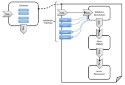
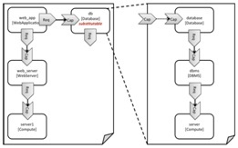
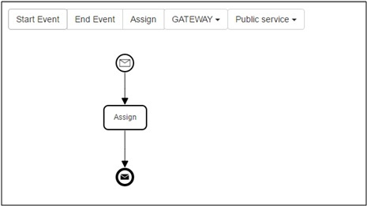

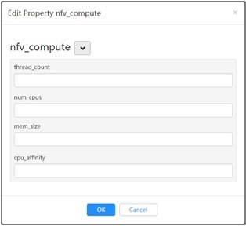
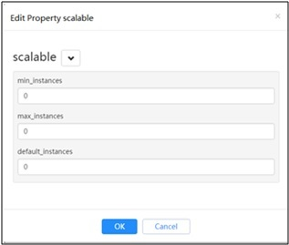
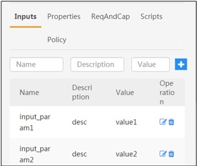
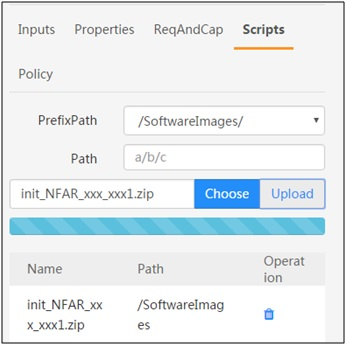
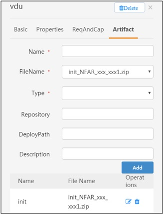
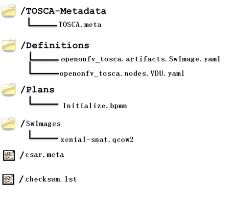
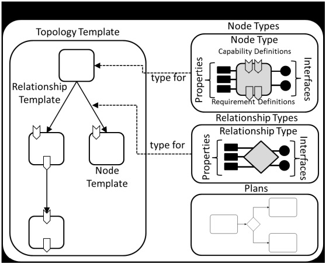
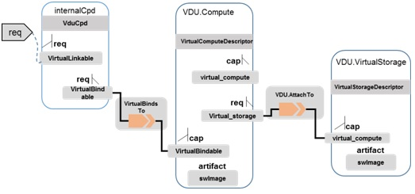
