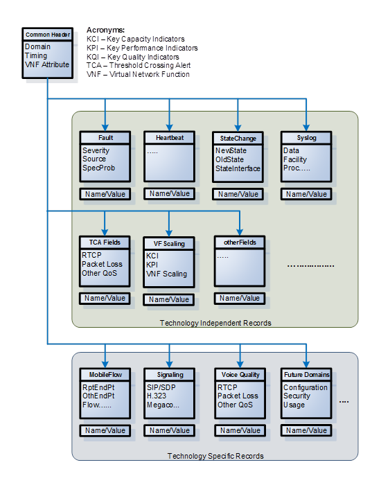

.. contents::
   :depth: 3
..

**VNF Management Requirements for ONAP**

+-----------------+-------------+
+-----------------+-------------+
| Revision        | 2017-2      |
+-----------------+-------------+
| Revision Date   | 6/30/2017   |
+-----------------+-------------+

**Document Revision History**

+-------------+------------+------------------------------------------------------------------------------------------+
| Date        | Revision   | Description                                                                              |
+=============+============+==========================================================================================+
| 2/1/2017    | 1.0        | Initial publication defining VNF Management Requirements for ONAP                        |
+-------------+------------+------------------------------------------------------------------------------------------+
| 3/31/2017   | 1.1        | Updates to reflect name change from OpenECOMP to ONAP                                    |
+-------------+------------+------------------------------------------------------------------------------------------+
| 6/30/2017   | 2017-2     | Updates to Monitoring and Management requirements                                        |
|             |            |                                                                                          |
|             |            | -  Section 4.2                                                                           |
|             |            |                                                                                          |
|             |            | -  Update to verbiage on Data Model                                                      |
|             |            |                                                                                          |
|             |            | -  break out common events and domain-specific events                                    |
|             |            |                                                                                          |
|             |            | -  update to data model drawing                                                          |
|             |            |                                                                                          |
|             |            | -  Section 4.3                                                                           |
|             |            |                                                                                          |
|             |            |    -  new domains and description updates                                                |
|             |            |                                                                                          |
|             |            |    -  re-ordering to sub-sections                                                        |
|             |            |                                                                                          |
|             |            | Update to Configuration Management requirements to include Chef and Ansible              |
|             |            |                                                                                          |
|             |            | -  Section 2                                                                             |
|             |            |                                                                                          |
|             |            |    -  Update Design Definition requirements for resource Configuration                   |
|             |            |                                                                                          |
|             |            |    -  New Appendix A in support of Chef Design definition requirements                   |
|             |            |                                                                                          |
|             |            |    -  New Appendix B in support of Ansible Design definition requirements                |
|             |            |                                                                                          |
|             |            | -  Section 3.3                                                                           |
|             |            |                                                                                          |
|             |            |    -  New section 3.3 to describe requirements in support of Chef interface to VNFs      |
|             |            |                                                                                          |
|             |            | -  Section 3.4                                                                           |
|             |            |                                                                                          |
|             |            |    -  New section 3.4 to describe requirements in support of Ansible interface to VNFs   |
|             |            |                                                                                          |
|             |            |    -  New Appendix D in support requirements for optional Ansible Server                 |
|             |            |                                                                                          |
|             |            | -  Section 3.5                                                                           |
|             |            |                                                                                          |
|             |            |    -  Include VNF operations for support of Chef and Ansible interfaces                  |
|             |            |                                                                                          |
|             |            | Update to Licensing requirements to include Licensing Meta data definition               |
|             |            |                                                                                          |
|             |            | -  Section 2                                                                             |
|             |            |                                                                                          |
|             |            |    -  Update Design Definition requirements for Licensing                                |
|             |            |                                                                                          |
|             |            |    -  New Appendix C to describe Licensing data requirements for Design Definition       |
+-------------+------------+------------------------------------------------------------------------------------------+

Introduction
============

This document is part of a hierarchy of documents that describes the
overall Requirements and Guidelines for ONAP (Open Network Automation
Platform). The diagram below identifies where this document fits in the
hierarchy.

+---------------------------------------------+----------------------------------------+-------------------------------------------+------------------------------+---------------------------------+
| ONAP Requirements and Guidelines                                                                                                                                                                  |
+=============================================+========================================+===========================================+==============================+=================================+
| VNF Guidelines for Network Cloud and ONAP   | Future ONAP Subject Documents                                                                                                                       |
+---------------------------------------------+----------------------------------------+-------------------------------------------+------------------------------+---------------------------------+
| VNF Cloud Readiness Requirements for ONAP   | VNF Management Requirements for ONAP   | VNF Heat Template Requirements for ONAP   | Future                       | Future Requirements Documents   |
|                                             |                                        |                                           | VNF Requirements Documents   |                                 |
+---------------------------------------------+----------------------------------------+-------------------------------------------+------------------------------+---------------------------------+

Document summary:

*VNF Guidelines for Network Cloud and ONAP*

-  Describes VNF environment and overview of requirements

*VNF Cloud Readiness Requirements for ONAP*

-  Cloud readiness requirements for VNFs (Design, Resiliency, Security,
   and DevOps)

**VNF Management Requirements for ONAP**

-  Requirements for how VNFs interact and utilize ONAP

*VNF Heat Template Requirements for ONAP*

-  Provides recommendations and standards for building Heat templates
   compatible with ONAP– initial implementations of Network Cloud are
   assumed to be OpenStack based.

Feedback on or questions about the content of this document may be sent
to the following email address: VNFGuidelines@list.att.com.

The ONAP platform is the part of the larger Network Function
Virtualization/Software Defined Network (NFV/SDN) ecosystem that is
responsible for the efficient control, operation and management of
Virtual Network Function (VNF) capabilities and functions. It specifies
standardized abstractions and interfaces that enable efficient
interoperation of the NVF/SDN ecosystem components. It enables
product/service independent capabilities for design, creation and
runtime lifecycle management (includes all aspects of installation,
change management, assurance, and retirement) of resources in NFV/SDN
environment (see `ECOMP white paper <http://att.com/ecomp>`__\  [1]_).
These capabilities are provided using two major architectural
frameworks: (1) a Design Time Framework to design, define and program
the platform (uniform onboarding), and (2) a Runtime Execution Framework
to execute the logic programmed in the design environment (uniform
delivery and runtime lifecycle management). The platform delivers an
integrated information model based on the VNF package to express the
characteristics and behavior of these resources in the Design Time
Framework. The information model is utilized by Runtime Execution
Framework to manage the runtime lifecycle of the VNFs. The management
processes are orchestrated across various modules of ONAP to
instantiate, configure, scale, monitor, and reconfigure the VNFs using a
set of standard APIs provided by the VNF developers.

Design Definition
=================

The ONAP Design Time Framework provides the ability to design NFV
resources including VNFs, Services, and products. The vendor must
provide VNF packages that include a rich set of recipes, management and
functional interfaces, policies, configuration parameters, and
infrastructure requirements that can be utilized by the ONAP Design
module to onboard and catalog these resources. Initially this
information may be provided in documents, but in the near future a
method will be developed to automate as much of the transfer of data as
possible to satisfy its long term requirements.

The current VNF Package Requirement is based on a subset of the
Requirements contained in the ETSI Document: ETSI GS NFV-MAN 001 v1.1.1
and GS NFV IFA011 V0.3.0 (2015-10) - Network Functions Virtualization
(NFV), Management and Orchestration, VNF Packaging Specification.

Table 1. VNF Package

+--------------------------+-------------------------------------------------------------------------------------------------------------------------------------------------------------------------------------------------------------------------------------------------------------------------------------------------------------------------------------------------------------------------------------------------------------------+------------+------------+
| **Principle**            | **Description**                                                                                                                                                                                                                                                                                                                                                                                                   | **Type**   | **ID#**    |
+==========================+===================================================================================================================================================================================================================================================================================================================================================================================================================+============+============+
| Resource                 | The VNF Vendor must provide a Manifest File that contains a list of all the components in the VNF package.                                                                                                                                                                                                                                                                                                        | Must       | 10010      |
|                          |                                                                                                                                                                                                                                                                                                                                                                                                                   |            |            |
| Description              |                                                                                                                                                                                                                                                                                                                                                                                                                   |            |            |
+--------------------------+-------------------------------------------------------------------------------------------------------------------------------------------------------------------------------------------------------------------------------------------------------------------------------------------------------------------------------------------------------------------------------------------------------------------+------------+------------+
|                          | The package must include VNF Identification Data to uniquely identify the resource for a given Vendor. The identification data must include: an identifier for the VNF, the name of the VNF as was given by the VNF Vendor, VNF description, VNF Vendor, and version.                                                                                                                                             | Must       | 10020      |
+--------------------------+-------------------------------------------------------------------------------------------------------------------------------------------------------------------------------------------------------------------------------------------------------------------------------------------------------------------------------------------------------------------------------------------------------------------+------------+------------+
|                          | The VNF Vendor must provide documentation describing VNF Management APIs. The document must include information and tools for:                                                                                                                                                                                                                                                                                    | Must       | 10030      |
|                          |                                                                                                                                                                                                                                                                                                                                                                                                                   |            |            |
|                          | -  ONAP to deploy and configure (initially and ongoing) the VNF application(s) (e.g., NETCONF APIs). Includes description of configurable parameters for the VNF and whether the parameters can be configured after VNF instantiation.                                                                                                                                                                            |            |            |
|                          |                                                                                                                                                                                                                                                                                                                                                                                                                   |            |            |
|                          | -  ONAP to monitor the health of the VNF (conditions that require healing and/or scaling responses). Includes a description of:                                                                                                                                                                                                                                                                                   |            |            |
|                          |                                                                                                                                                                                                                                                                                                                                                                                                                   |            |            |
|                          |    -  Parameters that can be monitored for the VNF and event records (status, fault, flow, session, call, control plane, etc.) generated by the VNF after instantiation.                                                                                                                                                                                                                                          |            |            |
|                          |                                                                                                                                                                                                                                                                                                                                                                                                                   |            |            |
|                          |    -  Runtime lifecycle events and related actions (e.g., control responses, tests) which can be performed for the VNF.                                                                                                                                                                                                                                                                                           |            |            |
+--------------------------+-------------------------------------------------------------------------------------------------------------------------------------------------------------------------------------------------------------------------------------------------------------------------------------------------------------------------------------------------------------------------------------------------------------------+------------+------------+
|                          | The VNF package must include documentation describing VNF Functional APIs that are utilized to build network and application services. This document describes the externally exposed functional inputs and outputs for the VNF, including interface format and protocols supported.                                                                                                                              | Must       | 10040      |
+--------------------------+-------------------------------------------------------------------------------------------------------------------------------------------------------------------------------------------------------------------------------------------------------------------------------------------------------------------------------------------------------------------------------------------------------------------+------------+------------+
|                          | The VNF Vendor must provide documentation describing VNF Functional Capabilities that are utilized to operationalize the VNF and compose complex services.                                                                                                                                                                                                                                                        | Must       | 10050      |
+--------------------------+-------------------------------------------------------------------------------------------------------------------------------------------------------------------------------------------------------------------------------------------------------------------------------------------------------------------------------------------------------------------------------------------------------------------+------------+------------+
|                          | The VNF Vendor must provide information regarding any dependency (e.g., affinity, anti-affinity) with other VNFs and resources.                                                                                                                                                                                                                                                                                   | Must       | 10060      |
+--------------------------+-------------------------------------------------------------------------------------------------------------------------------------------------------------------------------------------------------------------------------------------------------------------------------------------------------------------------------------------------------------------------------------------------------------------+------------+------------+
| Resource                 | The VNF Vendor must support and provide artifacts for configuration management using at least one of the following technologies:                                                                                                                                                                                                                                                                                  | Must       | 10070      |
|                          |                                                                                                                                                                                                                                                                                                                                                                                                                   |            |            |
| Configuration            | -  Netconf/YANG                                                                                                                                                                                                                                                                                                                                                                                                   |            |            |
|                          |                                                                                                                                                                                                                                                                                                                                                                                                                   |            |            |
|                          | -  Chef                                                                                                                                                                                                                                                                                                                                                                                                           |            |            |
|                          |                                                                                                                                                                                                                                                                                                                                                                                                                   |            |            |
|                          | -  Ansible                                                                                                                                                                                                                                                                                                                                                                                                        |            |            |
|                          |                                                                                                                                                                                                                                                                                                                                                                                                                   |            |            |
|                          | Note: The requirements for Netconf/YANG, Chef, and Ansible protocols are provided separately and must be supported only if the corresponding protocol option is provided by the vendor.                                                                                                                                                                                                                           |            |            |
+--------------------------+-------------------------------------------------------------------------------------------------------------------------------------------------------------------------------------------------------------------------------------------------------------------------------------------------------------------------------------------------------------------------------------------------------------------+------------+------------+
|                          | **Configuration Management via Netconf/YANG**                                                                                                                                                                                                                                                                                                                                                                     | Must       | 10071      |
|                          |                                                                                                                                                                                                                                                                                                                                                                                                                   |            |            |
|                          | The VNF Vendor must provide a Resource/Device YANG model as a foundation for creating the YANG model for configuration. This will include VNF attributes/parameters and valid values/attributes configurable by policy.                                                                                                                                                                                           |            |            |
+--------------------------+-------------------------------------------------------------------------------------------------------------------------------------------------------------------------------------------------------------------------------------------------------------------------------------------------------------------------------------------------------------------------------------------------------------------+------------+------------+
|                          | **Configuration Management via Chef**                                                                                                                                                                                                                                                                                                                                                                             | Must       | 10072      |
|                          |                                                                                                                                                                                                                                                                                                                                                                                                                   |            |            |
|                          | -  VNF Vendor must provide cookbooks to be loaded on the appropriate Chef Server.                                                                                                                                                                                                                                                                                                                                 |            |            |
|                          |                                                                                                                                                                                                                                                                                                                                                                                                                   |            |            |
|                          | -  The VNF Vendor is required to provide a JSON file for each supported action for the VNF. The JSON file must contain key value pairs with all relevant values populated with sample data that illustrates its usage. The fields and their description are defined in Appendix A.                                                                                                                                |            |            |
|                          |                                                                                                                                                                                                                                                                                                                                                                                                                   |            |            |
|                          | Note: Chef support in ONAP is not currently available and planned for 4Q 2017.                                                                                                                                                                                                                                                                                                                                    |            |            |
+--------------------------+-------------------------------------------------------------------------------------------------------------------------------------------------------------------------------------------------------------------------------------------------------------------------------------------------------------------------------------------------------------------------------------------------------------------+------------+------------+
|                          | **Configuration Management via Ansible**                                                                                                                                                                                                                                                                                                                                                                          | Must       | 10073      |
|                          |                                                                                                                                                                                                                                                                                                                                                                                                                   |            |            |
|                          | -  VNF Vendor must provide playbooks to be loaded on the appropriate Ansible Server.                                                                                                                                                                                                                                                                                                                              |            |            |
|                          |                                                                                                                                                                                                                                                                                                                                                                                                                   |            |            |
|                          | -  The VNF Vendor is required to provide a JSON file for each supported action for the VNF. The JSON file must contain key value pairs with all relevant values populated with sample data that illustrates its usage. The fields and their description are defined in Appendix B.                                                                                                                                |            |            |
|                          |                                                                                                                                                                                                                                                                                                                                                                                                                   |            |            |
|                          | Note: Ansible support in ONAP is not currently available and planned for 4Q 2017.                                                                                                                                                                                                                                                                                                                                 |            |            |
+--------------------------+-------------------------------------------------------------------------------------------------------------------------------------------------------------------------------------------------------------------------------------------------------------------------------------------------------------------------------------------------------------------------------------------------------------------+------------+------------+
|                          | The VNF Package must include configuration scripts for boot sequence and configuration.                                                                                                                                                                                                                                                                                                                           | Must       | 10080      |
+--------------------------+-------------------------------------------------------------------------------------------------------------------------------------------------------------------------------------------------------------------------------------------------------------------------------------------------------------------------------------------------------------------------------------------------------------------+------------+------------+
|                          | The VNF Vendor must provide configurable parameters (if unable to conform to YANG model) including VNF attributes/parameters and valid values, dynamic attributes and cross parameter dependencies (e.g., customer provisioning data).                                                                                                                                                                            | Must       | 10090      |
+--------------------------+-------------------------------------------------------------------------------------------------------------------------------------------------------------------------------------------------------------------------------------------------------------------------------------------------------------------------------------------------------------------------------------------------------------------+------------+------------+
| Resource                 | The VNF Vendor must provide documentation for the VNF Policy Description to manage the VNF runtime lifecycle. The document must include a description of how the policies (conditions and actions) are implemented in the VNF.                                                                                                                                                                                    | Must       | 10100      |
|                          |                                                                                                                                                                                                                                                                                                                                                                                                                   |            |            |
| Control Loop             |                                                                                                                                                                                                                                                                                                                                                                                                                   |            |            |
+--------------------------+-------------------------------------------------------------------------------------------------------------------------------------------------------------------------------------------------------------------------------------------------------------------------------------------------------------------------------------------------------------------------------------------------------------------+------------+------------+
|                          | The VNF Package must include documentation describing the fault, performance, capacity events/alarms and other event records that are made available by the VNF. The document must include:                                                                                                                                                                                                                       | Must       | 10110      |
|                          |                                                                                                                                                                                                                                                                                                                                                                                                                   |            |            |
|                          | -  A unique identification string for the specific VNF, a description of the problem that caused the error, and steps or procedures to perform Root Cause Analysis and resolve the issue.                                                                                                                                                                                                                         |            |            |
|                          |                                                                                                                                                                                                                                                                                                                                                                                                                   |            |            |
|                          | -  All events, severity level (e.g., informational, warning, error) and descriptions including causes/fixes if applicable for the event.                                                                                                                                                                                                                                                                          |            |            |
|                          |                                                                                                                                                                                                                                                                                                                                                                                                                   |            |            |
|                          | -  All events (fault, measurement for VNF Scaling, Syslogs, State Change and Mobile Flow), that need to be collected at each VM, VNFC (defined in *VNF Guidelines for Network Cloud and ONAP*) and for the overall VNF.                                                                                                                                                                                           |            |            |
+--------------------------+-------------------------------------------------------------------------------------------------------------------------------------------------------------------------------------------------------------------------------------------------------------------------------------------------------------------------------------------------------------------------------------------------------------------+------------+------------+
|                          | The VNF Vendor must provide an XML file that contains a list of VNF error codes, descriptions of the error, and possible causes/corrective action.                                                                                                                                                                                                                                                                | Must       | 10120      |
+--------------------------+-------------------------------------------------------------------------------------------------------------------------------------------------------------------------------------------------------------------------------------------------------------------------------------------------------------------------------------------------------------------------------------------------------------------+------------+------------+
|                          | Provide documentation describing all parameters that are available to monitor the VNF after instantiation (includes all counters, OIDs, PM data, KPIs, etc.) that must be collected for reporting purposes. The documentation must include a list of:                                                                                                                                                             | Must       | 10130      |
|                          |                                                                                                                                                                                                                                                                                                                                                                                                                   |            |            |
|                          | -  Monitoring parameters/counters exposed for virtual resource management and VNF application management.                                                                                                                                                                                                                                                                                                         |            |            |
|                          |                                                                                                                                                                                                                                                                                                                                                                                                                   |            |            |
|                          | -  KPIs and metrics that need to be collected at each VM for capacity planning and performance management purposes.                                                                                                                                                                                                                                                                                               |            |            |
|                          |                                                                                                                                                                                                                                                                                                                                                                                                                   |            |            |
|                          | -  The monitoring parameters must include latencies, success rates, retry rates, load and quality (e.g., DPM) for the key transactions/functions supported by the VNF and those that must be exercised by the VNF in order to perform its function.                                                                                                                                                               |            |            |
|                          |                                                                                                                                                                                                                                                                                                                                                                                                                   |            |            |
|                          | -  For each KPI, provide lower and upper limits.                                                                                                                                                                                                                                                                                                                                                                  |            |            |
|                          |                                                                                                                                                                                                                                                                                                                                                                                                                   |            |            |
|                          | -  When relevant, provide a threshold crossing alert point for each KPI and describe the significance of the threshold crossing.                                                                                                                                                                                                                                                                                  |            |            |
|                          |                                                                                                                                                                                                                                                                                                                                                                                                                   |            |            |
|                          | -  For each KPI, identify the suggested actions that need to be performed when a threshold crossing alert event is recorded.                                                                                                                                                                                                                                                                                      |            |            |
|                          |                                                                                                                                                                                                                                                                                                                                                                                                                   |            |            |
|                          | -  Describe any requirements for the monitoring component of tools for Network Cloud automation and management to provide these records to components of the VNF.                                                                                                                                                                                                                                                 |            |            |
|                          |                                                                                                                                                                                                                                                                                                                                                                                                                   |            |            |
|                          | -  When applicable, provide calculators needed to convert raw data into appropriate reporting artifacts.                                                                                                                                                                                                                                                                                                          |            |            |
+--------------------------+-------------------------------------------------------------------------------------------------------------------------------------------------------------------------------------------------------------------------------------------------------------------------------------------------------------------------------------------------------------------------------------------------------------------+------------+------------+
|                          | The VNF Package must include documentation describing supported VNF scaling capabilities and capacity limits (e.g., number of users, bandwidth, throughput, concurrent calls).                                                                                                                                                                                                                                    | Must       | 10140      |
+--------------------------+-------------------------------------------------------------------------------------------------------------------------------------------------------------------------------------------------------------------------------------------------------------------------------------------------------------------------------------------------------------------------------------------------------------------+------------+------------+
|                          | The VNF Package must include documentation describing the characteristics for the VNF reliability and high availability.                                                                                                                                                                                                                                                                                          | Must       | 10150      |
+--------------------------+-------------------------------------------------------------------------------------------------------------------------------------------------------------------------------------------------------------------------------------------------------------------------------------------------------------------------------------------------------------------------------------------------------------------+------------+------------+
|                          | The VNF vendor must provide an artifact per VNF that contains all of the VNF Event Records supported. The artifact should include reference to the specific release of the VNF Event Stream Common Event Data Model document it is based on. ( `AT&T Service Specification; Service: VES Event Listener <https://github.com/att/evel-test-collector/tree/master/docs/att_interface_definition>`__)                | Must       | 10151      |
+--------------------------+-------------------------------------------------------------------------------------------------------------------------------------------------------------------------------------------------------------------------------------------------------------------------------------------------------------------------------------------------------------------------------------------------------------------+------------+------------+
| Compute,                 | The VNF Package must include VNF topology that describes basic network and application connectivity internal and external to the VNF including Link type, KPIs, Bandwidth, latency, jitter, QoS (if applicable) for each interface.                                                                                                                                                                               | Must       | 10160      |
|                          |                                                                                                                                                                                                                                                                                                                                                                                                                   |            |            |
| Network,                 |                                                                                                                                                                                                                                                                                                                                                                                                                   |            |            |
|                          |                                                                                                                                                                                                                                                                                                                                                                                                                   |            |            |
| Storage                  |                                                                                                                                                                                                                                                                                                                                                                                                                   |            |            |
|                          |                                                                                                                                                                                                                                                                                                                                                                                                                   |            |            |
| Requirements             |                                                                                                                                                                                                                                                                                                                                                                                                                   |            |            |
+--------------------------+-------------------------------------------------------------------------------------------------------------------------------------------------------------------------------------------------------------------------------------------------------------------------------------------------------------------------------------------------------------------------------------------------------------------+------------+------------+
|                          | The VNF Package must include VM requirements via a Heat template that provides the necessary data for:                                                                                                                                                                                                                                                                                                            | Must       | 10170      |
|                          |                                                                                                                                                                                                                                                                                                                                                                                                                   |            |            |
|                          | -  VM specifications for all VNF components - for hypervisor, CPU, memory, storage.                                                                                                                                                                                                                                                                                                                               |            |            |
|                          |                                                                                                                                                                                                                                                                                                                                                                                                                   |            |            |
|                          | -  Network connections, interface connections, internal and external to VNF.                                                                                                                                                                                                                                                                                                                                      |            |            |
|                          |                                                                                                                                                                                                                                                                                                                                                                                                                   |            |            |
|                          | -  High availability redundancy model.                                                                                                                                                                                                                                                                                                                                                                            |            |            |
|                          |                                                                                                                                                                                                                                                                                                                                                                                                                   |            |            |
|                          | -  Scaling/growth VM specifications.                                                                                                                                                                                                                                                                                                                                                                              |            |            |
|                          |                                                                                                                                                                                                                                                                                                                                                                                                                   |            |            |
|                          | Note: Must comply with the *VNF Heat Template Requirements for ONAP*.                                                                                                                                                                                                                                                                                                                                             |            |            |
+--------------------------+-------------------------------------------------------------------------------------------------------------------------------------------------------------------------------------------------------------------------------------------------------------------------------------------------------------------------------------------------------------------------------------------------------------------+------------+------------+
|                          | The VNF Vendor must provide the binaries and images needed to instantiate the VNF (VNF and VNFC images).                                                                                                                                                                                                                                                                                                          | Must       | 10180      |
+--------------------------+-------------------------------------------------------------------------------------------------------------------------------------------------------------------------------------------------------------------------------------------------------------------------------------------------------------------------------------------------------------------------------------------------------------------+------------+------------+
|                          | The VNF Vendor must describe scaling capabilities to manage scaling characteristics of the VNF.                                                                                                                                                                                                                                                                                                                   | Must       | 10190      |
+--------------------------+-------------------------------------------------------------------------------------------------------------------------------------------------------------------------------------------------------------------------------------------------------------------------------------------------------------------------------------------------------------------------------------------------------------------+------------+------------+
| Testing                  | The VNF Package must include documentation describing the tests that were conducted by the Vendor and the test results.                                                                                                                                                                                                                                                                                           | Must       | 10200      |
+--------------------------+-------------------------------------------------------------------------------------------------------------------------------------------------------------------------------------------------------------------------------------------------------------------------------------------------------------------------------------------------------------------------------------------------------------------+------------+------------+
|                          | The VNF Vendor must provide their testing scripts to support testing.                                                                                                                                                                                                                                                                                                                                             | Must       | 10210      |
+--------------------------+-------------------------------------------------------------------------------------------------------------------------------------------------------------------------------------------------------------------------------------------------------------------------------------------------------------------------------------------------------------------------------------------------------------------+------------+------------+
|                          | The VNF Vendor must provide software components that can be packaged with/near the VNF, if needed, to simulate any functions or systems that connect to the VNF system under test. This component is necessary only if the existing testing environment does not have the necessary simulators.                                                                                                                   | Must       | 10220      |
+--------------------------+-------------------------------------------------------------------------------------------------------------------------------------------------------------------------------------------------------------------------------------------------------------------------------------------------------------------------------------------------------------------------------------------------------------------+------------+------------+
| Licensing Requirements   | VNFs must provide metrics (e.g., number of sessions, number of subscribers, number of seats, etc.) to ONAP for tracking every license.                                                                                                                                                                                                                                                                            | Must       | 10230      |
+--------------------------+-------------------------------------------------------------------------------------------------------------------------------------------------------------------------------------------------------------------------------------------------------------------------------------------------------------------------------------------------------------------------------------------------------------------+------------+------------+
|                          | Contract shall define the reporting process and the available reporting tools. The vendor will have to agree to the process that can be met by Service Provider reporting infrastructure.                                                                                                                                                                                                                         | Must       | 10240      |
+--------------------------+-------------------------------------------------------------------------------------------------------------------------------------------------------------------------------------------------------------------------------------------------------------------------------------------------------------------------------------------------------------------------------------------------------------------+------------+------------+
|                          | VNF vendors shall enumerate all of the open source licenses their VNF(s) incorporate.                                                                                                                                                                                                                                                                                                                             | Must       | 10250      |
+--------------------------+-------------------------------------------------------------------------------------------------------------------------------------------------------------------------------------------------------------------------------------------------------------------------------------------------------------------------------------------------------------------------------------------------------------------+------------+------------+
|                          | Audits of Service Provider’s business must not be required.                                                                                                                                                                                                                                                                                                                                                       | Must       | 10260      |
+--------------------------+-------------------------------------------------------------------------------------------------------------------------------------------------------------------------------------------------------------------------------------------------------------------------------------------------------------------------------------------------------------------------------------------------------------------+------------+------------+
|                          | Vendor functions and metrics that require additional infrastructure such as a vendor license server for deployment shall not be supported.                                                                                                                                                                                                                                                                        | Must       | 10270      |
+--------------------------+-------------------------------------------------------------------------------------------------------------------------------------------------------------------------------------------------------------------------------------------------------------------------------------------------------------------------------------------------------------------------------------------------------------------+------------+------------+
|                          | Provide clear measurements for licensing purposes to allow automated scale up/down by the management system.                                                                                                                                                                                                                                                                                                      | Must       | 10280      |
+--------------------------+-------------------------------------------------------------------------------------------------------------------------------------------------------------------------------------------------------------------------------------------------------------------------------------------------------------------------------------------------------------------------------------------------------------------+------------+------------+
|                          | The vendor must provide the ability to scale up a vendor supplied product during growth and scale down a vendor supplied product during decline without “real-time” restrictions based upon vendor permissions.                                                                                                                                                                                                   | Must       | 10290      |
+--------------------------+-------------------------------------------------------------------------------------------------------------------------------------------------------------------------------------------------------------------------------------------------------------------------------------------------------------------------------------------------------------------------------------------------------------------+------------+------------+
|                          | A universal license key must be provided per VNF to be used as needed by services (i.e., not tied to a VM instance) as the recommended solution. The vendor may provide pools of Unique VNF License Keys, where there is a unique key for each VNF instance as an alternate solution. Licensing issues should be resolved without interrupting in-service VNFs.                                                   | Must       | 10300      |
+--------------------------+-------------------------------------------------------------------------------------------------------------------------------------------------------------------------------------------------------------------------------------------------------------------------------------------------------------------------------------------------------------------------------------------------------------------+------------+------------+
|                          | The VNF Vendor must support the metadata about licenses (and their applicable entitlements) as defined in this document for VNF software, and any license keys required to authorize use of the VNF software. This metadata will be used to facilitate onboarding the VNF into the ONAP environment and automating processes for putting the licenses into use and managing the full lifecycle of the licenses.   | Must       | 10310      |
|                          |                                                                                                                                                                                                                                                                                                                                                                                                                   |            |            |
|                          | The details of this license model are described in Appendix C.                                                                                                                                                                                                                                                                                                                                                    |            |            |
|                          |                                                                                                                                                                                                                                                                                                                                                                                                                   |            |            |
|                          | Note: License metadata support in ONAP is not currently available and planned for 1Q 2018.                                                                                                                                                                                                                                                                                                                        |            |            |
+--------------------------+-------------------------------------------------------------------------------------------------------------------------------------------------------------------------------------------------------------------------------------------------------------------------------------------------------------------------------------------------------------------------------------------------------------------+------------+------------+

Configuration Management
========================

ONAP interacts directly with VNFs through its Network and Application
Adapters to perform configuration activities within NFV environment.
These activities include service and resource
configuration/reconfiguration, automated scaling of resources, service
and resource removal to support runtime lifecycle management of VNFs and
services. The Adapters employ a model driven approach along with
standardized APIs provided by the VNF developers to configure resources
and manage their runtime lifecycle.

NETCONF Standards and Capabilities
----------------------------------

ONAP Controllers and their Adapters utilize device YANG model and
NETCONF APIs to make the required changes in the VNF state and
configuration. The VNF providers must provide the Device YANG model and
NETCONF server supporting NETCONF APIs to comply with target ONAP and
industry standards.

**Table 2. VNF Configuration via NETCONF**

+-----------------+-----------------------------------------------------------------------------------------------------------------------------------------------------------------------------------------------------------------------------------------------------------------------------------------------------------------------------------------------------------------------------------------------------------------------------------------------------------------------------------------------------------------------+------------+------------+
| **Principle**   | **Description**                                                                                                                                                                                                                                                                                                                                                                                                                                                                                                       | **Type**   | **ID #**   |
+=================+=======================================================================================================================================================================================================================================================================================================================================================================================================================================================================================================================+============+============+
| Configuration   | Virtual Network functions (VNFs) must include a NETCONF server enabling runtime configuration and lifecycle management capabilities. The NETCONF server embedded in VNFs shall provide a NETCONF interface fully defined by supplied YANG models.                                                                                                                                                                                                                                                                     | Must       | 11010      |
|                 |                                                                                                                                                                                                                                                                                                                                                                                                                                                                                                                       |            |            |
| Management      |                                                                                                                                                                                                                                                                                                                                                                                                                                                                                                                       |            |            |
+-----------------+-----------------------------------------------------------------------------------------------------------------------------------------------------------------------------------------------------------------------------------------------------------------------------------------------------------------------------------------------------------------------------------------------------------------------------------------------------------------------------------------------------------------------+------------+------------+
| NETCONF         | NETCONF server connection parameters shall be configurable during virtual machine instantiation through Heat templates where SSH keys, usernames, passwords, SSH service and SSH port numbers are Heat template parameters.                                                                                                                                                                                                                                                                                           | Must       | 11020      |
|                 |                                                                                                                                                                                                                                                                                                                                                                                                                                                                                                                       |            |            |
| Server          |                                                                                                                                                                                                                                                                                                                                                                                                                                                                                                                       |            |            |
|                 |                                                                                                                                                                                                                                                                                                                                                                                                                                                                                                                       |            |            |
| Requirements    |                                                                                                                                                                                                                                                                                                                                                                                                                                                                                                                       |            |            |
+-----------------+-----------------------------------------------------------------------------------------------------------------------------------------------------------------------------------------------------------------------------------------------------------------------------------------------------------------------------------------------------------------------------------------------------------------------------------------------------------------------------------------------------------------------+------------+------------+
|                 | Following protocol operations must be implemented:                                                                                                                                                                                                                                                                                                                                                                                                                                                                    | Must       | 11030      |
|                 |                                                                                                                                                                                                                                                                                                                                                                                                                                                                                                                       |            |            |
|                 | **close-session()**- Gracefully close the current session.                                                                                                                                                                                                                                                                                                                                                                                                                                                            |            |            |
|                 |                                                                                                                                                                                                                                                                                                                                                                                                                                                                                                                       |            |            |
|                 |     **commit(confirmed, confirm-timeout)** - Commit candidate configuration datastore to the running configuration.                                                                                                                                                                                                                                                                                                                                                                                                   |            |            |
|                 |                                                                                                                                                                                                                                                                                                                                                                                                                                                                                                                       |            |            |
|                 |     **discard-changes()** - Revert the candidate configuration datastore to the running configuration                                                                                                                                                                                                                                                                                                                                                                                                                 |            |            |
|                 |                                                                                                                                                                                                                                                                                                                                                                                                                                                                                                                       |            |            |
|                 |     **edit-config(target, default-operation, test-option, error-option, config)** - Edit the target configuration datastore by merging, replacing, creating, or deleting new config elements.                                                                                                                                                                                                                                                                                                                         |            |            |
|                 |                                                                                                                                                                                                                                                                                                                                                                                                                                                                                                                       |            |            |
|                 |     **get(filter)** - Retrieve (a filtered subset of) the running configuration and device state information. This should include the list of VNF supported schemas.                                                                                                                                                                                                                                                                                                                                                  |            |            |
|                 |                                                                                                                                                                                                                                                                                                                                                                                                                                                                                                                       |            |            |
|                 |     **get-config(source, filter)** - Retrieve a (filtered subset of a) configuration from the configuration datastore source.                                                                                                                                                                                                                                                                                                                                                                                         |            |            |
|                 |                                                                                                                                                                                                                                                                                                                                                                                                                                                                                                                       |            |            |
|                 |     **kill-session(session)** - Force the termination of **session**.                                                                                                                                                                                                                                                                                                                                                                                                                                                 |            |            |
|                 |                                                                                                                                                                                                                                                                                                                                                                                                                                                                                                                       |            |            |
|                 | **lock(target)** - Lock the configuration datastore target.                                                                                                                                                                                                                                                                                                                                                                                                                                                           |            |            |
|                 |                                                                                                                                                                                                                                                                                                                                                                                                                                                                                                                       |            |            |
|                 |     **unlock(target)** - Unlock the configuration datastore target.                                                                                                                                                                                                                                                                                                                                                                                                                                                   |            |            |
+-----------------+-----------------------------------------------------------------------------------------------------------------------------------------------------------------------------------------------------------------------------------------------------------------------------------------------------------------------------------------------------------------------------------------------------------------------------------------------------------------------------------------------------------------------+------------+------------+
|                 | Following protocol operations should be implemented:                                                                                                                                                                                                                                                                                                                                                                                                                                                                  | Should     | 11040      |
|                 |                                                                                                                                                                                                                                                                                                                                                                                                                                                                                                                       |            |            |
|                 |     **copy-config(target, source) -** Copy the content of the configuration datastore source to the configuration datastore target.                                                                                                                                                                                                                                                                                                                                                                                   |            |            |
|                 |                                                                                                                                                                                                                                                                                                                                                                                                                                                                                                                       |            |            |
|                 |     **delete-config(target) -** Delete the named configuration datastore target.                                                                                                                                                                                                                                                                                                                                                                                                                                      |            |            |
|                 |                                                                                                                                                                                                                                                                                                                                                                                                                                                                                                                       |            |            |
|                 |     **get-schema(identifier, version, format) -** Retrieve the YANG schema.                                                                                                                                                                                                                                                                                                                                                                                                                                           |            |            |
+-----------------+-----------------------------------------------------------------------------------------------------------------------------------------------------------------------------------------------------------------------------------------------------------------------------------------------------------------------------------------------------------------------------------------------------------------------------------------------------------------------------------------------------------------------+------------+------------+
|                 | All configuration data shall be editable through a NETCONF <*edit-config*> operation. Proprietary NETCONF RPCs that make configuration changes are not sufficient.                                                                                                                                                                                                                                                                                                                                                    | Must       | 11050      |
+-----------------+-----------------------------------------------------------------------------------------------------------------------------------------------------------------------------------------------------------------------------------------------------------------------------------------------------------------------------------------------------------------------------------------------------------------------------------------------------------------------------------------------------------------------+------------+------------+
|                 | By default, the entire configuration of the VNF must be retrievable via NETCONF's <get-config> and <edit-config>, independently of whether it was configured via NETCONF or other mechanisms.                                                                                                                                                                                                                                                                                                                         | Must       | 11060      |
+-----------------+-----------------------------------------------------------------------------------------------------------------------------------------------------------------------------------------------------------------------------------------------------------------------------------------------------------------------------------------------------------------------------------------------------------------------------------------------------------------------------------------------------------------------+------------+------------+
|                 | The **:partial-lock** and **:partial-unlock** capabilities, defined in RFC 5717 must be supported. This allows multiple independent clients to each write to a different part of the <running> configuration at the same time.                                                                                                                                                                                                                                                                                        | Must       | 11070      |
+-----------------+-----------------------------------------------------------------------------------------------------------------------------------------------------------------------------------------------------------------------------------------------------------------------------------------------------------------------------------------------------------------------------------------------------------------------------------------------------------------------------------------------------------------------+------------+------------+
|                 | The **:rollback-on-error** value for the <error-option> parameter to the <edit-config> operation must be supported. If any error occurs during the requested edit operation, then the target database (usually the running configuration) will be left affected. This provides an 'all-or-nothing' edit mode for a single <edit-config> request.                                                                                                                                                                      | Must       | 11080      |
+-----------------+-----------------------------------------------------------------------------------------------------------------------------------------------------------------------------------------------------------------------------------------------------------------------------------------------------------------------------------------------------------------------------------------------------------------------------------------------------------------------------------------------------------------------+------------+------------+
|                 | The server must support the **:startup** capability. It will allow the running configuration to be copied to this special database. It can also be locked and unlocked.                                                                                                                                                                                                                                                                                                                                               | Must       | 11090      |
+-----------------+-----------------------------------------------------------------------------------------------------------------------------------------------------------------------------------------------------------------------------------------------------------------------------------------------------------------------------------------------------------------------------------------------------------------------------------------------------------------------------------------------------------------------+------------+------------+
|                 | The **:url** value must be supported to specify protocol operation source and target parameters. The capability URI for this feature will indicate which schemes (e.g., file, https, sftp) that the server supports within a particular URL value. The 'file' scheme allows for editable local configuration databases. The other schemes allow for remote storage of configuration databases.                                                                                                                        | Must       | 11100      |
+-----------------+-----------------------------------------------------------------------------------------------------------------------------------------------------------------------------------------------------------------------------------------------------------------------------------------------------------------------------------------------------------------------------------------------------------------------------------------------------------------------------------------------------------------------+------------+------------+
|                 | At least one of the capabilities **:candidate** or **:writable-running** must be implemented. If both **:candidate** and **:writable-running** are provided then two locks should be supported.                                                                                                                                                                                                                                                                                                                       | Must       | 11110      |
+-----------------+-----------------------------------------------------------------------------------------------------------------------------------------------------------------------------------------------------------------------------------------------------------------------------------------------------------------------------------------------------------------------------------------------------------------------------------------------------------------------------------------------------------------------+------------+------------+
|                 | The server must fully support the XPath 1.0 specification for filtered retrieval of configuration and other database contents. The 'type' attribute within the <filter> parameter for <get> and <get-config> operations may be set to 'xpath'. The 'select' attribute (which contains the XPath expression) will also be supported by the server. A server may support partial XPath retrieval filtering, but it cannot advertise the **:xpath** capability unless the entire XPath 1.0 specification is supported.   | Must       | 11120      |
+-----------------+-----------------------------------------------------------------------------------------------------------------------------------------------------------------------------------------------------------------------------------------------------------------------------------------------------------------------------------------------------------------------------------------------------------------------------------------------------------------------------------------------------------------------+------------+------------+
|                 | The **:validate** capability must be implemented.                                                                                                                                                                                                                                                                                                                                                                                                                                                                     | Must       | 11130      |
+-----------------+-----------------------------------------------------------------------------------------------------------------------------------------------------------------------------------------------------------------------------------------------------------------------------------------------------------------------------------------------------------------------------------------------------------------------------------------------------------------------------------------------------------------------+------------+------------+
|                 | If **:candidate** is supported, **:confirmed-commit** must be implemented.                                                                                                                                                                                                                                                                                                                                                                                                                                            | Must       | 11140      |
+-----------------+-----------------------------------------------------------------------------------------------------------------------------------------------------------------------------------------------------------------------------------------------------------------------------------------------------------------------------------------------------------------------------------------------------------------------------------------------------------------------------------------------------------------------+------------+------------+
|                 | The **:with-defaults** capability [RFC6243] shall be implemented.                                                                                                                                                                                                                                                                                                                                                                                                                                                     | Must       | 11150      |
+-----------------+-----------------------------------------------------------------------------------------------------------------------------------------------------------------------------------------------------------------------------------------------------------------------------------------------------------------------------------------------------------------------------------------------------------------------------------------------------------------------------------------------------------------------+------------+------------+
|                 | Data model discovery and download as defined in [RFC6022] shall be implemented.                                                                                                                                                                                                                                                                                                                                                                                                                                       | Must       | 11160      |
+-----------------+-----------------------------------------------------------------------------------------------------------------------------------------------------------------------------------------------------------------------------------------------------------------------------------------------------------------------------------------------------------------------------------------------------------------------------------------------------------------------------------------------------------------------+------------+------------+
|                 | NETCONF Event Notifications [RFC5277] should be implemented.                                                                                                                                                                                                                                                                                                                                                                                                                                                          | Should     | 11170      |
+-----------------+-----------------------------------------------------------------------------------------------------------------------------------------------------------------------------------------------------------------------------------------------------------------------------------------------------------------------------------------------------------------------------------------------------------------------------------------------------------------------------------------------------------------------+------------+------------+
|                 | All data models shall be defined in YANG [RFC6020], and the mapping to NETCONF shall follow the rules defined in this RFC.                                                                                                                                                                                                                                                                                                                                                                                            | Must       | 11180      |
+-----------------+-----------------------------------------------------------------------------------------------------------------------------------------------------------------------------------------------------------------------------------------------------------------------------------------------------------------------------------------------------------------------------------------------------------------------------------------------------------------------------------------------------------------------+------------+------------+
|                 | The data model upgrade rules defined in [RFC6020] section 10 should be followed. All deviations from section 10 rules shall be handled by a built-in automatic upgrade mechanism.                                                                                                                                                                                                                                                                                                                                     | Must       | 11190      |
+-----------------+-----------------------------------------------------------------------------------------------------------------------------------------------------------------------------------------------------------------------------------------------------------------------------------------------------------------------------------------------------------------------------------------------------------------------------------------------------------------------------------------------------------------------+------------+------------+
|                 | The VNF must support parallel and simultaneous configuration of separate objects within itself.                                                                                                                                                                                                                                                                                                                                                                                                                       | Must       | 11200      |
+-----------------+-----------------------------------------------------------------------------------------------------------------------------------------------------------------------------------------------------------------------------------------------------------------------------------------------------------------------------------------------------------------------------------------------------------------------------------------------------------------------------------------------------------------------+------------+------------+
|                 | Locking is required if a common object is being manipulated by two simultaneous NETCONF configuration operations on the same VNF within the context of the same writable running data store (e.g., if an interface parameter is being configured then it should be locked out for configuration by a simultaneous configuration operation on that same interface parameter).                                                                                                                                          | Must       | 11210      |
+-----------------+-----------------------------------------------------------------------------------------------------------------------------------------------------------------------------------------------------------------------------------------------------------------------------------------------------------------------------------------------------------------------------------------------------------------------------------------------------------------------------------------------------------------------+------------+------------+
|                 | Locking must be applied based on the sequence of NETCONF operations, with the first configuration operation locking out all others until completed.                                                                                                                                                                                                                                                                                                                                                                   | Must       | 11220      |
+-----------------+-----------------------------------------------------------------------------------------------------------------------------------------------------------------------------------------------------------------------------------------------------------------------------------------------------------------------------------------------------------------------------------------------------------------------------------------------------------------------------------------------------------------------+------------+------------+
|                 | If a VNF needs to lock an object for configuration, the lock must be permitted at the finest granularity to avoid blocking simultaneous configuration operations on unrelated objects (e.g., BGP configuration should not be locked out if an interface is being configured, Entire Interface configuration should not be locked out if a non-overlapping parameter on the interface is being configured). The granularity of the lock must be able to be specified via a restricted or full XPath expression.        | Must       | 11230      |
+-----------------+-----------------------------------------------------------------------------------------------------------------------------------------------------------------------------------------------------------------------------------------------------------------------------------------------------------------------------------------------------------------------------------------------------------------------------------------------------------------------------------------------------------------------+------------+------------+
|                 | All simultaneous configuration operations should guarantee the VNF configuration integrity (e.g., if a change is attempted to the BUM filter rate from multiple interfaces on the same EVC, then they need to be sequenced in the VNF without locking either configuration method out).                                                                                                                                                                                                                               | Must       | 11240      |
+-----------------+-----------------------------------------------------------------------------------------------------------------------------------------------------------------------------------------------------------------------------------------------------------------------------------------------------------------------------------------------------------------------------------------------------------------------------------------------------------------------------------------------------------------------+------------+------------+
|                 | To prevent permanent lock-outs, locks must be released:                                                                                                                                                                                                                                                                                                                                                                                                                                                               | Must       | 11250      |
|                 |                                                                                                                                                                                                                                                                                                                                                                                                                                                                                                                       |            |            |
|                 | a. when/if a session applying the lock is terminated (e.g., SSH session is terminated)                                                                                                                                                                                                                                                                                                                                                                                                                                |            |            |
|                 |                                                                                                                                                                                                                                                                                                                                                                                                                                                                                                                       |            |            |
|                 | b. when the corresponding <partial-unlock> operation succeeds                                                                                                                                                                                                                                                                                                                                                                                                                                                         |            |            |
|                 |                                                                                                                                                                                                                                                                                                                                                                                                                                                                                                                       |            |            |
|                 | c. when a user configured timer has expired forcing the NETCONF SSH Session termination (i.e., product must expose a configuration knob for a user setting of a lock expiration timer)                                                                                                                                                                                                                                                                                                                                |            |            |
|                 |                                                                                                                                                                                                                                                                                                                                                                                                                                                                                                                       |            |            |
|                 | Additionally, to guard against hung NETCONF sessions, another NETCONF session should be able to initiate the release of the lock by killing the session owning the lock, using the <kill-session> operation.                                                                                                                                                                                                                                                                                                          |            |            |
+-----------------+-----------------------------------------------------------------------------------------------------------------------------------------------------------------------------------------------------------------------------------------------------------------------------------------------------------------------------------------------------------------------------------------------------------------------------------------------------------------------------------------------------------------------+------------+------------+
|                 | The VNF should support simultaneous <commit> operations within the context of this locking requirements framework.                                                                                                                                                                                                                                                                                                                                                                                                    | Must       | 11260      |
+-----------------+-----------------------------------------------------------------------------------------------------------------------------------------------------------------------------------------------------------------------------------------------------------------------------------------------------------------------------------------------------------------------------------------------------------------------------------------------------------------------------------------------------------------------+------------+------------+
|                 | The supplied YANG code and associated NETCONF servers shall support all operations, administration and management (OAM) functions available from the supplier for VNFs.                                                                                                                                                                                                                                                                                                                                               | Must       | 11270      |
+-----------------+-----------------------------------------------------------------------------------------------------------------------------------------------------------------------------------------------------------------------------------------------------------------------------------------------------------------------------------------------------------------------------------------------------------------------------------------------------------------------------------------------------------------------+------------+------------+
|                 | Sub tree filtering must be supported.                                                                                                                                                                                                                                                                                                                                                                                                                                                                                 | Must       | 11280      |
+-----------------+-----------------------------------------------------------------------------------------------------------------------------------------------------------------------------------------------------------------------------------------------------------------------------------------------------------------------------------------------------------------------------------------------------------------------------------------------------------------------------------------------------------------------+------------+------------+
|                 | Heartbeat via a <get> with null filter shall be supported.                                                                                                                                                                                                                                                                                                                                                                                                                                                            | Must       | 11290      |
+-----------------+-----------------------------------------------------------------------------------------------------------------------------------------------------------------------------------------------------------------------------------------------------------------------------------------------------------------------------------------------------------------------------------------------------------------------------------------------------------------------------------------------------------------------+------------+------------+
|                 | Get-schema (ietf-netconf-monitoring) must be supported to pull YANG model over session.                                                                                                                                                                                                                                                                                                                                                                                                                               | Must       | 11300      |
+-----------------+-----------------------------------------------------------------------------------------------------------------------------------------------------------------------------------------------------------------------------------------------------------------------------------------------------------------------------------------------------------------------------------------------------------------------------------------------------------------------------------------------------------------------+------------+------------+
|                 | The supplied YANG code shall be validated using the open source pyang [2]_ program using the following commands:                                                                                                                                                                                                                                                                                                                                                                                                      | Must       | 11310      |
|                 |                                                                                                                                                                                                                                                                                                                                                                                                                                                                                                                       |            |            |
|                 | $ pyang --verbose --strict <YANG-file-name(s)>                                                                                                                                                                                                                                                                                                                                                                                                                                                                        |            |            |
|                 |                                                                                                                                                                                                                                                                                                                                                                                                                                                                                                                       |            |            |
|                 | $ echo $!                                                                                                                                                                                                                                                                                                                                                                                                                                                                                                             |            |            |
+-----------------+-----------------------------------------------------------------------------------------------------------------------------------------------------------------------------------------------------------------------------------------------------------------------------------------------------------------------------------------------------------------------------------------------------------------------------------------------------------------------------------------------------------------------+------------+------------+
|                 | The echo command must return a zero value otherwise the validation has failed.                                                                                                                                                                                                                                                                                                                                                                                                                                        | Must       | 11320      |
+-----------------+-----------------------------------------------------------------------------------------------------------------------------------------------------------------------------------------------------------------------------------------------------------------------------------------------------------------------------------------------------------------------------------------------------------------------------------------------------------------------------------------------------------------------+------------+------------+
|                 | The supplier shall demonstrate mounting the NETCONF server on OpenDaylight (client) and:                                                                                                                                                                                                                                                                                                                                                                                                                              | Must       | 11330      |
|                 |                                                                                                                                                                                                                                                                                                                                                                                                                                                                                                                       |            |            |
|                 | -  Modify, update, change, rollback configurations using each configuration data element.                                                                                                                                                                                                                                                                                                                                                                                                                             |            |            |
|                 |                                                                                                                                                                                                                                                                                                                                                                                                                                                                                                                       |            |            |
|                 | -  Query each state (non-configuration) data element.                                                                                                                                                                                                                                                                                                                                                                                                                                                                 |            |            |
|                 |                                                                                                                                                                                                                                                                                                                                                                                                                                                                                                                       |            |            |
|                 | -  Execute each YANG RPC.                                                                                                                                                                                                                                                                                                                                                                                                                                                                                             |            |            |
|                 |                                                                                                                                                                                                                                                                                                                                                                                                                                                                                                                       |            |            |
|                 | -  Receive data through each notification statement.                                                                                                                                                                                                                                                                                                                                                                                                                                                                  |            |            |
+-----------------+-----------------------------------------------------------------------------------------------------------------------------------------------------------------------------------------------------------------------------------------------------------------------------------------------------------------------------------------------------------------------------------------------------------------------------------------------------------------------------------------------------------------------+------------+------------+

The following table provides the Yang models that suppliers must
conform, and those where applicable, that suppliers need to use.

Table 3. YANG Models

+----------------+------------------------------------------------------------------------------------+------------+------------+
| **RFC**        | **Description**                                                                    | **Type**   | **ID #**   |
+================+====================================================================================+============+============+
| RFC 6020       | YANG - A Data Modeling Language for the Network Configuration Protocol (NETCONF)   | Must       | 12010      |
+----------------+------------------------------------------------------------------------------------+------------+------------+
| RFC 6022       | YANG module for NETCONF monitoring                                                 | Must       | 12020      |
+----------------+------------------------------------------------------------------------------------+------------+------------+
| RFC 6470       | NETCONF Base Notifications                                                         | Must       | 12030      |
+----------------+------------------------------------------------------------------------------------+------------+------------+
| RFC 6244       | An Architecture for Network Management Using NETCONF and YANG                      | Must       | 12040      |
+----------------+------------------------------------------------------------------------------------+------------+------------+
| RFC 6087       | Guidelines for Authors and Reviewers of YANG Data Model Documents                  | Must       | 12050      |
+----------------+------------------------------------------------------------------------------------+------------+------------+
| \*\*RFC 6991   | Common YANG Data Types                                                             | Should     | 12060      |
+----------------+------------------------------------------------------------------------------------+------------+------------+
| RFC 6536       | NETCONF Access Control Model                                                       | Should     | 12070      |
+----------------+------------------------------------------------------------------------------------+------------+------------+
| RFC 7223       | A YANG Data Model for Interface Management                                         | Should     | 12080      |
+----------------+------------------------------------------------------------------------------------+------------+------------+
| RFC 7224       | IANA Interface Type YANG Module                                                    | Should     | 12090      |
+----------------+------------------------------------------------------------------------------------+------------+------------+
| RFC 7277       | A YANG Data Model for IP Management                                                | Should     | 12100      |
+----------------+------------------------------------------------------------------------------------+------------+------------+
| RFC 7317       | A YANG Data Model for System Management                                            | Should     | 12110      |
+----------------+------------------------------------------------------------------------------------+------------+------------+
| RFC 7407       | A YANG Data Model for SNMP Configuration                                           | Should     | 12120      |
+----------------+------------------------------------------------------------------------------------+------------+------------+

The NETCONF server interface shall fully conform to the following
NETCONF RFCs.

Table 4. NETCONF RFCs

+------------+--------------------------------------------------------------------+------------+------------+
| **RFC**    | **Description**                                                    | **Type**   | **ID #**   |
+============+====================================================================+============+============+
| RFC 4741   | NETCONF Configuration Protocol                                     | Must       | 12130      |
+------------+--------------------------------------------------------------------+------------+------------+
| RFC 4742   | Using the NETCONF Configuration Protocol over Secure Shell (SSH)   | Must       | 12140      |
+------------+--------------------------------------------------------------------+------------+------------+
| RFC 5277   | NETCONF Event Notification                                         | Must       | 12150      |
+------------+--------------------------------------------------------------------+------------+------------+
| RFC 5717   | Partial Lock Remote Procedure Call                                 | Must       | 12160      |
+------------+--------------------------------------------------------------------+------------+------------+
| RFC 6241   | NETCONF Configuration Protocol                                     | Must       | 12170      |
+------------+--------------------------------------------------------------------+------------+------------+
| RFC 6242   | Using the Network Configuration Protocol over Secure Shell         | Must       | 12180      |
+------------+--------------------------------------------------------------------+------------+------------+

VNF REST APIs 
--------------

Healthcheck is a command for which no NETCONF support exists. Therefore,
this must be supported using a RESTful interface which we have defined.

The VNF must provide a REST formatted GET RPCs to support Healthcheck
queries via the GET method over HTTP(s).

The port number, url, and other authentication information is provided
by the VNF vendor.

**Table 5. VNF REST APIs**

+-----------------+-------------------------------------------------------------------------------------------------------------------------------------------------------------------------------------------------------------------------------------------------------------------------------------------------------------------------------------------------------------------------------------------------------+------------+------------+
| **Principal**   | **Description**                                                                                                                                                                                                                                                                                                                                                                                       | **Type**   | **ID #**   |
+=================+=======================================================================================================================================================================================================================================================================================================================================================================================================+============+============+
| REST APIs       | The HealthCheck RPC, executes a vendor-defined VNF Healthcheck over the scope of the entire VNF (e.g., if there are multiple VNFCs, then run a health check, as appropriate, for all VNFCs). It returns a 200 OK if the test completes. A JSON object is returned indicating state (healthy, unhealthy), scope identifier, time-stamp and one or more blocks containing info and fault information.   | Must       | 12190      |
|                 |                                                                                                                                                                                                                                                                                                                                                                                                       |            |            |
|                 | If the VNF is unable to run the HealthCheck, return a standard http error code and message.                                                                                                                                                                                                                                                                                                           |            |            |
|                 |                                                                                                                                                                                                                                                                                                                                                                                                       |            |            |
|                 | Examples:                                                                                                                                                                                                                                                                                                                                                                                             |            |            |
|                 |                                                                                                                                                                                                                                                                                                                                                                                                       |            |            |
|                 | 200                                                                                                                                                                                                                                                                                                                                                                                                   |            |            |
|                 |                                                                                                                                                                                                                                                                                                                                                                                                       |            |            |
|                 | {                                                                                                                                                                                                                                                                                                                                                                                                     |            |            |
|                 |                                                                                                                                                                                                                                                                                                                                                                                                       |            |            |
|                 |     "identifier": "scope represented",                                                                                                                                                                                                                                                                                                                                                                |            |            |
|                 |                                                                                                                                                                                                                                                                                                                                                                                                       |            |            |
|                 |     "state": "healthy",                                                                                                                                                                                                                                                                                                                                                                               |            |            |
|                 |                                                                                                                                                                                                                                                                                                                                                                                                       |            |            |
|                 |     "time": "01-01-1000:0000"                                                                                                                                                                                                                                                                                                                                                                         |            |            |
|                 |                                                                                                                                                                                                                                                                                                                                                                                                       |            |            |
|                 | }                                                                                                                                                                                                                                                                                                                                                                                                     |            |            |
|                 |                                                                                                                                                                                                                                                                                                                                                                                                       |            |            |
|                 | 200                                                                                                                                                                                                                                                                                                                                                                                                   |            |            |
|                 |                                                                                                                                                                                                                                                                                                                                                                                                       |            |            |
|                 | {                                                                                                                                                                                                                                                                                                                                                                                                     |            |            |
|                 |                                                                                                                                                                                                                                                                                                                                                                                                       |            |            |
|                 |     "identifier": "scope represented",                                                                                                                                                                                                                                                                                                                                                                |            |            |
|                 |                                                                                                                                                                                                                                                                                                                                                                                                       |            |            |
|                 |     "state": "unhealthy",                                                                                                                                                                                                                                                                                                                                                                             |            |            |
|                 |                                                                                                                                                                                                                                                                                                                                                                                                       |            |            |
|                 | {[                                                                                                                                                                                                                                                                                                                                                                                                    |            |            |
|                 |                                                                                                                                                                                                                                                                                                                                                                                                       |            |            |
|                 |     "info": "System threshold exceeded details",                                                                                                                                                                                                                                                                                                                                                      |            |            |
|                 |                                                                                                                                                                                                                                                                                                                                                                                                       |            |            |
|                 |     "fault":                                                                                                                                                                                                                                                                                                                                                                                          |            |            |
|                 |                                                                                                                                                                                                                                                                                                                                                                                                       |            |            |
|                 | {                                                                                                                                                                                                                                                                                                                                                                                                     |            |            |
|                 |                                                                                                                                                                                                                                                                                                                                                                                                       |            |            |
|                 |     "cpuOverall": 0.80,                                                                                                                                                                                                                                                                                                                                                                               |            |            |
|                 |                                                                                                                                                                                                                                                                                                                                                                                                       |            |            |
|                 |     "cpuThreshold": 0.45                                                                                                                                                                                                                                                                                                                                                                              |            |            |
|                 |                                                                                                                                                                                                                                                                                                                                                                                                       |            |            |
|                 | }                                                                                                                                                                                                                                                                                                                                                                                                     |            |            |
|                 |                                                                                                                                                                                                                                                                                                                                                                                                       |            |            |
|                 | ]},                                                                                                                                                                                                                                                                                                                                                                                                   |            |            |
|                 |                                                                                                                                                                                                                                                                                                                                                                                                       |            |            |
|                 |     "time": "01-01-1000:0000"                                                                                                                                                                                                                                                                                                                                                                         |            |            |
|                 |                                                                                                                                                                                                                                                                                                                                                                                                       |            |            |
|                 | }                                                                                                                                                                                                                                                                                                                                                                                                     |            |            |
+-----------------+-------------------------------------------------------------------------------------------------------------------------------------------------------------------------------------------------------------------------------------------------------------------------------------------------------------------------------------------------------------------------------------------------------+------------+------------+

Chef Standards and Capabilities
-------------------------------

ONAP will support configuration of VNFs via Chef subject to the
requirements and guidelines defined in this section.

The Chef configuration management mechanism follows a client-server
model. It requires the presence of a Chef-Client on the VNF that will be
directly managed by a Chef Server. The Chef-client will register with
the appropriate Chef Server and are managed via ‘cookbooks’ and
configuration attributes loaded on the Chef Server which contain all
necessary information to execute the appropriate actions on the VNF via
the Chef-client.

ONAP will utilize the open source Chef Server, invoke the documented
Chef REST APIs to manage the VNF and requires the use of open source
Chef-Client and Push Jobs Client on the VNF
(https://downloads.chef.io/).

**Table 6. VNF Configuration via Chef**

+----------------------------+---------------------------------------------------------------------------------------------------------------------------------------------------------------------------------------------------------------------------------------------------------------------------------------------------------------+------------+------------+
| **Principle**              | **Description**                                                                                                                                                                                                                                                                                               | **Type**   | **ID #**   |
+============================+===============================================================================================================================================================================================================================================================================================================+============+============+
| Chef Server Requirements   | ONAP will interact with the Chef Server designated to manage a target VNF. ONAP design allows for the VNF to register with the following types of Chef Server  [3]_:                                                                                                                                          | Must       | 12310      |
|                            |                                                                                                                                                                                                                                                                                                               |            |            |
|                            | -  **Chef Server hosted by ONAP**: ONAP will provide a Chef Server to manage a VNF. If this choice is used then it is required that the VNF Vendor provide all relevant cookbooks to ONAP to be loaded on the Chef Server.                                                                                    |            |            |
|                            |                                                                                                                                                                                                                                                                                                               |            |            |
|                            | -  **Chef Server hosted in Tenant Space**: The Chef Server may also be hosted external to ONAP in tenant space. Same guidelines as ONAP Chef Server apply. In addition, the owner is required to provide appropriate credentials to ONAP in order to interact with the Chef Server.                           |            |            |
+----------------------------+---------------------------------------------------------------------------------------------------------------------------------------------------------------------------------------------------------------------------------------------------------------------------------------------------------------+------------+------------+
| Chef Client                | It is required that as part of the installation process, the chef-client on the VNF be preloaded with validator keys and configuration to register with the designated Chef Server.                                                                                                                           | Must       | 12320      |
|                            |                                                                                                                                                                                                                                                                                                               |            |            |
| Requirements               |                                                                                                                                                                                                                                                                                                               |            |            |
+----------------------------+---------------------------------------------------------------------------------------------------------------------------------------------------------------------------------------------------------------------------------------------------------------------------------------------------------------+------------+------------+
|                            | All the endpoints (VMs) of a VNF that contain chef-clients are required to have routable FQDNs which are used to register with the Chef Server. As part of invoking VNF actions, ONAP will trigger push jobs against FQDNs of endpoints for a VNF, if required.                                               | Must       | 12330      |
+----------------------------+---------------------------------------------------------------------------------------------------------------------------------------------------------------------------------------------------------------------------------------------------------------------------------------------------------------+------------+------------+
|                            | It is recommended that each VNF expose a single endpoint that is responsible for all functionality.                                                                                                                                                                                                           | May        | 12331      |
+----------------------------+---------------------------------------------------------------------------------------------------------------------------------------------------------------------------------------------------------------------------------------------------------------------------------------------------------------+------------+------------+
|                            | It is required that the VNF be installed with                                                                                                                                                                                                                                                                 | Must       | 12340      |
|                            |                                                                                                                                                                                                                                                                                                               |            |            |
|                            | -  Chef-Client >= 12.0                                                                                                                                                                                                                                                                                        |            |            |
|                            |                                                                                                                                                                                                                                                                                                               |            |            |
|                            | -  Chef push jobs client >= 2.0                                                                                                                                                                                                                                                                               |            |            |
+----------------------------+---------------------------------------------------------------------------------------------------------------------------------------------------------------------------------------------------------------------------------------------------------------------------------------------------------------+------------+------------+
| Chef Roles/                | Each VNF Vendor is required to make available for loading on appropriate Chef Server, all relevant Chef artifacts (roles/cookbooks/recipes) required to execute VNF actions requested by ONAP.                                                                                                                | Must       | 12350      |
|                            |                                                                                                                                                                                                                                                                                                               |            |            |
| Requirements               |                                                                                                                                                                                                                                                                                                               |            |            |
+----------------------------+---------------------------------------------------------------------------------------------------------------------------------------------------------------------------------------------------------------------------------------------------------------------------------------------------------------+------------+------------+
|                            | For each supported VNF action, the VNF Vendor is required to provide a run list of roles/cookbooks/recipes that will perform the desired VNF action in its entirety as specified by ONAP (see Section 3.5 for list of VNF actions and requirements), when triggered by a chef-client run list in JSON file.   | Must       | 12360      |
+----------------------------+---------------------------------------------------------------------------------------------------------------------------------------------------------------------------------------------------------------------------------------------------------------------------------------------------------------+------------+------------+
|                            | Roles/cookbooks/recipes invoked for a VNF action must not contain any instance specific parameters for the VNF. Instead they must accept all necessary instance specific data from the environment or node object attributes.                                                                                 | Must       | 12370      |
+----------------------------+---------------------------------------------------------------------------------------------------------------------------------------------------------------------------------------------------------------------------------------------------------------------------------------------------------------+------------+------------+
|                            | It is required that all configurable parameters in the roles, cookbooks and recipes that can be set by ONAP, over-ride any default values.                                                                                                                                                                    | Must       | 12380      |
+----------------------------+---------------------------------------------------------------------------------------------------------------------------------------------------------------------------------------------------------------------------------------------------------------------------------------------------------------+------------+------------+
|                            | It is required that when executing a VNF action, if the chef-client run encounters any critical errors/failures, it update status on the Chef Server appropriately (e.g., via a fail or raise an exception).                                                                                                  | Must       | 12390      |
+----------------------------+---------------------------------------------------------------------------------------------------------------------------------------------------------------------------------------------------------------------------------------------------------------------------------------------------------------+------------+------------+
|                            | If the VNF action requires the output of a chef-client run be made available (e.g., get running configuration), an attribute, defined as node[‘PushJobOutput’] must be populated with the desired output on all nodes in the push job that execute chef-client run.                                           | Must       | 12400      |
+----------------------------+---------------------------------------------------------------------------------------------------------------------------------------------------------------------------------------------------------------------------------------------------------------------------------------------------------------+------------+------------+
|                            | It is recommended that, for actions that change state of the VNF (e.g., configure), the Vendor design appropriate cookbooks that can automatically ‘rollback’ to the original state in case of any errors.                                                                                                    | Must       | 12410      |
+----------------------------+---------------------------------------------------------------------------------------------------------------------------------------------------------------------------------------------------------------------------------------------------------------------------------------------------------------+------------+------------+
|                            | It is recommended that any chef-client run associated with a VNF action support callback URLs to return information to ONAP upon completion of the chef-client run.                                                                                                                                           | Should     | 12420      |
|                            |                                                                                                                                                                                                                                                                                                               |            |            |
|                            | -  As part of the push job, ONAP will provide two parameters in the environment of the push job JSON object:                                                                                                                                                                                                  |            |            |
|                            |                                                                                                                                                                                                                                                                                                               |            |            |
|                            |    -  ‘RequestId’ a unique Id to be used to identify the request,                                                                                                                                                                                                                                             |            |            |
|                            |                                                                                                                                                                                                                                                                                                               |            |            |
|                            |    -  ‘CallbackUrl’, the URL to post response back.                                                                                                                                                                                                                                                           |            |            |
|                            |                                                                                                                                                                                                                                                                                                               |            |            |
|                            | -  If the CallbackUrl field is empty or missing in the push job, then the chef-client run need not post the results back via callback.                                                                                                                                                                        |            |            |
|                            |                                                                                                                                                                                                                                                                                                               |            |            |
|                            | -  If the chef-client run list includes a cookbook/recipe that is callback capable, it is required to, upon completion of the chef-client run, POST back on the callback URL, a JSON object as described in Table A2.                                                                                         |            |            |
|                            |                                                                                                                                                                                                                                                                                                               |            |            |
|                            | -  Failure to POST on the Callback Url should not be considered a critical error. That is, if the chef-client successfully completes the VNF action, it should reflect this status on the Chef Server regardless of whether the Callback succeeded or not.                                                    |            |            |
+----------------------------+---------------------------------------------------------------------------------------------------------------------------------------------------------------------------------------------------------------------------------------------------------------------------------------------------------------+------------+------------+

ONAP Chef API Usage
~~~~~~~~~~~~~~~~~~~

This section outlines the workflow that ONAP invokes when it receives an
action request against a Chef managed VNF.

1. When ONAP receives a request for an action for a Chef Managed VNF, it
   retrieves the corresponding template (based on **action** and
   **VNF)** from its database and sets necessary values in the
   “Environment”, “Node” and “NodeList” keys (if present) from either
   the payload of the received action or internal data.

2. If “Environment” key is present in the updated template, it posts the
   corresponding JSON dictionary to the appropriate Environment object
   REST endpoint on the Chef Server thus updating the Environment
   attributes on the Chef Server.

3. Next, it creates a Node Object from the “Node” JSON dictionary for
   all elements listed in the NodeList (using the FQDN to construct the
   endpoint) by replicating it  [4]_. As part of this process, it will
   set the name field in each Node Object to the corresponding FQDN.
   These node objects are then posted on the Chef Server to
   corresponding Node Object REST endpoints to update the corresponding
   node attributes.

4. If PushJobFlag is set to “True” in the template, ONAP requests a push
   job against all the nodes in the NodeList to trigger
   chef-client\ **.** It will not invoke any other command via the push
   job. ONAP will include a callback URL in the push job request and a
   unique Request Id. An example push job posted by ONAP is listed
   below:

   {

   "command": "chef-client",

   "run\_timeout": 300,

   "nodes”: [“node1.vnf\_a.onap.com”, “node2.vnf\_a.onap.com”],

   "env": {

   “RequestId”:”8279-abcd-aksdj-19231”,

   “CallbackUrl”:”<callback url>”

   },

   }

5. If CallbackCapable field in the template is not present or set to
   “False” ONAP will poll the Chef Server to check completion status of
   the push job.

6. If “GetOutputFlag” is set to “True” in the template and
   CallbackCapable is not set to “True”, ONAP will retrieve any output
   from each node where the push job has finished by accessing the Node
   Object attribute node[‘PushJobOutput’].

Ansible Standards and Capabilities
----------------------------------

ONAP will support configuration of VNFs via Ansible subject to the
requirements and guidelines defined in this section.

Ansible allows agentless management of VMs via execution of ‘playbooks’
over ssh. The ‘playbooks’ are a structured set of tasks which contain
all the necessary data and execution capabilities to take the necessary
action on one or more target VMs of the VNF. ONAP will utilize the
framework of an Ansible Server that will host and invoke playbooks to
manage VNFs that support Ansible.

**Table 7. VNF Configuration via Ansible**

+-------------------------------+----------------------------------------------------------------------------------------------------------------------------------------------------------------------------------------------------------------------------------------------------------------------------------------------------------------------------------------------------------------------------------------------------------------------------------------------------------------------------------------------------------------------------------------+------------+------------+
| **Principle**                 | **Description**                                                                                                                                                                                                                                                                                                                                                                                                                                                                                                                        | **Type**   | **ID #**   |
+===============================+========================================================================================================================================================================================================================================================================================================================================================================================================================================================================================================================================+============+============+
| Ansible Server Requirements   | ONAP will utilize an Ansible server in order to manage VNFs that support Ansible playbooks. We note that Ansible in general does not require the use of a server. However, this framework has been adopted to align with ONAP architecture, ease of management and scalability.                                                                                                                                                                                                                                                        | Must       | 12510      |
|                               |                                                                                                                                                                                                                                                                                                                                                                                                                                                                                                                                        |            |            |
|                               | All playbooks for the VNF will be hosted on a designated Ansible Server that meets ONAP Ansible API requirements. ONAP design allows for VNFs to be managed by an Ansible Server in any of the two following forms [5]_:                                                                                                                                                                                                                                                                                                               |            |            |
|                               |                                                                                                                                                                                                                                                                                                                                                                                                                                                                                                                                        |            |            |
|                               | -  **Ansible Server hosted by ONAP**: ONAP will provide an Ansible Server to manage a VNF. If this choice is used then it is required that the VNF Vendor provide all relevant playbooks to ONAP to be loaded on the Ansible Server.                                                                                                                                                                                                                                                                                                   |            |            |
|                               |                                                                                                                                                                                                                                                                                                                                                                                                                                                                                                                                        |            |            |
|                               | -  **Ansible Server hosted in Tenant Space**: Same guidelines as the ONAP Ansible Server. The Ansible Server must meet the ONAP Ansible Server API Interface requirements.                                                                                                                                                                                                                                                                                                                                                             |            |            |
+-------------------------------+----------------------------------------------------------------------------------------------------------------------------------------------------------------------------------------------------------------------------------------------------------------------------------------------------------------------------------------------------------------------------------------------------------------------------------------------------------------------------------------------------------------------------------------+------------+------------+
| Ansible Client                | The endpoints (VMs) of a VNF on which playbooks will be executed must have routable FQDNs that are reachable via the Ansible Server. ONAP will initiate requests to the Ansible Server for invocation of playbooks against these end points [6]_.                                                                                                                                                                                                                                                                                      | Must       | 12520      |
|                               |                                                                                                                                                                                                                                                                                                                                                                                                                                                                                                                                        |            |            |
| Requirements                  |                                                                                                                                                                                                                                                                                                                                                                                                                                                                                                                                        |            |            |
+-------------------------------+----------------------------------------------------------------------------------------------------------------------------------------------------------------------------------------------------------------------------------------------------------------------------------------------------------------------------------------------------------------------------------------------------------------------------------------------------------------------------------------------------------------------------------------+------------+------------+
|                               | It is recommended that a VNF typically have a single endpoint.                                                                                                                                                                                                                                                                                                                                                                                                                                                                         | May        | 12521      |
+-------------------------------+----------------------------------------------------------------------------------------------------------------------------------------------------------------------------------------------------------------------------------------------------------------------------------------------------------------------------------------------------------------------------------------------------------------------------------------------------------------------------------------------------------------------------------------+------------+------------+
|                               | The endpoint VM(s) of a VNF on which an Ansible playbook will be executed is required to have Python >= 2.7.                                                                                                                                                                                                                                                                                                                                                                                                                           | Must       | 12530      |
+-------------------------------+----------------------------------------------------------------------------------------------------------------------------------------------------------------------------------------------------------------------------------------------------------------------------------------------------------------------------------------------------------------------------------------------------------------------------------------------------------------------------------------------------------------------------------------+------------+------------+
|                               | The endpoint VM(s) must support SSH and allow SSH access to the Ansible server in line with Network Cloud Service Provider guidelines for authentication and access.                                                                                                                                                                                                                                                                                                                                                                   | Must       | 12540      |
+-------------------------------+----------------------------------------------------------------------------------------------------------------------------------------------------------------------------------------------------------------------------------------------------------------------------------------------------------------------------------------------------------------------------------------------------------------------------------------------------------------------------------------------------------------------------------------+------------+------------+
| Ansible Playbook              | An Ansible playbook is a collection of tasks that is executed on the Ansible server (local host) and/or the target VM (s) in order to complete the desired action. Each VNF Vendor is required to make available (or load on VNF Ansible Server) playbooks that conform to the ONAP requirements.                                                                                                                                                                                                                                      | Must       | 12550      |
|                               |                                                                                                                                                                                                                                                                                                                                                                                                                                                                                                                                        |            |            |
| Requirements                  |                                                                                                                                                                                                                                                                                                                                                                                                                                                                                                                                        |            |            |
+-------------------------------+----------------------------------------------------------------------------------------------------------------------------------------------------------------------------------------------------------------------------------------------------------------------------------------------------------------------------------------------------------------------------------------------------------------------------------------------------------------------------------------------------------------------------------------+------------+------------+
|                               | It is required that each VNF action be supported by invocation of **one** playbook [7]_. The playbook will be responsible for executing all necessary tasks (as well as calling other playbooks) to complete the request.                                                                                                                                                                                                                                                                                                              | Must       | 12560      |
+-------------------------------+----------------------------------------------------------------------------------------------------------------------------------------------------------------------------------------------------------------------------------------------------------------------------------------------------------------------------------------------------------------------------------------------------------------------------------------------------------------------------------------------------------------------------------------+------------+------------+
|                               | A playbook must not contain any instance specific parameters. It must utilize information from key value pairs that will be provided by the Ansible Server as extra-vars during invocation to execute the desired VNF action. If the playbook requires files, they must also be supplied using the methodology detailed in the Ansible Server API.                                                                                                                                                                                     | Must       | 12570      |
+-------------------------------+----------------------------------------------------------------------------------------------------------------------------------------------------------------------------------------------------------------------------------------------------------------------------------------------------------------------------------------------------------------------------------------------------------------------------------------------------------------------------------------------------------------------------------------+------------+------------+
|                               | The Ansible Server will determine if a playbook invoked to execute a VNF action finished successfully or not using the “PLAY\_RECAP” summary in Ansible log. The playbook will be considered to successfully finish only if the “PLAY RECAP” section at the end of playbook execution output has no unreachable hosts and no failed tasks. Otherwise, the playbook will be considered to have failed.                                                                                                                                  | Must       | 12580      |
+-------------------------------+----------------------------------------------------------------------------------------------------------------------------------------------------------------------------------------------------------------------------------------------------------------------------------------------------------------------------------------------------------------------------------------------------------------------------------------------------------------------------------------------------------------------------------------+------------+------------+
|                               | VNF vendor must design playbooks to allow Ansible Server to infer failure or success based on the “PLAY\_RECAP” capability.                                                                                                                                                                                                                                                                                                                                                                                                            | Must       | 12590      |
+-------------------------------+----------------------------------------------------------------------------------------------------------------------------------------------------------------------------------------------------------------------------------------------------------------------------------------------------------------------------------------------------------------------------------------------------------------------------------------------------------------------------------------------------------------------------------------+------------+------------+
|                               | If, as part of a VNF action (e.g., audit), a playbook is required to return any VNF information, it must be written to a specific set of text files that will be retrieved and made available by the Ansible Server. The text files must be written in the same directory as the one from which the playbook is being executed. A text file must be created for each host the playbook is run on, with the name ‘<playbook name> <hostname>\_results.txt’ into which any desired output from each respective VM/VNF must be written.   | Must       | 12600      |
+-------------------------------+----------------------------------------------------------------------------------------------------------------------------------------------------------------------------------------------------------------------------------------------------------------------------------------------------------------------------------------------------------------------------------------------------------------------------------------------------------------------------------------------------------------------------------------+------------+------------+
|                               | It is recommended that, for actions that change state of the VNF (e.g., configure), the VNF Vendor design appropriate playbooks that can automatically ‘rollback’ to the original state in case of any errors.                                                                                                                                                                                                                                                                                                                         | Should     | 12610      |
|                               |                                                                                                                                                                                                                                                                                                                                                                                                                                                                                                                                        |            |            |
|                               | NOTE: In case rollback at the playbook level is not supported or possible, vendor shall provide alternative locking mechanism (e.g., for a small VNF the rollback mechanism may rely on workflow to terminate and re-instantiate VNF VMs and then re-run playbook(s)).                                                                                                                                                                                                                                                                 |            |            |
+-------------------------------+----------------------------------------------------------------------------------------------------------------------------------------------------------------------------------------------------------------------------------------------------------------------------------------------------------------------------------------------------------------------------------------------------------------------------------------------------------------------------------------------------------------------------------------+------------+------------+

ONAP Controller APIs and Behavior
---------------------------------

ONAP Controllers support the following operations which act directly
upon the VNF. Most of these utilize the NETCONF interface. There are
additional commands in use but these either act internally on Controller
itself or depend upon network cloud components for implementation. Those
actions do not put any special requirement on the VNF provider.

The following table summarizes how the VNF must act in response to
commands from ONAP.

Table 8. ONAP Controller APIs and NETCONF Commands

+---------------------+----------------------------------------------------------------------------------------------------------------------------------------------------------------------------------------------------------------------------------------------------------------------------------+-------------------------------------------------------------------------------------------------------------------------------------------------------------------------------------------------------------------------------+
| **Action**          | **Description**                                                                                                                                                                                                                                                                  | **NETCONF Commands**                                                                                                                                                                                                          |
+=====================+==================================================================================================================================================================================================================================================================================+===============================================================================================================================================================================================================================+
| Action              | Queries ONAP Controller for the current state of a previously submitted runtime LCM (Lifecycle Management) action.                                                                                                                                                               | There is currently no way to check the request status in NETCONF so action status is managed internally by the ONAP controller.                                                                                               |
|                     |                                                                                                                                                                                                                                                                                  |                                                                                                                                                                                                                               |
| Status              |                                                                                                                                                                                                                                                                                  |                                                                                                                                                                                                                               |
+---------------------+----------------------------------------------------------------------------------------------------------------------------------------------------------------------------------------------------------------------------------------------------------------------------------+-------------------------------------------------------------------------------------------------------------------------------------------------------------------------------------------------------------------------------+
| Audit, Sync         | Compare active (uploaded) configuration against the current configuration in the ONAP controller. Audit returns failure if different. Sync considers the active (uploaded) configuration as the current configuration.                                                           | The <get-config> operation is used to retrieve the running configuration from the VNF.                                                                                                                                        |
+---------------------+----------------------------------------------------------------------------------------------------------------------------------------------------------------------------------------------------------------------------------------------------------------------------------+-------------------------------------------------------------------------------------------------------------------------------------------------------------------------------------------------------------------------------+
| Lock,               | Returns true when the given VNF has been locked.                                                                                                                                                                                                                                 | There is currently no way to query lock state in NETCONF so VNF locking and unlocking is managed internally by the ONAP controller.                                                                                           |
|                     |                                                                                                                                                                                                                                                                                  |                                                                                                                                                                                                                               |
| Unlock,             |                                                                                                                                                                                                                                                                                  |                                                                                                                                                                                                                               |
|                     |                                                                                                                                                                                                                                                                                  |                                                                                                                                                                                                                               |
| CheckLock           |                                                                                                                                                                                                                                                                                  |                                                                                                                                                                                                                               |
+---------------------+----------------------------------------------------------------------------------------------------------------------------------------------------------------------------------------------------------------------------------------------------------------------------------+-------------------------------------------------------------------------------------------------------------------------------------------------------------------------------------------------------------------------------+
| Configure,          | Configure applies a post-instantiation configuration the target VNF or VNFC. ConfigModify updates only a subset of the total configuration parameters of a VNF.                                                                                                                  | The <edit-config> operation loads all or part of a specified configuration data set to the specified target database. If there is no <candidate/> database, then the target is the <running/> database. A <commit> follows.   |
|                     |                                                                                                                                                                                                                                                                                  |                                                                                                                                                                                                                               |
| ConfigModify        |                                                                                                                                                                                                                                                                                  |                                                                                                                                                                                                                               |
+---------------------+----------------------------------------------------------------------------------------------------------------------------------------------------------------------------------------------------------------------------------------------------------------------------------+-------------------------------------------------------------------------------------------------------------------------------------------------------------------------------------------------------------------------------+
| Health              | Executes a VNF health check and returns the result. A health check is VNF-specific.                                                                                                                                                                                              | The ONAP health check interface is defined over REST and requires the target VNF to expose a standardized HTTP(S) interface for that purpose. See Section 3.2.                                                                |
|                     |                                                                                                                                                                                                                                                                                  |                                                                                                                                                                                                                               |
| Check               |                                                                                                                                                                                                                                                                                  |                                                                                                                                                                                                                               |
+---------------------+----------------------------------------------------------------------------------------------------------------------------------------------------------------------------------------------------------------------------------------------------------------------------------+-------------------------------------------------------------------------------------------------------------------------------------------------------------------------------------------------------------------------------+
| StartApplication,   | ONAP requests application to be started or stopped on the VNF or VNFC. These actions do not need to be supported if (1) the application starts automatically after Configure or if the VM’s are started and (2) the application gracefully shuts down if the VM’s are stopped.   | These commands have no specific NETCONF RPC action.                                                                                                                                                                           |
|                     |                                                                                                                                                                                                                                                                                  |                                                                                                                                                                                                                               |
| StopApplication     |                                                                                                                                                                                                                                                                                  | They can be supported using Ansible or Chef (see Table 9 below).                                                                                                                                                              |
+---------------------+----------------------------------------------------------------------------------------------------------------------------------------------------------------------------------------------------------------------------------------------------------------------------------+-------------------------------------------------------------------------------------------------------------------------------------------------------------------------------------------------------------------------------+
| SoftwareUpload,     | Upgrades the target VNF to a new version without interrupting VNF operation.                                                                                                                                                                                                     | These commands have no specific NETCONF RPC action.                                                                                                                                                                           |
|                     |                                                                                                                                                                                                                                                                                  |                                                                                                                                                                                                                               |
| LiveUpgrade         |                                                                                                                                                                                                                                                                                  | They can be supported using Ansible or Chef (see Table 9 below).                                                                                                                                                              |
+---------------------+----------------------------------------------------------------------------------------------------------------------------------------------------------------------------------------------------------------------------------------------------------------------------------+-------------------------------------------------------------------------------------------------------------------------------------------------------------------------------------------------------------------------------+

Table 9 lists the required Chef and Ansible support for commands from
ONAP.

Table 9. ONAP Controller APIs and Chef/Ansible Support

+---------------------+--------------------------------------------------------------------------------------------------------------------------------------------------------------------------------------------------------------------------------------------------------------------------------------------------+---------------------------------------------------------------------------------------------------------------------------------------------------------------------------------------------------------------------------------------------------------+
| **Action**          | **Chef**                                                                                                                                                                                                                                                                                         | **Ansible**                                                                                                                                                                                                                                             |
+=====================+==================================================================================================================================================================================================================================================================================================+=========================================================================================================================================================================================================================================================+
| Action              | Not needed. ActionStatus is managed internally by the ONAP controller.                                                                                                                                                                                                                           | Not needed. ActionStatus is managed internally by the ONAP controller.                                                                                                                                                                                  |
|                     |                                                                                                                                                                                                                                                                                                  |                                                                                                                                                                                                                                                         |
| Status              |                                                                                                                                                                                                                                                                                                  |                                                                                                                                                                                                                                                         |
+---------------------+--------------------------------------------------------------------------------------------------------------------------------------------------------------------------------------------------------------------------------------------------------------------------------------------------+---------------------------------------------------------------------------------------------------------------------------------------------------------------------------------------------------------------------------------------------------------+
| Audit, Sync         | VNF Vendor must provide any necessary roles, cookbooks, recipes to retrieve the running configuration from a VNF and place it in the respective Node Objects ‘PushJobOutput’ attribute of all nodes in NodeList when triggered by a chef-client run.                                             | VNF Vendor must provide an Ansible playbook to retrieve the running configuration from a VNF and place the output on the Ansible server in a manner aligned with playbook requirements listed in this document.                                         |
|                     |                                                                                                                                                                                                                                                                                                  |                                                                                                                                                                                                                                                         |
|                     | The JSON file for this VNF action is required to set “PushJobFlag” to “True” and “GetOutputFlag” to “True”. The “Node” JSON dictionary must have the run list populated with the necessary sequence of roles, cookbooks, recipes.                                                                | The PlaybookName must be provided in the JSON file.                                                                                                                                                                                                     |
|                     |                                                                                                                                                                                                                                                                                                  |                                                                                                                                                                                                                                                         |
|                     | The Environment and Node values should contain all appropriate configuration attributes.                                                                                                                                                                                                         | NodeList must list FQDNs of an example VNF on which to execute playbook.                                                                                                                                                                                |
|                     |                                                                                                                                                                                                                                                                                                  |                                                                                                                                                                                                                                                         |
|                     | NodeList must list sample FQDNs that are required to conduct a chef-client run for this VNF Action.                                                                                                                                                                                              |                                                                                                                                                                                                                                                         |
+---------------------+--------------------------------------------------------------------------------------------------------------------------------------------------------------------------------------------------------------------------------------------------------------------------------------------------+---------------------------------------------------------------------------------------------------------------------------------------------------------------------------------------------------------------------------------------------------------+
| Lock,               | Not needed. VNF locking and unlocking is managed internally by the ONAP controller.                                                                                                                                                                                                              | Not needed. VNF locking and unlocking is managed internally by the ONAP controller.                                                                                                                                                                     |
|                     |                                                                                                                                                                                                                                                                                                  |                                                                                                                                                                                                                                                         |
| Unlock,             |                                                                                                                                                                                                                                                                                                  |                                                                                                                                                                                                                                                         |
|                     |                                                                                                                                                                                                                                                                                                  |                                                                                                                                                                                                                                                         |
| CheckLock           |                                                                                                                                                                                                                                                                                                  |                                                                                                                                                                                                                                                         |
+---------------------+--------------------------------------------------------------------------------------------------------------------------------------------------------------------------------------------------------------------------------------------------------------------------------------------------+---------------------------------------------------------------------------------------------------------------------------------------------------------------------------------------------------------------------------------------------------------+
| Configure,          | VNF Vendor must provide any necessary roles, cookbooks, recipes to apply configuration attributes to the VNF when triggered by a chef-client run. All configurable attributes must be obtained from the Environment and Node objects on the Chef Server.                                         | VNF Vendor must provide an Ansible playbook that can configure the VNF with parameters supplied by the Ansible Server.                                                                                                                                  |
|                     |                                                                                                                                                                                                                                                                                                  |                                                                                                                                                                                                                                                         |
| ConfigModify        | The JSON file for this VNF action should include all configurable attributes in the Environment and/or Node JSON dictionary.                                                                                                                                                                     | The PlaybookName must be provided in the JSON file.                                                                                                                                                                                                     |
|                     |                                                                                                                                                                                                                                                                                                  |                                                                                                                                                                                                                                                         |
|                     | The “PushJobFlag” must be set to “True”.                                                                                                                                                                                                                                                         | The “EnvParameters” and/or “FileParameters” field values should be provided and contain all configurable parameters for the VNF.                                                                                                                        |
|                     |                                                                                                                                                                                                                                                                                                  |                                                                                                                                                                                                                                                         |
|                     | The “Node” JSON dictionary must have the run list populated with necessary sequence of roles, cookbooks, recipes. This action is not expected to return an output.                                                                                                                               | NodeList must list FQDNs of an example VNF on which to execute playbook.                                                                                                                                                                                |
|                     |                                                                                                                                                                                                                                                                                                  |                                                                                                                                                                                                                                                         |
|                     | “GetOutputFlag” must be set to “False”.                                                                                                                                                                                                                                                          |                                                                                                                                                                                                                                                         |
|                     |                                                                                                                                                                                                                                                                                                  |                                                                                                                                                                                                                                                         |
|                     | NodeList must list sample FQDNs that are required to conduct a chef-client run for this VNF Action.                                                                                                                                                                                              |                                                                                                                                                                                                                                                         |
+---------------------+--------------------------------------------------------------------------------------------------------------------------------------------------------------------------------------------------------------------------------------------------------------------------------------------------+---------------------------------------------------------------------------------------------------------------------------------------------------------------------------------------------------------------------------------------------------------+
| Health              | The ONAP health check interface is defined over REST and requires the target VNF to expose a standardized HTTP(S) interface for that purpose. See Section 3.2.                                                                                                                                   | The ONAP health check interface is defined over REST and requires the target VNF to expose a standardized HTTP(S) interface for that purpose. See Section 3.2.                                                                                          |
|                     |                                                                                                                                                                                                                                                                                                  |                                                                                                                                                                                                                                                         |
| Check               |                                                                                                                                                                                                                                                                                                  |                                                                                                                                                                                                                                                         |
+---------------------+--------------------------------------------------------------------------------------------------------------------------------------------------------------------------------------------------------------------------------------------------------------------------------------------------+---------------------------------------------------------------------------------------------------------------------------------------------------------------------------------------------------------------------------------------------------------+
| StartApplication,   | VNF Vendor must provide roles, cookbooks, recipes to start an application on the VNF when triggered by a chef-client run. If application does not start, the run must fail or raise an exception. If application is already started, or starts successfully, the run must finish successfully.   | VNF Vendor must provide an Ansible playbook to start the application on the VNF. If application does not start, the playbook must indicate failure. If application is already started, or starts successfully, the playbook must finish successfully.   |
|                     |                                                                                                                                                                                                                                                                                                  |                                                                                                                                                                                                                                                         |
| StopApplication     | For StopApplication, the application must be stopped gracefully (no loss of traffic).                                                                                                                                                                                                            | For StopApplication, the application must be stopped gracefully (no loss of traffic).                                                                                                                                                                   |
+---------------------+--------------------------------------------------------------------------------------------------------------------------------------------------------------------------------------------------------------------------------------------------------------------------------------------------+---------------------------------------------------------------------------------------------------------------------------------------------------------------------------------------------------------------------------------------------------------+
| SoftwareUpload,     | VNF Vendor must provide any necessary roles, cookbooks, recipes to apply a software upgrade to the VNF when triggered by a chef-client run.                                                                                                                                                      | VNF Vendor must provide an Ansible playbook that can apply a software upgrade to the VNF when triggered by the Ansible server                                                                                                                           |
|                     |                                                                                                                                                                                                                                                                                                  |                                                                                                                                                                                                                                                         |
| LiveUpgrade         |                                                                                                                                                                                                                                                                                                  |                                                                                                                                                                                                                                                         |
+---------------------+--------------------------------------------------------------------------------------------------------------------------------------------------------------------------------------------------------------------------------------------------------------------------------------------------+---------------------------------------------------------------------------------------------------------------------------------------------------------------------------------------------------------------------------------------------------------+

For information purposes, the following ONAP controller functions are
planned in the future:

Table 10. Planned ONAP Controller Functions

+------------------+------------------------------------------------------------------------------------------------------------------------------------------------------------------------------------------------------------------------------------------------------------------------------------------------------------------+
| ConfigSave,      | ConfigSave stores the VNF running configuration to a url or file using a specified name. ConfigRestore replaces the VNF running configuration with the configuration previously stored with a url or file with the specified name.                                                                               |
|                  |                                                                                                                                                                                                                                                                                                                  |
| ConfigRestore    |                                                                                                                                                                                                                                                                                                                  |
+==================+==================================================================================================================================================================================================================================================================================================================+
| Reconfigure      | If the audit fails, Reconfigure may be used to be replace the VNF running configuration using a previously uploaded configuration in the ONAP controller.                                                                                                                                                        |
+------------------+------------------------------------------------------------------------------------------------------------------------------------------------------------------------------------------------------------------------------------------------------------------------------------------------------------------+
| ConfigStartup    | ConfigStartup is used to store a running configuration to be used when a VNF is rebooted.                                                                                                                                                                                                                        |
+------------------+------------------------------------------------------------------------------------------------------------------------------------------------------------------------------------------------------------------------------------------------------------------------------------------------------------------+
| ConfigRecovery   | ConfigRecovery is used to replace the running configuration with a recovery configuration. This recovery configuration is stored in the ONAP Controller and is the configuration uploaded after instantiation. It will only be used if there is no other option to restore the VNF to a working configuration.   |
+------------------+------------------------------------------------------------------------------------------------------------------------------------------------------------------------------------------------------------------------------------------------------------------------------------------------------------------+
| StatusQuery      | Executes a VNF status query and returns the result. A status query is VNF-specific.                                                                                                                                                                                                                              |
+------------------+------------------------------------------------------------------------------------------------------------------------------------------------------------------------------------------------------------------------------------------------------------------------------------------------------------------+

Monitoring & Management
=======================

This section addresses data collection and event processing
functionality that is directly dependent on the interfaces provided by
the VNFs’ APIs. These can be in the form of asynchronous interfaces for
event, fault notifications, and autonomous data streams. They can also
be synchronous interfaces for on-demand requests to retrieve various
performance, usage, and other event information.

The target direction for VNF interfaces is to employ APIs that are
implemented utilizing standardized messaging and modeling protocols over
standardized transports. Migrating to a virtualized environment presents
a tremendous opportunity to eliminate the need for proprietary
interfaces for vendor equipment while removing the traditional
boundaries between Network Management Systems and Element Management
Systems. Additionally, VNFs provide the ability to instrument the
networking applications by creating event records to test and monitor
end-to-end data flow through the network, similar to what physical or
virtual probes provide without the need to insert probes at various
points in the network. The VNF vendors must be able to provide the
aforementioned set of required data directly to the ONAP collection
layer using standardized interfaces.

Transports and Protocols Supporting Resource Interfaces
-------------------------------------------------------

Delivery of data from VNFs to ONAP must use the same common transport
mechanisms and protocols for all VNFs. Transport mechanisms and
protocols have been selected to enable both high volume and moderate
volume datasets, as well as asynchronous and synchronous communications
over secure connections. The specified encoding provides
self-documenting content, so data fields can be changed as needs evolve,
while minimizing changes to data delivery.

The term ‘Event Record’ is used throughout this document to represent
various forms instrumentation/telemetry made available by the VNF
including, faults, status events and various other types of VNF
measurements and logs. Headers received by themselves must be used as
heartbeat indicators. The common structure and delivery protocols for
other types of data will be given in future versions of this document as
we get more insight into data volumes and required processing.

In the following guidelines, we provide options for encoding,
serialization and data delivery. Agreements between Service Providers
and VNF vendors shall determine which encoding, serialization and
delivery method to use for particular data sets. The selected methods
must be agreed to prior to the on-boarding of the VNF into ONAP design
studio.

Table 11. Monitoring & Management

+----------------------------------------------+---------------------------------------------------------------------------------------------------------------------------------------------------------------------------------------------------------------------------------------------------------------------------------------------------------------------------------------------------------------------------------------------------------------------------------------------------------------------------------------------------------------------------------------------------------------------------------------------------------------------------------------------------------------------------------------------------------------------------------------------------------------------+------------+------------+
| **Principle**                                | **Description**                                                                                                                                                                                                                                                                                                                                                                                                                                                                                                                                                                                                                                                                                                                                                     | **Type**   | **ID #**   |
+==============================================+=====================================================================================================================================================================================================================================================================================================================================================================================================================================================================================================================================================================================================================================================================================================================================================================+============+============+
| VNF telemetry via standardized interface     | VNFs must provide all telemetry (e.g., fault event records, syslog records, performance records etc.) to ONAP using the model, format and mechanisms described in this section.                                                                                                                                                                                                                                                                                                                                                                                                                                                                                                                                                                                     | Must       | 13005      |
+----------------------------------------------+---------------------------------------------------------------------------------------------------------------------------------------------------------------------------------------------------------------------------------------------------------------------------------------------------------------------------------------------------------------------------------------------------------------------------------------------------------------------------------------------------------------------------------------------------------------------------------------------------------------------------------------------------------------------------------------------------------------------------------------------------------------------+------------+------------+
| Encoding and Serialization                   | Content delivered from VNFs to ONAP is to be encoded and serialized using JSON (option 1). High-volume data is to be encoded and serialized using Avro, where Avro data format are described using JSON (option 2) [8]_.                                                                                                                                                                                                                                                                                                                                                                                                                                                                                                                                            | Must       | 13010      |
|                                              |                                                                                                                                                                                                                                                                                                                                                                                                                                                                                                                                                                                                                                                                                                                                                                     |            |            |
|                                              | -  JSON plain text format is preferred for moderate volume data sets (option 1), as JSON has the advantage of having well-understood simple processing and being human-readable without additional decoding. Examples of moderate volume data sets include the fault alarms and performance alerts, heartbeat messages, measurements used for VNF scaling and syslogs.                                                                                                                                                                                                                                                                                                                                                                                              |            |            |
|                                              |                                                                                                                                                                                                                                                                                                                                                                                                                                                                                                                                                                                                                                                                                                                                                                     |            |            |
|                                              | -  Binary format using Avro is preferred for high volume data sets (option 2) such as mobility flow measurements and other high-volume streaming events (such as mobility signaling events or SIP signaling) or bulk data, as this will significantly reduce the volume of data to be transmitted. As of the date of this document, all events are reported using plain text JSON and REST.                                                                                                                                                                                                                                                                                                                                                                         |            |            |
|                                              |                                                                                                                                                                                                                                                                                                                                                                                                                                                                                                                                                                                                                                                                                                                                                                     |            |            |
|                                              | -  Avro content is self-documented, using a JSON schema. The JSON schema is delivered along with the data content (http://avro.apache.org/docs/current/ ). This means the presence and position of data fields can be recognized automatically, as well as the data format, definition and other attributes. Avro content can be serialized as JSON tagged text or as binary. In binary format, the JSON schema is included as a separate data block, so the content is not tagged, further compressing the volume. For streaming data, Avro will read the schema when the stream is established and apply the schema to the received content.                                                                                                                      |            |            |
|                                              |                                                                                                                                                                                                                                                                                                                                                                                                                                                                                                                                                                                                                                                                                                                                                                     |            |            |
|                                              | -  In the future, we may consider support for other types of encoding & serialization (e.g., gRPC) based on industry demand.                                                                                                                                                                                                                                                                                                                                                                                                                                                                                                                                                                                                                                        |            |            |
+----------------------------------------------+---------------------------------------------------------------------------------------------------------------------------------------------------------------------------------------------------------------------------------------------------------------------------------------------------------------------------------------------------------------------------------------------------------------------------------------------------------------------------------------------------------------------------------------------------------------------------------------------------------------------------------------------------------------------------------------------------------------------------------------------------------------------+------------+------------+
| Reporting Frequency                          | The frequency that asynchronous data is delivered will vary based on the content and how data may be aggregated or grouped together. For example, alarms and alerts are expected to be delivered as soon as they appear. In contrast, other content, such as performance measurements, KPIs or reported network signaling may have various ways of packaging and delivering content. Some content should be streamed immediately; or content may be monitored over a time interval, then packaged as collection of records and delivered as block; or data may be collected until a package of a certain size has been collected; or content may be summarized statistically over a time interval, or computed as a KPI, with the summary or KPI being delivered.   | Must       | 13020      |
|                                              |                                                                                                                                                                                                                                                                                                                                                                                                                                                                                                                                                                                                                                                                                                                                                                     |            |            |
|                                              | -  We expect the reporting frequency to be configurable depending on the virtual network function’s needs for management. For example, Service Provider may choose to vary the frequency of collection between normal and trouble-shooting scenarios.                                                                                                                                                                                                                                                                                                                                                                                                                                                                                                               |            |            |
|                                              |                                                                                                                                                                                                                                                                                                                                                                                                                                                                                                                                                                                                                                                                                                                                                                     |            |            |
|                                              | -  Decisions about the frequency of data reporting will affect the size of delivered data sets, recommended delivery method, and how the data will be interpreted by ONAP. However, this should not affect deserialization and decoding of the data, which will be guided by the accompanying JSON schema.                                                                                                                                                                                                                                                                                                                                                                                                                                                          |            |            |
+----------------------------------------------+---------------------------------------------------------------------------------------------------------------------------------------------------------------------------------------------------------------------------------------------------------------------------------------------------------------------------------------------------------------------------------------------------------------------------------------------------------------------------------------------------------------------------------------------------------------------------------------------------------------------------------------------------------------------------------------------------------------------------------------------------------------------+------------+------------+
| Addressing and Delivery Protocol             | ONAP destinations can be addressed by URLs for RESTful data PUT. Future data sets may also be addressed by host name and port number for TCP streaming, or by host name and landing zone directory for SFTP transfer of bulk files.                                                                                                                                                                                                                                                                                                                                                                                                                                                                                                                                 | Must       | 13030      |
|                                              |                                                                                                                                                                                                                                                                                                                                                                                                                                                                                                                                                                                                                                                                                                                                                                     |            |            |
|                                              | -  REST using HTTPS delivery of plain text JSON is preferred for moderate sized asynchronous data sets, and for high volume data sets when feasible.                                                                                                                                                                                                                                                                                                                                                                                                                                                                                                                                                                                                                |            |            |
|                                              |                                                                                                                                                                                                                                                                                                                                                                                                                                                                                                                                                                                                                                                                                                                                                                     |            |            |
|                                              | -  VNFs must have the capability of maintaining a primary and backup DNS name (URL) for connecting to ONAP collectors, with the ability to switch between addresses based on conditions defined by policy such as time-outs, and buffering to store messages until they can be delivered. At its discretion, the service provider may choose to populate only one collector address for a VNF. In this case, the network will promptly resolve connectivity problems caused by a collector or network failure transparently to the VNF.                                                                                                                                                                                                                             |            |            |
|                                              |                                                                                                                                                                                                                                                                                                                                                                                                                                                                                                                                                                                                                                                                                                                                                                     |            |            |
|                                              | -  VNFs will be configured with initial address(es) to use at deployment time. After that the address(es) may be changed through ONAP-defined policies delivered from ONAP to the VNF using PUTs to a RESTful API, in the same way that other controls over data reporting will be controlled by policy.                                                                                                                                                                                                                                                                                                                                                                                                                                                            |            |            |
|                                              |                                                                                                                                                                                                                                                                                                                                                                                                                                                                                                                                                                                                                                                                                                                                                                     |            |            |
|                                              | -  Other options are expected to include:                                                                                                                                                                                                                                                                                                                                                                                                                                                                                                                                                                                                                                                                                                                           |            |            |
|                                              |                                                                                                                                                                                                                                                                                                                                                                                                                                                                                                                                                                                                                                                                                                                                                                     |            |            |
|                                              |    -  REST delivery of binary encoded data sets.                                                                                                                                                                                                                                                                                                                                                                                                                                                                                                                                                                                                                                                                                                                    |            |            |
|                                              |                                                                                                                                                                                                                                                                                                                                                                                                                                                                                                                                                                                                                                                                                                                                                                     |            |            |
|                                              |    -  TCP for high volume streaming asynchronous data sets and for other high volume data sets. TCP delivery can be used for either JSON or binary encoded data sets.                                                                                                                                                                                                                                                                                                                                                                                                                                                                                                                                                                                               |            |            |
|                                              |                                                                                                                                                                                                                                                                                                                                                                                                                                                                                                                                                                                                                                                                                                                                                                     |            |            |
|                                              |    -  SFTP for asynchronous bulk files, such as bulk files that contain large volumes of data collected over a long time interval or data collected across many VNFs. This is not preferred. Preferred is to reorganize the data into more frequent or more focused data sets, and deliver these by REST or TCP as appropriate.                                                                                                                                                                                                                                                                                                                                                                                                                                     |            |            |
|                                              |                                                                                                                                                                                                                                                                                                                                                                                                                                                                                                                                                                                                                                                                                                                                                                     |            |            |
|                                              |    -  REST for synchronous data, using RESTCONF (e.g., for VNF state polling).                                                                                                                                                                                                                                                                                                                                                                                                                                                                                                                                                                                                                                                                                      |            |            |
|                                              |                                                                                                                                                                                                                                                                                                                                                                                                                                                                                                                                                                                                                                                                                                                                                                     |            |            |
|                                              | -  The ONAP addresses as data destinations for each VNF must be provided by ONAP Policy, and may be changed by Policy while the VNF is in operation. We expect the VNF to be capable of redirecting traffic to changed destinations with no loss of data, for example from one REST URL to another, or from one TCP host and port to another.                                                                                                                                                                                                                                                                                                                                                                                                                       |            |            |
+----------------------------------------------+---------------------------------------------------------------------------------------------------------------------------------------------------------------------------------------------------------------------------------------------------------------------------------------------------------------------------------------------------------------------------------------------------------------------------------------------------------------------------------------------------------------------------------------------------------------------------------------------------------------------------------------------------------------------------------------------------------------------------------------------------------------------+------------+------------+
| Asynchronous and Synchronous Data Delivery   | VNFs are to deliver asynchronous data as data becomes available, or according to the configured frequency. The delivered data must be encoded using JSON or Avro, addressed and delivered as described in the previous paragraphs.                                                                                                                                                                                                                                                                                                                                                                                                                                                                                                                                  | Must       | 13040      |
+----------------------------------------------+---------------------------------------------------------------------------------------------------------------------------------------------------------------------------------------------------------------------------------------------------------------------------------------------------------------------------------------------------------------------------------------------------------------------------------------------------------------------------------------------------------------------------------------------------------------------------------------------------------------------------------------------------------------------------------------------------------------------------------------------------------------------+------------+------------+
|                                              | VNFs are to respond to data requests from ONAP as soon as those requests are received, as a synchronous response.                                                                                                                                                                                                                                                                                                                                                                                                                                                                                                                                                                                                                                                   | Must       | 13050      |
+----------------------------------------------+---------------------------------------------------------------------------------------------------------------------------------------------------------------------------------------------------------------------------------------------------------------------------------------------------------------------------------------------------------------------------------------------------------------------------------------------------------------------------------------------------------------------------------------------------------------------------------------------------------------------------------------------------------------------------------------------------------------------------------------------------------------------+------------+------------+
|                                              | Synchronous communication must leverage the RESTCONF/NETCONF framework used by the ONAP configuration subsystem. This shall include using YANG configuration models and RESTCONF (https://tools.ietf.org/html/draft-ietf-netconf-restconf-09#page-46).                                                                                                                                                                                                                                                                                                                                                                                                                                                                                                              | Must       | 13060      |
+----------------------------------------------+---------------------------------------------------------------------------------------------------------------------------------------------------------------------------------------------------------------------------------------------------------------------------------------------------------------------------------------------------------------------------------------------------------------------------------------------------------------------------------------------------------------------------------------------------------------------------------------------------------------------------------------------------------------------------------------------------------------------------------------------------------------------+------------+------------+
|                                              | The VNF must respond with content encoded in JSON, as described in the RESTCONF specification. This way the encoding of a synchronous communication will be consistent with Avro.                                                                                                                                                                                                                                                                                                                                                                                                                                                                                                                                                                                   | Must       | 13070      |
+----------------------------------------------+---------------------------------------------------------------------------------------------------------------------------------------------------------------------------------------------------------------------------------------------------------------------------------------------------------------------------------------------------------------------------------------------------------------------------------------------------------------------------------------------------------------------------------------------------------------------------------------------------------------------------------------------------------------------------------------------------------------------------------------------------------------------+------------+------------+
|                                              | ONAP may request the VNF to deliver the current data for any of the record types defined in Section 4.2 below. The VNF must respond by returning the requested record, populated with the current field values. (Currently the defined record types include the common header record, technology independent records such as Fault, Heartbeat, State Change, Syslog, and technology specific records such as Mobile Flow, Signaling and Voice Quality records.  Additional record types will be added in the future as they are standardized and become available.)                                                                                                                                                                                                 | Must       | 13080      |
+----------------------------------------------+---------------------------------------------------------------------------------------------------------------------------------------------------------------------------------------------------------------------------------------------------------------------------------------------------------------------------------------------------------------------------------------------------------------------------------------------------------------------------------------------------------------------------------------------------------------------------------------------------------------------------------------------------------------------------------------------------------------------------------------------------------------------+------------+------------+
|                                              | ONAP may request the VNF to deliver granular data on device or subsystem status or performance, referencing the YANG configuration model for the VNF. The VNF must respond by returning the requested data elements.                                                                                                                                                                                                                                                                                                                                                                                                                                                                                                                                                | Must       | 13090      |
+----------------------------------------------+---------------------------------------------------------------------------------------------------------------------------------------------------------------------------------------------------------------------------------------------------------------------------------------------------------------------------------------------------------------------------------------------------------------------------------------------------------------------------------------------------------------------------------------------------------------------------------------------------------------------------------------------------------------------------------------------------------------------------------------------------------------------+------------+------------+
|                                              | If YANG models need to be translated to and from JSON, (https://trac.tools.ietf.org/id/draft-lhotka-netmod-yang-json-00.html) should be utilized for translation, meaning YANG configuration and content can be represented via JSON, consistent with Avro, as described in “Encoding and Serialization” section.                                                                                                                                                                                                                                                                                                                                                                                                                                                   | Should     | 13100      |
+----------------------------------------------+---------------------------------------------------------------------------------------------------------------------------------------------------------------------------------------------------------------------------------------------------------------------------------------------------------------------------------------------------------------------------------------------------------------------------------------------------------------------------------------------------------------------------------------------------------------------------------------------------------------------------------------------------------------------------------------------------------------------------------------------------------------------+------------+------------+
| Security                                     | VNFs must support secure connections and transports.                                                                                                                                                                                                                                                                                                                                                                                                                                                                                                                                                                                                                                                                                                                | Must       | 13110      |
+----------------------------------------------+---------------------------------------------------------------------------------------------------------------------------------------------------------------------------------------------------------------------------------------------------------------------------------------------------------------------------------------------------------------------------------------------------------------------------------------------------------------------------------------------------------------------------------------------------------------------------------------------------------------------------------------------------------------------------------------------------------------------------------------------------------------------+------------+------------+
|                                              | Access to ONAP and to VNFs, and creation of connections, must be controlled through secure credentials, log-on and exchange mechanisms.                                                                                                                                                                                                                                                                                                                                                                                                                                                                                                                                                                                                                             | Must       | 13120      |
+----------------------------------------------+---------------------------------------------------------------------------------------------------------------------------------------------------------------------------------------------------------------------------------------------------------------------------------------------------------------------------------------------------------------------------------------------------------------------------------------------------------------------------------------------------------------------------------------------------------------------------------------------------------------------------------------------------------------------------------------------------------------------------------------------------------------------+------------+------------+
|                                              | Data in motion must be carried only over secure connections.                                                                                                                                                                                                                                                                                                                                                                                                                                                                                                                                                                                                                                                                                                        | Must       | 13130      |
+----------------------------------------------+---------------------------------------------------------------------------------------------------------------------------------------------------------------------------------------------------------------------------------------------------------------------------------------------------------------------------------------------------------------------------------------------------------------------------------------------------------------------------------------------------------------------------------------------------------------------------------------------------------------------------------------------------------------------------------------------------------------------------------------------------------------------+------------+------------+
|                                              | Service Providers require that any content containing Sensitive Personal Information (SPI) or certain proprietary data must be encrypted, in addition to applying the regular procedures for securing access and delivery.                                                                                                                                                                                                                                                                                                                                                                                                                                                                                                                                          | Must       | 13140      |
+----------------------------------------------+---------------------------------------------------------------------------------------------------------------------------------------------------------------------------------------------------------------------------------------------------------------------------------------------------------------------------------------------------------------------------------------------------------------------------------------------------------------------------------------------------------------------------------------------------------------------------------------------------------------------------------------------------------------------------------------------------------------------------------------------------------------------+------------+------------+

Data Model for Event Records 
-----------------------------

This section describes the data model for the collection of telemetry
data from VNFs by Service Providers (SPs) to manage VNF health and
runtime lifecycle. This data model is referred to as the VNF Event
Streaming (VES) specifications. While this document is focused on
specifying some of the records from the ONAP perspective, there may be
other external bodies using the same framework to specify additional
records. For example, OPNFV has a VES project [9]_ that is looking to
specify records for OpenStack’s internal telemetry to manage Application
(VNFs), physical and virtual infrastructure (compute, storage, network
devices), and virtual infrastructure managers (cloud controllers, SDN
controllers). Note that any configurable parameters for these data
records (e.g., frequency, granularity, policy-based configuration) will
be managed using the “Configuration” framework described in the prior
sections of this document.

The Data Model consists of:

-  Common Header Record: This data structure precedes each of the
   Technology Independent and Technology Specific records sections of
   the data model.

-  Technology Independent Records: This version of the document
   specifies the model for Fault, Heartbeat, State Change, Syslog,
   Threshold Crossing Alerts, and VF Scaling\* (short for
   measurementForVfScalingFields) records. In the future, these may be
   extended to support other types of technology independent records.
   Each of these records allows additional fields (name/ value pairs)
   for extensibility. The vendors can use these vendor-specific
   additional fields to provide additional information that may be
   relevant to the managing systems.

-  Technology Specific Records: This version of the document specifies
   the model for Mobile Flow records, Signaling and Voice Quality
   records. In the future, these may be extended to support other types
   of records (e.g., Network Fabric, Security records, etc.). Each of
   these records allows additional fields (name/value pairs) for
   extensibility. The VNF vendors can use these VNF-specific additional
   fields to provide additional information that may be relevant to the
   managing systems. A placeholder for additional technology specific
   areas of interest to be defined in the future documents has been
   depicted.

|image0|
Figure 1. Data Model for Event Records

Event Records - Data Structure Description
------------------------------------------

The data structure for event records consists of:

-  a Common Event Header block;

-  zero or more technology independent domain blocks; and

   -  e.g., Fault domain, State Change domain, Syslog domain, etc.

-  zero or more technology specific domain blocks.

   -  e.g., Mobile Flow domain, Signaling domain, Voice Quality domain,
      etc.

Note: Heartbeat records would only have the Common Event Header block.
An optional heartbeat domain is available if required by the heartbeat
implementation.

Common Event Header
~~~~~~~~~~~~~~~~~~~~~

The common header that precedes any of the domain-specific records
contains information identifying the type of record to follow,
information about the sender and other identifying characteristics
related to timestamp, sequence number, etc.

Technology Independent Records – Fault Fields
~~~~~~~~~~~~~~~~~~~~~~~~~~~~~~~~~~~~~~~~~~~~~

The Fault Record, describing a condition in the Fault domain, contains
information about the fault such as the entity under fault, the
severity, resulting status, etc.

Technology Independent Records – Heartbeat Fields
~~~~~~~~~~~~~~~~~~~~~~~~~~~~~~~~~~~~~~~~~~~~~~~~~

The Heartbeat Record provides an optional structure for communicating
information about heartbeat or watchdog signaling events. It can contain
information about service intervals, status information etc. as required
by the heartbeat implementation.

Technology Independent Records – State Change Fields
~~~~~~~~~~~~~~~~~~~~~~~~~~~~~~~~~~~~~~~~~~~~~~~~~~~~

The State Change Record provides a structure for communicating
information about data flow through the VNF. It can contain information
about state change related to physical device that is reported by VNF.
As an example, when cards or port name of the entity that has changed
state.

Technology Independent Records – Syslog Fields
~~~~~~~~~~~~~~~~~~~~~~~~~~~~~~~~~~~~~~~~~~~~~~

The Syslog Record provides a structure for communicating any type of
information that may be logged by the VNF. It can contain information
about system internal events, status, errors, etc.

Technology Independent Records – Threshold Crossing Alert Fields
~~~~~~~~~~~~~~~~~~~~~~~~~~~~~~~~~~~~~~~~~~~~~~~~~~~~~~~~~~~~~~~~

The Threshold Crossing Alert (TCA) Record provides a structure for
communicating information about threshold crossing alerts. It can
contain alert definitions and types, actions, events, timestamps and
physical or logical details.

Technology Independent Records - VF Scaling Fields
~~~~~~~~~~~~~~~~~~~~~~~~~~~~~~~~~~~~~~~~~~~~~~~~~~

The VF Scaling\* (short for measurementForVfScalingFields) Record
contains information about VF and VNF resource structure and its
condition to help in the management of the resources for purposes of
elastic scaling.

Technology Independent Records – otherFields
~~~~~~~~~~~~~~~~~~~~~~~~~~~~~~~~~~~~~~~~~~~~

The otherFields Record defines fields for events belonging to the
otherFields domain of the Technology Independent domain enumeration.
This record provides a mechanism to convey a complex set of fields
(possibly nested or opaque) and is purely intended to address
miscellaneous needs such as addressing time-to-market considerations or
other proof-of-concept evaluations.  Hence, use of this record type is
discouraged and should be minimized.

Technology Specific Records – Mobile Flow Fields
~~~~~~~~~~~~~~~~~~~~~~~~~~~~~~~~~~~~~~~~~~~~~~~~

The Mobile Flow Record provides a structure for communicating
information about data flow through the VNF. It can contain information
about connectivity and data flows between serving elements for mobile
service, such as between LTE reference points, etc.

Technology Specific Records – Signaling Fields
~~~~~~~~~~~~~~~~~~~~~~~~~~~~~~~~~~~~~~~~~~~~~~

The Signaling Record provides a structure for communicating information
about signaling messages, parameters and signaling state. It can contain
information about data flows for
`signaling <https://en.wikipedia.org/wiki/Signaling_%28telecommunications%29>`__
and controlling
`multimedia <https://en.wikipedia.org/wiki/Multimedia>`__ communication
`session <https://en.wikipedia.org/wiki/Session_%28computer_science%29>`__\ s
such as `voice <https://en.wikipedia.org/wiki/Telephone_call>`__ and
`video calls <https://en.wikipedia.org/wiki/Video_call>`__.

Technology Specific Records – Voice Quality Fields
~~~~~~~~~~~~~~~~~~~~~~~~~~~~~~~~~~~~~~~~~~~~~~~~~~

The Voice Quality Record provides a structure for communicating
information about voice quality statistics including media connection
information, such as transmitted octet and packet counts, packet loss,
packet delay variation, round-trip delay, QoS parameters and codec
selection.

Technology Specific Records – Future Domains
~~~~~~~~~~~~~~~~~~~~~~~~~~~~~~~~~~~~~~~~~~~~~

The futureDomains Record is a placeholder for additional technology
specific areas of interest that will be defined and described in the
future documents.

Data Structure Specification of the Event Record
------------------------------------------------

For additional information on the event record formats of the data
structures mentioned above, please refer to `AT&T Service Specification;
Service: VES Event
Listener <https://github.com/att/evel-test-collector/tree/master/docs/att_interface_definition>`__.

**Appendix A – Chef JSON Key Value Description**

The following provides the key value pairs that must be contained in the
JSON file supporting Chef action.

Table A1. Chef JSON File key value description
~~~~~~~~~~~~~~~~~~~~~~~~~~~~~~~~~~~~~~~~~~~~~~

+-------------------+---------------------------------------------------------------------------------------------------------------------------------------------------------------------------------------------------------------------------------------------------------------------------------------------------+-------------+-----------------------------------------------------------------------------------------------------------------------------------------+
| **Field Name**    | **Description**                                                                                                                                                                                                                                                                                   | **Type**    | **Comment**                                                                                                                             |
+===================+===================================================================================================================================================================================================================================================================================================+=============+=========================================================================================================================================+
| Environment       | A JSON dictionary representing a Chef Environment object. If the VNF action requires loading or modifying Chef environment attributes associated with the VNF, all the relevant information must be provided in this JSON dictionary in a structure that conforms to a Chef Environment Object.   | Optional    | Depends on VNF action.                                                                                                                  |
+-------------------+---------------------------------------------------------------------------------------------------------------------------------------------------------------------------------------------------------------------------------------------------------------------------------------------------+-------------+-----------------------------------------------------------------------------------------------------------------------------------------+
| Node              | A JSON dictionary representing a Chef Node Object.                                                                                                                                                                                                                                                | Mandatory   |                                                                                                                                         |
|                   |                                                                                                                                                                                                                                                                                                   |             |                                                                                                                                         |
|                   | The Node JSON dictionary must include the run list to be triggered for the desired VNF action by the push job. It should also include any attributes that need to be configured on the Node Object as part of the VNF action.                                                                     |             |                                                                                                                                         |
+-------------------+---------------------------------------------------------------------------------------------------------------------------------------------------------------------------------------------------------------------------------------------------------------------------------------------------+-------------+-----------------------------------------------------------------------------------------------------------------------------------------+
| NodeList          | Array of FQDNs that correspond to the endpoints (VMs) of a VNF registered with the Chef Server that need to trigger a chef-client run as part of the desired VNF action.                                                                                                                          | Mandatory   |                                                                                                                                         |
+-------------------+---------------------------------------------------------------------------------------------------------------------------------------------------------------------------------------------------------------------------------------------------------------------------------------------------+-------------+-----------------------------------------------------------------------------------------------------------------------------------------+
| PushJobFlag       | This field indicates whether the VNF action requires a push Job. Push job object will be created by ONAP if required.                                                                                                                                                                             | Mandatory   | If set to “True”, ONAP will request a push job. Ignored otherwise.                                                                      |
+-------------------+---------------------------------------------------------------------------------------------------------------------------------------------------------------------------------------------------------------------------------------------------------------------------------------------------+-------------+-----------------------------------------------------------------------------------------------------------------------------------------+
| CallbackCapable   | This field indicates if the chef-client run invoked by push job corresponding to the VNF action is capable of posting results on a callback URL.                                                                                                                                                  | Optional    | If Chef cookbook is callback capable, VNF owner is required to set it to “True”. Ignored otherwise.                                     |
+-------------------+---------------------------------------------------------------------------------------------------------------------------------------------------------------------------------------------------------------------------------------------------------------------------------------------------+-------------+-----------------------------------------------------------------------------------------------------------------------------------------+
| GetOutputFlag     | Flag which indicates whether ONAP should retrieve output generated in a chef-client run from Node object attribute node[‘PushJobOutput’] for this VNF action (e.g., in Audit).                                                                                                                    | Mandatory   | ONAP will retrieve output from NodeObject attributes [‘PushJobOutput’] for all nodes in NodeList if set to “True”. Ignored otherwise.   |
+-------------------+---------------------------------------------------------------------------------------------------------------------------------------------------------------------------------------------------------------------------------------------------------------------------------------------------+-------------+-----------------------------------------------------------------------------------------------------------------------------------------+

Chef Template example:

“Environment”:{

      "name": "HAR",

      "description": "VNF Chef environment for HAR",

      "json\_class": "Chef::Environment",

      "chef\_type": "environment",

      "default\_attributes": { },

      "override\_attributes": {

            “Retry\_Time”:”50”,

            “MemCache”: “1024”,

            “Database\_IP”:”10.10.1.5”

      },

}

}

“Node”: {

      “name” : “signal.network.com “

      "chef\_type": "node",

      "json\_class": "Chef::Node",

      "attributes": {

            “IPAddress1”: “192.168.1.2”,

            “IPAddress2”:”135.16.162.5”,

            “MyRole”:”BE”

      },

      "override": {},

      "default": {},

      “normal”:{},

      “automatic”:{},

      “chef\_environment” : “\_default”

      "run\_list": [ "configure\_signal" ]

      },

      “NodeList”:[“node1.vnf\_a.onap.com”, “node2.vnf\_a.onap.com”],

      “PushJobFlag”: “True”

      “CallbackCapable”:True

      “GetOutputFlag” : “False”

}

The example JSON file provided by the vendor for each VNF action will be
turned into a template by ONAP, that can be updated with instance
specific values at run-time.

Some points worth noting regarding the JSON fields:

a. The JSON file must be created for each action for each VNF.

b. If a VNF action involves multiple endpoints (VMs) of a VNF, ONAP will
   replicate the “Node” JSON dictionary in the template and post it to
   each FQDN (i.e., endpoint) in the NodeList after setting the “name”
   field in the Node object to be the respective FQDN [10]_. Hence, it
   is required that all end points (VMs) of a VNF involved in a VNF
   action support the same set of Node Object attributes.

The following table describes the JSON dictionary to post in Callback.

Table A2. JSON Dictionary to Post in Callback
~~~~~~~~~~~~~~~~~~~~~~~~~~~~~~~~~~~~~~~~~~~~~

+-----------------+-----------------------------------------------------------------------------------------------------------------------------------------------------------------------------------------------------------+-------------+-------------------------------------------------------------+
| **Key**         | **Description**                                                                                                                                                                                           | **Type**    | **Comment**                                                 |
+=================+===========================================================================================================================================================================================================+=============+=============================================================+
| RequestId       | A unique string associated with the original request by ONAP. This key-value pair will be provided by ONAP in the environment of the push job request and must be returned as part of the POST message.   | Mandatory   |                                                             |
+-----------------+-----------------------------------------------------------------------------------------------------------------------------------------------------------------------------------------------------------+-------------+-------------------------------------------------------------+
| StatusCode      | An integer that must be set to                                                                                                                                                                            | Mandatory   |                                                             |
|                 |                                                                                                                                                                                                           |             |                                                             |
|                 | 200 if chef-client run on the node finished successfully                                                                                                                                                  |             |                                                             |
|                 |                                                                                                                                                                                                           |             |                                                             |
|                 | 500 otherwise.                                                                                                                                                                                            |             |                                                             |
+-----------------+-----------------------------------------------------------------------------------------------------------------------------------------------------------------------------------------------------------+-------------+-------------------------------------------------------------+
| StatusMessage   | A string which must be set to                                                                                                                                                                             | Mandatory   |                                                             |
|                 |                                                                                                                                                                                                           |             |                                                             |
|                 | ‘SUCCESS’ if StatusCode was 200                                                                                                                                                                           |             |                                                             |
|                 |                                                                                                                                                                                                           |             |                                                             |
|                 | Appropriate error message otherwise.                                                                                                                                                                      |             |                                                             |
+-----------------+-----------------------------------------------------------------------------------------------------------------------------------------------------------------------------------------------------------+-------------+-------------------------------------------------------------+
| Name            | A string which corresponds to the name of the node where push job is run. It is required that the value be retrieved from the node object attributes (where it is always defined).                        | Mandatory   |                                                             |
+-----------------+-----------------------------------------------------------------------------------------------------------------------------------------------------------------------------------------------------------+-------------+-------------------------------------------------------------+
| PushJobOutput   | Any output from the chef-client run that needs to be returned to ONAP.                                                                                                                                    | Optional    | Depends on VNF action. If empty, it must not be included.   |
+-----------------+-----------------------------------------------------------------------------------------------------------------------------------------------------------------------------------------------------------+-------------+-------------------------------------------------------------+

**Appendix B – Ansible JSON Key Value Description**

The following provides the key value pairs that must be contained in the
JSON file supporting Ansible action.

Table B1. Ansible JSON File key value description
~~~~~~~~~~~~~~~~~~~~~~~~~~~~~~~~~~~~~~~~~~~~~~~~~

+------------------+--------------------------------------------------------------------------------------------------------------------------------------------------------------------------------------------------------------------------------------------------------------------------------------------+-------------+---------------------------------------------------------------------+
| **Field Name**   | **Description**                                                                                                                                                                                                                                                                            | **Type**    | **Comment**                                                         |
+==================+============================================================================================================================================================================================================================================================================================+=============+=====================================================================+
| PlaybookName     | VNF Vendor must list name of the playbook used to execute the VNF action.                                                                                                                                                                                                                  | Mandatory   |                                                                     |
+------------------+--------------------------------------------------------------------------------------------------------------------------------------------------------------------------------------------------------------------------------------------------------------------------------------------+-------------+---------------------------------------------------------------------+
| Action           | Name of VNF action.                                                                                                                                                                                                                                                                        | Optional    |                                                                     |
+------------------+--------------------------------------------------------------------------------------------------------------------------------------------------------------------------------------------------------------------------------------------------------------------------------------------+-------------+---------------------------------------------------------------------+
| EnvParameters    | A JSON dictionary which should list key value pairs to be passed to the Ansible playbook. These values would correspond to instance specific parameters that a playbook may need to execute an action.                                                                                     | Optional    | Depends on the VNF action.                                          |
+------------------+--------------------------------------------------------------------------------------------------------------------------------------------------------------------------------------------------------------------------------------------------------------------------------------------+-------------+---------------------------------------------------------------------+
| NodeList         | A JSON array of FQDNs that the playbook must be executed on.                                                                                                                                                                                                                               | Optional    | If not provided, playbook will be executed on the Ansible Server.   |
+------------------+--------------------------------------------------------------------------------------------------------------------------------------------------------------------------------------------------------------------------------------------------------------------------------------------+-------------+---------------------------------------------------------------------+
| FileParameters   | A JSON dictionary where keys are filenames and values are contents of files. The Ansible Server will utilize this feature to generate files with keys as filenames and values as content. This attribute can be used to generate files that a playbook may require as part of execution.   | Optional    | Depends on the VNF action and playbook design.                      |
+------------------+--------------------------------------------------------------------------------------------------------------------------------------------------------------------------------------------------------------------------------------------------------------------------------------------+-------------+---------------------------------------------------------------------+
| Timeout          | Time (in seconds) that a playbook is expected to take to finish execution for the VNF. If playbook execution time exceeds this value, Ansible Server will terminate the playbook process.                                                                                                  | Optional    |                                                                     |
+------------------+--------------------------------------------------------------------------------------------------------------------------------------------------------------------------------------------------------------------------------------------------------------------------------------------+-------------+---------------------------------------------------------------------+

Ansible JSON file example:

{

      “Action”:”Configure”,

      "PlaybookName": "Ansible\_configure.yml",

      "NodeList": ["test1.vnf\_b.onap.com", “test2.vnf\_b.onap.com”],

      "Timeout": 60,

      "EnvParameters": {"Retry": 3, "Wait": 5, “ConfigFile”:”config.txt”},

      “FileParameters”:{“config.txt”:”db\_ip=10.1.1.1, sip\_timer=10000”}

}

In the above example, the Ansible Server will:

a. Process the “FileParameters” dictionary and generate a file named
   ‘config.txt’ with contents set to the value of the ‘config.txt’ key.

b. Execute the playbook named ‘Ansible\_configure.yml’ on nodes with
   FQDNs test1.vnf\_b.onap.com and test2.vnf\_b.onap.com respectively
   while providing the following key value pairs to the playbook:
   Retry=3, Wait=5, ConfigFile=config.txt

c. If execution time of the playbook exceeds 60 secs (across all hosts),
   it will be terminated.

**Appendix C – VNF License Information Guidelines**

This Appendix describes the metadata to be supplied for VNF licenses.

1. General Information

Table C1 defines the required and optional fields for licenses.

Table C1. Required Fields for General Information
~~~~~~~~~~~~~~~~~~~~~~~~~~~~~~~~~~~~~~~~~~~~~~~~~

+--------------------------------+-----------------------------------------------------------------------------------------------------------------------------------------------------------------------------------------------------------------------------------------------------------------------------------------------------------+-------------------+-------------+
| **Field Name**                 | **Description**                                                                                                                                                                                                                                                                                           | **Data Type**     | **Type**    |
+================================+===========================================================================================================================================================================================================================================================================================================+===================+=============+
| Vendor Name                    | The name of the vendor.                                                                                                                                                                                                                                                                                   | String            | Mandatory   |
+--------------------------------+-----------------------------------------------------------------------------------------------------------------------------------------------------------------------------------------------------------------------------------------------------------------------------------------------------------+-------------------+-------------+
| Vendor Product                 | The name of the product to which this agreement applies.                                                                                                                                                                                                                                                  | String            | Mandatory   |
|                                |                                                                                                                                                                                                                                                                                                           |                   |             |
|                                | Note: a contract/agreement may apply to more than one vendor product. In that case, provide the metadata for each product separately.                                                                                                                                                                     |                   |             |
+--------------------------------+-----------------------------------------------------------------------------------------------------------------------------------------------------------------------------------------------------------------------------------------------------------------------------------------------------------+-------------------+-------------+
| Vendor Product Description     | A general description of vendor software product.                                                                                                                                                                                                                                                         | String            | Optional    |
+--------------------------------+-----------------------------------------------------------------------------------------------------------------------------------------------------------------------------------------------------------------------------------------------------------------------------------------------------------+-------------------+-------------+
| Export Control                 | ECCNs are 5-character alpha-numeric designations used on the Commerce Control List (CCL) to identify dual-use items for export control purposes. An ECCN categorizes items based on the nature of the product, i.e. type of commodity, software, or technology and its respective technical parameters.   | String            | Mandatory   |
|                                |                                                                                                                                                                                                                                                                                                           |                   |             |
| Classification Number (ECCN)   |                                                                                                                                                                                                                                                                                                           |                   |             |
+--------------------------------+-----------------------------------------------------------------------------------------------------------------------------------------------------------------------------------------------------------------------------------------------------------------------------------------------------------+-------------------+-------------+
| Reporting Requirements         | A list of any reporting requirements on the usage of the software product.                                                                                                                                                                                                                                | List of strings   | Optional    |
+--------------------------------+-----------------------------------------------------------------------------------------------------------------------------------------------------------------------------------------------------------------------------------------------------------------------------------------------------------+-------------------+-------------+

1. Entitlements

Entitlements describe software license use rights. The use rights may be
quantified by various metrics: # users, # software instances, # units.
The use rights may be limited by various criteria: location (physical or
logical), type of customer, type of device, time, etc.

One or more entitlements can be defined; each one consists of the
following fields:

Table C2. Required Fields for Entitlements
~~~~~~~~~~~~~~~~~~~~~~~~~~~~~~~~~~~~~~~~~~

+-----------------------------------------------------+---------------------------------------------------------------------------------------------------------------------------------------------------------------------------------------+-------------------+---------------+
| **Field Name**                                      | **Description**                                                                                                                                                                       | **Data Type**     | **Type**      |
+=====================================================+=======================================================================================================================================================================================+===================+===============+
| Vendor Part Number / Manufacture Reference Number   | Identifier for the entitlement as described by the vendor in their price list / catalog / contract.                                                                                   | String            | Mandatory     |
+-----------------------------------------------------+---------------------------------------------------------------------------------------------------------------------------------------------------------------------------------------+-------------------+---------------+
| Description                                         | Verbiage that describes the entitlement.                                                                                                                                              | String            | Optional      |
+-----------------------------------------------------+---------------------------------------------------------------------------------------------------------------------------------------------------------------------------------------+-------------------+---------------+
| Entitlement Identifier                              | Each entitlement defined must be identified by a unique value (e.g., numbered 1, 2, 3….)                                                                                              | String            | Mandatory     |
+-----------------------------------------------------+---------------------------------------------------------------------------------------------------------------------------------------------------------------------------------------+-------------------+---------------+
| Minimum Order Requirement                           | The minimum number of entitlements that need to be purchased. For example, the entitlements must be purchased in a block of 100. If no minimum is required, the value will be zero.   | Number            | Mandatory     |
+-----------------------------------------------------+---------------------------------------------------------------------------------------------------------------------------------------------------------------------------------------+-------------------+---------------+
| Unique Reporting Requirements                       | A list of any reporting requirements on the usage of the software product. (e.g.: quarterly usage reports are required)                                                               | List of Strings   | Optional      |
+-----------------------------------------------------+---------------------------------------------------------------------------------------------------------------------------------------------------------------------------------------+-------------------+---------------+
| License Type                                        | Type of license applicable to the software product. (e.g.: fixed-term, perpetual, trial, subscription.)                                                                               | String            | Mandatory     |
+-----------------------------------------------------+---------------------------------------------------------------------------------------------------------------------------------------------------------------------------------------+-------------------+---------------+
| License Duration                                    | Valid values:                                                                                                                                                                         | String            | Conditional   |
|                                                     |                                                                                                                                                                                       |                   |               |
|                                                     | **year**, **quarter**, **month**, **day**.                                                                                                                                            |                   |               |
|                                                     |                                                                                                                                                                                       |                   |               |
|                                                     | Not applicable when license type is Perpetual.                                                                                                                                        |                   |               |
+-----------------------------------------------------+---------------------------------------------------------------------------------------------------------------------------------------------------------------------------------------+-------------------+---------------+
| License Duration Quantification                     | Number of years, quarters, months, or days for which the license is valid.                                                                                                            | Number            | Conditional   |
|                                                     |                                                                                                                                                                                       |                   |               |
|                                                     | Not applicable when license type is Perpetual.                                                                                                                                        |                   |               |
+-----------------------------------------------------+---------------------------------------------------------------------------------------------------------------------------------------------------------------------------------------+-------------------+---------------+
| Limits                                              | see section C.4 for possible values                                                                                                                                                   | List              | Optional      |
+-----------------------------------------------------+---------------------------------------------------------------------------------------------------------------------------------------------------------------------------------------+-------------------+---------------+

1. License Keys

This section defines information on any License Keys associated with the
Software Product. A license key is a data string (or a file) providing a
means to authorize the use of software. License key does not provide
entitlement information.

License Keys are not required. Optionally, one or more license keys can
be defined; each one consists of the following fields:

Table C3. Required Fields for License Keys
~~~~~~~~~~~~~~~~~~~~~~~~~~~~~~~~~~~~~~~~~~

+--------------------------+---------------------------------------------------------------------------------------------------------------+-----------------+-------------+
| **Field Name**           | **Description**                                                                                               | **Data Type**   | **Type**    |
+==========================+===============================================================================================================+=================+=============+
| Description              | Verbiage that describes the license key                                                                       | String          | Mandatory   |
+--------------------------+---------------------------------------------------------------------------------------------------------------+-----------------+-------------+
| License Key Identifier   | Each license key defined must be identified by a unique value (e.g., numbered 1, 2, 3….)                      | String          | Mandatory   |
+--------------------------+---------------------------------------------------------------------------------------------------------------+-----------------+-------------+
| Key Function             | Lifecycle stage (e.g., Instantiation or Activation) at which the license key is applied to the software.      | String          | Optional    |
+--------------------------+---------------------------------------------------------------------------------------------------------------+-----------------+-------------+
| License Key Type         | Valid values:                                                                                                 | String          | Mandatory   |
|                          |                                                                                                               |                 |             |
|                          | **Universal, Unique**                                                                                         |                 |             |
|                          |                                                                                                               |                 |             |
|                          | **Universal** - a single license key value that may be used with any number of instances of the software.     |                 |             |
|                          |                                                                                                               |                 |             |
|                          | **Unique**- a unique license key value is required for each instance of the software.                         |                 |             |
+--------------------------+---------------------------------------------------------------------------------------------------------------+-----------------+-------------+
| Limits                   | see section C.4 for possible values                                                                           | List            | Optional    |
+--------------------------+---------------------------------------------------------------------------------------------------------------+-----------------+-------------+

1. Entitlement and License Key Limits

Limitations on the use of software entitlements and license keys may be
based on factors such as: features enabled in the product, the allowed
capacity of the product, number of installations, etc... The limits may
generally be categorized as:

-  where (location)

-  when (time)

-  how (usages)

-  who/what (entity)

-  amount (how much)

Multiple limits may be applicable for an entitlement or license key.
Each limit may further be described by limit behavior, duration,
quantification, aggregation, aggregation interval, start date, end date,
and threshold.

When the limit is associated with a quantity, the quantity is relative
to an instance of the entitlement or license key. For example:

-  Each entitlement grants the right to 50 concurrent users. If 10
   entitlements are purchased, the total number of concurrent users
   permitted would be 500. In this example, the limit category is
   **amount**, the limit type is **users**, and the limit
   **quantification** is **50.**

   Each license key may be installed on 3 devices. If 5 license keys are
   acquired, the total number of devices allowed would be 15. In this
   example, the limit category is **usages**, the limit type is
   **device**, and the limit **quantification** is **3.**

1. Location

Locations may be logical or physical location (e.g., site, country). For
example:

-  use is allowed in Canada

Table C4. Required Fields for Location
~~~~~~~~~~~~~~~~~~~~~~~~~~~~~~~~~~~~~~

+------------------------+---------------------------------------------------------------------------------------------------------------------+------------------+-------------+
| **Field Name**         | **Description**                                                                                                     | **Data Type**    | **Type**    |
+========================+=====================================================================================================================+==================+=============+
| Limit Identifier       | Each limit defined for an entitlement or license key must be identified by a unique value (e.g., numbered 1,2,3…)   | String           | Mandatory   |
+------------------------+---------------------------------------------------------------------------------------------------------------------+------------------+-------------+
| Limit Description      | Verbiage describing the limit.                                                                                      | String           | Mandatory   |
+------------------------+---------------------------------------------------------------------------------------------------------------------+------------------+-------------+
| Limit Behavior         | Description of the actions taken when the limit boundaries are reached.                                             | String           | Mandatory   |
+------------------------+---------------------------------------------------------------------------------------------------------------------+------------------+-------------+
| Limit Category         | Valid value: **location**                                                                                           | String           | Mandatory   |
+------------------------+---------------------------------------------------------------------------------------------------------------------+------------------+-------------+
| Limit Type             | Valid values: **city, county, state, country, region, MSA, BTA, CLLI**                                              | String           | Mandatory   |
+------------------------+---------------------------------------------------------------------------------------------------------------------+------------------+-------------+
| Limit List             | List of locations where the Vendor Product can be used or needs to be restricted from use                           | List of String   | Mandatory   |
+------------------------+---------------------------------------------------------------------------------------------------------------------+------------------+-------------+
| Limit Set Type         | Indicates if the list is an inclusion or exclusion.                                                                 | String           | Mandatory   |
|                        |                                                                                                                     |                  |             |
|                        | Valid Values:                                                                                                       |                  |             |
|                        |                                                                                                                     |                  |             |
|                        | **Allowed**                                                                                                         |                  |             |
|                        |                                                                                                                     |                  |             |
|                        | **Not allowed**                                                                                                     |                  |             |
+------------------------+---------------------------------------------------------------------------------------------------------------------+------------------+-------------+
| Limit Quantification   | The quantity (amount) the limit expresses.                                                                          | Number           | Optional    |
+------------------------+---------------------------------------------------------------------------------------------------------------------+------------------+-------------+

1. Time

Limit on the length of time the software may be used. For example:

-  license key valid for 1 year from activation

-  entitlement valid from 15 May 2018 thru 30 June 2020

Table C5. Required Fields for Time
~~~~~~~~~~~~~~~~~~~~~~~~~~~~~~~~~~

+------------------------+-------------------------------------------------------------------------------------------------------------------------------+------------------+---------------+
| **Field Name**         | **Description**                                                                                                               | **Data Type**    | **Type**      |
+========================+===============================================================================================================================+==================+===============+
| Limit Identifier       | Each limit defined for an entitlement or license key must be identified by a unique value (e.g., numbered)                    | String           | Mandatory     |
+------------------------+-------------------------------------------------------------------------------------------------------------------------------+------------------+---------------+
| Limit Description      | Verbiage describing the limit.                                                                                                | String           | Mandatory     |
+------------------------+-------------------------------------------------------------------------------------------------------------------------------+------------------+---------------+
| Limit Behavior         | Description of the actions taken when the limit boundaries are reached.                                                       | String           | Mandatory     |
|                        |                                                                                                                               |                  |               |
|                        | The limit behavior may also describe when a time limit takes effect. (e.g., key is valid for 1 year from date of purchase).   |                  |               |
+------------------------+-------------------------------------------------------------------------------------------------------------------------------+------------------+---------------+
| Limit Category         | Valid value: **time**                                                                                                         | String           | Mandatory     |
+------------------------+-------------------------------------------------------------------------------------------------------------------------------+------------------+---------------+
| Limit Type             | Valid values: **duration, date**                                                                                              | String           | Mandatory     |
+------------------------+-------------------------------------------------------------------------------------------------------------------------------+------------------+---------------+
| Limit List             | List of times for which the Vendor Product can be used or needs to be restricted from use                                     | List of String   | Mandatory     |
+------------------------+-------------------------------------------------------------------------------------------------------------------------------+------------------+---------------+
| Duration Units         | Required when limit type is duration. Valid values: **perpetual, year, quarter, month, day, minute, second, millisecond**     | String           | Conditional   |
+------------------------+-------------------------------------------------------------------------------------------------------------------------------+------------------+---------------+
| Limit Quantification   | The quantity (amount) the limit expresses.                                                                                    | Number           | Optional      |
+------------------------+-------------------------------------------------------------------------------------------------------------------------------+------------------+---------------+
| Start Date             | Required when limit type is date.                                                                                             | Date             | Optional      |
+------------------------+-------------------------------------------------------------------------------------------------------------------------------+------------------+---------------+
| End Date               | May be used when limit type is date.                                                                                          | Date             | Optional      |
+------------------------+-------------------------------------------------------------------------------------------------------------------------------+------------------+---------------+

1. Usage

Limits based on how the software is used. For example:

-  use is limited to a specific sub-set of the features/capabilities the
   software supports

-  use is limited to a certain environment (e.g., test, development,
   production…)

-  use is limited by processor (vm, cpu, core)

-  use is limited by software release

Table C6. Required Fields for Usage
~~~~~~~~~~~~~~~~~~~~~~~~~~~~~~~~~~~

+------------------------+--------------------------------------------------------------------------------------------------------------+------------------+-------------+
| **Field Name**         | **Description**                                                                                              | **Data Type**    | **Type**    |
+========================+==============================================================================================================+==================+=============+
| Limit Identifier       | Each limit defined for an entitlement or license key must be identified by a unique value (e.g., numbered)   | String           | Mandatory   |
+------------------------+--------------------------------------------------------------------------------------------------------------+------------------+-------------+
| Limit Description      | Verbiage describing the limit.                                                                               | String           | Mandatory   |
+------------------------+--------------------------------------------------------------------------------------------------------------+------------------+-------------+
| Limit Behavior         | Description of the actions taken when the limit boundaries are reached.                                      | String           | Mandatory   |
+------------------------+--------------------------------------------------------------------------------------------------------------+------------------+-------------+
| Limit Category         | Valid value: **usages**                                                                                      | String           | Mandatory   |
+------------------------+--------------------------------------------------------------------------------------------------------------+------------------+-------------+
| Limit Type             | Valid values: **feature, environment, processor, version**                                                   | String           | Mandatory   |
+------------------------+--------------------------------------------------------------------------------------------------------------+------------------+-------------+
| Limit List             | List of usage limits (e.g., test, development, vm, core, R1.2.1, R1.3.5…)                                    | List of String   | Mandatory   |
+------------------------+--------------------------------------------------------------------------------------------------------------+------------------+-------------+
| Limit Set Type         | Indicates if the list is an inclusion or exclusion.                                                          | String           | Mandatory   |
|                        |                                                                                                              |                  |             |
|                        | Valid Values:                                                                                                |                  |             |
|                        |                                                                                                              |                  |             |
|                        | **Allowed**                                                                                                  |                  |             |
|                        |                                                                                                              |                  |             |
|                        | **Not allowed**                                                                                              |                  |             |
+------------------------+--------------------------------------------------------------------------------------------------------------+------------------+-------------+
| Limit Quantification   | The quantity (amount) the limit expresses.                                                                   | Number           | Optional    |
+------------------------+--------------------------------------------------------------------------------------------------------------+------------------+-------------+

1. Entity

Limit on the entity (product line, organization, customer) allowed to
make use of the software. For example:

-  allowed to be used in support of wireless products

-  allowed to be used only for government entities

Table C7. Required Fields for Entity
~~~~~~~~~~~~~~~~~~~~~~~~~~~~~~~~~~~~

+------------------------+--------------------------------------------------------------------------------------------------------------+------------------+-------------+
| **Field Name**         | **Description**                                                                                              | **Data Type**    | **Type**    |
+========================+==============================================================================================================+==================+=============+
| Limit Identifier       | Each limit defined for an entitlement or license key must be identified by a unique value (e.g., numbered)   | String           | Mandatory   |
+------------------------+--------------------------------------------------------------------------------------------------------------+------------------+-------------+
| Limit Description      | Verbiage describing the limit.                                                                               | String           | Mandatory   |
+------------------------+--------------------------------------------------------------------------------------------------------------+------------------+-------------+
| Limit Behavior         | Description of the actions taken when the limit boundaries are reached.                                      | String           | Mandatory   |
+------------------------+--------------------------------------------------------------------------------------------------------------+------------------+-------------+
| Limit Category         | Valid value: **entity**                                                                                      | String           | Mandatory   |
+------------------------+--------------------------------------------------------------------------------------------------------------+------------------+-------------+
| Limit Type             | Valid values: **product line, organization, internal customer, external customer**                           | String           | Mandatory   |
+------------------------+--------------------------------------------------------------------------------------------------------------+------------------+-------------+
| Limit List             | List of entities for which the Vendor Product can be used or needs to be restricted from use                 | List of String   | Mandatory   |
+------------------------+--------------------------------------------------------------------------------------------------------------+------------------+-------------+
| Limit Set Type         | Indicates if the list is an inclusion or exclusion.                                                          | String           | Mandatory   |
|                        |                                                                                                              |                  |             |
|                        | Valid Values:                                                                                                |                  |             |
|                        |                                                                                                              |                  |             |
|                        | **Allowed**                                                                                                  |                  |             |
|                        |                                                                                                              |                  |             |
|                        | **Not allowed**                                                                                              |                  |             |
+------------------------+--------------------------------------------------------------------------------------------------------------+------------------+-------------+
| Limit Quantification   | The quantity (amount) the limit expresses.                                                                   | Number           | Optional    |
+------------------------+--------------------------------------------------------------------------------------------------------------+------------------+-------------+

1. Amount

These limits describe terms relative to utilization of the functions of
the software (for example, number of named users permitted, throughput,
or capacity). Limits of this type may also be relative to utilization of
other resources (for example, a limit for firewall software is not based
on use of the firewall software, but on the number of network
subscribers).

The metadata describing this type of limit includes the unit of measure
(e.g., # users, # sessions, # MB, # TB, etc.), the quantity of units,
any aggregation function (e.g., peak or average users), and aggregation
interval (day, month, quarter, year, etc.).

Table C8. Required Fields for Amount
~~~~~~~~~~~~~~~~~~~~~~~~~~~~~~~~~~~~

+------------------------+----------------------------------------------------------------------------------------------------------------------------------------------------------------------------------------------------------------------------------------------------------------+-----------------+-------------+
| **Field Name**         | **Description**                                                                                                                                                                                                                                                | **Data Type**   | **Type**    |
+========================+================================================================================================================================================================================================================================================================+=================+=============+
| Limit Identifier       | Each limit defined for an entitlement or license key must be identified by a unique value (e.g., numbered)                                                                                                                                                     | String          | Mandatory   |
+------------------------+----------------------------------------------------------------------------------------------------------------------------------------------------------------------------------------------------------------------------------------------------------------+-----------------+-------------+
| Limit Description      | Verbiage describing the limit.                                                                                                                                                                                                                                 | String          | Mandatory   |
+------------------------+----------------------------------------------------------------------------------------------------------------------------------------------------------------------------------------------------------------------------------------------------------------+-----------------+-------------+
| Limit Behavior         | Description of the actions taken when the limit boundaries are reached.                                                                                                                                                                                        | String          | Mandatory   |
+------------------------+----------------------------------------------------------------------------------------------------------------------------------------------------------------------------------------------------------------------------------------------------------------+-----------------+-------------+
| Limit Category         | Valid value: **amount**                                                                                                                                                                                                                                        | String          | Mandatory   |
+------------------------+----------------------------------------------------------------------------------------------------------------------------------------------------------------------------------------------------------------------------------------------------------------+-----------------+-------------+
| Limit Type             | Valid values: **trunk, user, subscriber, session, token, transactions, seats, KB, MB, TB, GB**                                                                                                                                                                 | String          | Mandatory   |
+------------------------+----------------------------------------------------------------------------------------------------------------------------------------------------------------------------------------------------------------------------------------------------------------+-----------------+-------------+
| Type of Utilization    | Is the limit relative to utilization of the functions of the software or relative to utilization of other resources?                                                                                                                                           | String          | Mandatory   |
|                        |                                                                                                                                                                                                                                                                |                 |             |
|                        | Valid values:                                                                                                                                                                                                                                                  |                 |             |
|                        |                                                                                                                                                                                                                                                                |                 |             |
|                        | -  **software functions**                                                                                                                                                                                                                                      |                 |             |
|                        |                                                                                                                                                                                                                                                                |                 |             |
|                        | -  **other resources**                                                                                                                                                                                                                                         |                 |             |
+------------------------+----------------------------------------------------------------------------------------------------------------------------------------------------------------------------------------------------------------------------------------------------------------+-----------------+-------------+
| Limit Quantification   | The quantity (amount) the limit expresses.                                                                                                                                                                                                                     | Number          | Optional    |
+------------------------+----------------------------------------------------------------------------------------------------------------------------------------------------------------------------------------------------------------------------------------------------------------+-----------------+-------------+
| Aggregation Function   | Valid values: **peak, average**                                                                                                                                                                                                                                | String          | Optional    |
+------------------------+----------------------------------------------------------------------------------------------------------------------------------------------------------------------------------------------------------------------------------------------------------------+-----------------+-------------+
| Aggregation Interval   | Time period over which the aggregation is done (e.g., average sessions per quarter). Required when an Aggregation Function is specified.                                                                                                                       | String          | Optional    |
|                        |                                                                                                                                                                                                                                                                |                 |             |
|                        | Valid values: **day, month, quarter, year, minute, second, millisecond**                                                                                                                                                                                       |                 |             |
+------------------------+----------------------------------------------------------------------------------------------------------------------------------------------------------------------------------------------------------------------------------------------------------------+-----------------+-------------+
| Aggregation Scope      | Is the limit quantity applicable to a single entitlement or license key (each separately)? Or may the limit quantity be combined with others of the same type (resulting in limit amount that is the sum of all the purchased entitlements or license keys)?   | String          | Optional    |
|                        |                                                                                                                                                                                                                                                                |                 |             |
|                        | Valid values:                                                                                                                                                                                                                                                  |                 |             |
|                        |                                                                                                                                                                                                                                                                |                 |             |
|                        | -  **single**                                                                                                                                                                                                                                                  |                 |             |
|                        |                                                                                                                                                                                                                                                                |                 |             |
|                        | -  **combined**                                                                                                                                                                                                                                                |                 |             |
+------------------------+----------------------------------------------------------------------------------------------------------------------------------------------------------------------------------------------------------------------------------------------------------------+-----------------+-------------+
| Type of User           | Describes the types of users of the functionality offered by the software (e.g., authorized, named). This field is included when Limit Type is user.                                                                                                           | String          | Optional    |
+------------------------+----------------------------------------------------------------------------------------------------------------------------------------------------------------------------------------------------------------------------------------------------------------+-----------------+-------------+

**Appendix D – Ansible Server Specification**

This section outlines the specifications for an ONAP compliant Ansible
Server that can optionally be provided by the VNF Vendor. The Ansible
Server will be used as a repository to store Ansible playbooks as well
as an execution engine which upon a REST API request, will execute
Ansible playbook against VNFs.

Table D1. Ansible Server Requirements
~~~~~~~~~~~~~~~~~~~~~~~~~~~~~~~~~~~~~

+----------------------------------------------+------------------------------------------------------------------------------------------------------------------------------------------------------------------------------------------------------------------------------------------------------------------------------------------------------------------------------------------------------------------------------+------------+------------+
| **Principle**                                | **Description**                                                                                                                                                                                                                                                                                                                                                              | **Type**   | **ID #**   |
+==============================================+==============================================================================================================================================================================================================================================================================================================================================================================+============+============+
| Ansible Server Scope                         |     The Ansible Server is required to support storage and execution of playbooks that are in yaml format or a collection of playbooks compressed and uploaded in tar-ball format.                                                                                                                                                                                            | Must       | D1000      |
+----------------------------------------------+------------------------------------------------------------------------------------------------------------------------------------------------------------------------------------------------------------------------------------------------------------------------------------------------------------------------------------------------------------------------------+------------+------------+
|                                              |     The Ansible Server must accept requests for execution of playbooks via a REST interface. The scope of each request will involve exactly one action and will request execution of one playbook.                                                                                                                                                                           | Must       | D1010      |
+----------------------------------------------+------------------------------------------------------------------------------------------------------------------------------------------------------------------------------------------------------------------------------------------------------------------------------------------------------------------------------------------------------------------------------+------------+------------+
|                                              |     The playbook executed by the Ansible Server will be responsible for execution of the entire action against the VNF (e.g., calling other playbooks, running tasks on multiple VMs in the VNF) and return back the status of the action as well as any necessary output in its entirety after the action is finished.                                                      | Must       | D1020      |
+----------------------------------------------+------------------------------------------------------------------------------------------------------------------------------------------------------------------------------------------------------------------------------------------------------------------------------------------------------------------------------------------------------------------------------+------------+------------+
|                                              |     The Ansible Server must support simultaneous execution of multiple playbooks against different VNFs in parallel (i.e., process multiple requests).                                                                                                                                                                                                                       | Must       | D1030      |
+----------------------------------------------+------------------------------------------------------------------------------------------------------------------------------------------------------------------------------------------------------------------------------------------------------------------------------------------------------------------------------------------------------------------------------+------------+------------+
|                                              | The Ansible Server will be loaded with all necessary credentials to invoke playbooks against target VNF(s).                                                                                                                                                                                                                                                                  | Must       | D1040      |
+----------------------------------------------+------------------------------------------------------------------------------------------------------------------------------------------------------------------------------------------------------------------------------------------------------------------------------------------------------------------------------------------------------------------------------+------------+------------+
| Ansible Server/ONAP Interface                | Load Playbook\ **:** The Ansible Server must expose an authenticated interface to allow loading all necessary playbooks for a target VNF. It should impose an identification mechanism that allows each playbook to be uniquely identified.                                                                                                                                  | Must       | D1050      |
|                                              |                                                                                                                                                                                                                                                                                                                                                                              |            |            |
|                                              | -  It is recommended that the load Playbook API be a REST API.                                                                                                                                                                                                                                                                                                               |            |            |
+----------------------------------------------+------------------------------------------------------------------------------------------------------------------------------------------------------------------------------------------------------------------------------------------------------------------------------------------------------------------------------------------------------------------------------+------------+------------+
|                                              | Request API: The Ansible Server must expose a REST endpoint that accepts a POST message to request execution of the playbook. The POST request must be a JSON block as outlined in Table D2.                                                                                                                                                                                 | Must       | D1060      |
+----------------------------------------------+------------------------------------------------------------------------------------------------------------------------------------------------------------------------------------------------------------------------------------------------------------------------------------------------------------------------------------------------------------------------------+------------+------------+
|                                              | When the Ansible server accepts an authenticated request to execute a playbook, it is required to send back an initial response indicating whether the request is accepted or rejected. The response must be a JSON Object with the key value pairs as described in Table D3.                                                                                                | Must       | D1070      |
+----------------------------------------------+------------------------------------------------------------------------------------------------------------------------------------------------------------------------------------------------------------------------------------------------------------------------------------------------------------------------------------------------------------------------------+------------+------------+
|                                              | Result API: If the Ansible Server accepts a request to execute a playbook, it must make available status of the execution of the playbook at a Results REST endpoint indexed by the Id in the request in the form <url>?Id=<RequestId>&Type=GetResult where <url> is the URL used for submitting requests.                                                                   | Must       | D1080      |
+----------------------------------------------+------------------------------------------------------------------------------------------------------------------------------------------------------------------------------------------------------------------------------------------------------------------------------------------------------------------------------------------------------------------------------+------------+------------+
|                                              | When a GET is invoked against the Results REST endpoint, the Ansible Server must reply with an appropriate response:                                                                                                                                                                                                                                                         | Must       | D1090      |
|                                              |                                                                                                                                                                                                                                                                                                                                                                              |            |            |
|                                              | -  If the Endpoint is invalid (no request, or request expired), reply with a standard HTTP 404 error.                                                                                                                                                                                                                                                                        |            |            |
|                                              |                                                                                                                                                                                                                                                                                                                                                                              |            |            |
|                                              | -  If the playbook execution is still ongoing, then the Ansible Server is required to block on the GET request till the execution finishes or terminates.                                                                                                                                                                                                                    |            |            |
|                                              |                                                                                                                                                                                                                                                                                                                                                                              |            |            |
|                                              | -  Upon completion of execution, the Ansible Server is required to respond to the GET request with the result of the playbook execution in the form of a JSON message as outlined in the Table D4.                                                                                                                                                                           |            |            |
+----------------------------------------------+------------------------------------------------------------------------------------------------------------------------------------------------------------------------------------------------------------------------------------------------------------------------------------------------------------------------------------------------------------------------------+------------+------------+
|                                              | The dictionary associated with the ‘Results’ key in the Result Response must be a key-value pair where each key corresponds to an entry in the NodeList and the value is a dictionary with the format as outlined in Table D5.                                                                                                                                               | Must       | D1100      |
+----------------------------------------------+------------------------------------------------------------------------------------------------------------------------------------------------------------------------------------------------------------------------------------------------------------------------------------------------------------------------------------------------------------------------------+------------+------------+
| Ansible Server Actions                       | The Ansible Server must take the following actions when triggered by a request to execute a playbook:                                                                                                                                                                                                                                                                        | Must       | D1110      |
|                                              |                                                                                                                                                                                                                                                                                                                                                                              |            |            |
|                                              | -  Determine if the request is valid, and if so, must send back an initial response message accepting the request.                                                                                                                                                                                                                                                           |            |            |
|                                              |                                                                                                                                                                                                                                                                                                                                                                              |            |            |
|                                              | -  If the request contains a “FileParameters” key that is not NULL, create all the necessary files.                                                                                                                                                                                                                                                                          |            |            |
|                                              |                                                                                                                                                                                                                                                                                                                                                                              |            |            |
|                                              | -  Invoke the ansible playbook while providing it all appropriate parameters listed in EnvParameters and inventory information listed in NodeList. The playbook will be responsible for execution of all necessary steps required by the VNF action.                                                                                                                         |            |            |
|                                              |                                                                                                                                                                                                                                                                                                                                                                              |            |            |
|                                              | -  If the playbook finishes, use the PLAY\_RECAP functionality to determine whether playbook finished successfully on each endpoint identified in the NodeList.                                                                                                                                                                                                              |            |            |
|                                              |                                                                                                                                                                                                                                                                                                                                                                              |            |            |
|                                              | -  If the playbook finishes, collect any output returned by the playbook. A playbook conforming to the ONAP vendor requirements document will write out any necessary output to a file named ‘<hostname>\_results.txt’ in the working directory, where ‘hostname’ is an element of the NodeList where the playbook is being executed.                                        |            |            |
|                                              |                                                                                                                                                                                                                                                                                                                                                                              |            |            |
|                                              | -  If the playbook execution exceeds the Timeout value, the playbook execution process is terminated and ansible log that captures the last task executed is stored.                                                                                                                                                                                                         |            |            |
|                                              |                                                                                                                                                                                                                                                                                                                                                                              |            |            |
|                                              | -  Make results available on the Results REST Endpoint as documented in Table D3.                                                                                                                                                                                                                                                                                            |            |            |
|                                              |                                                                                                                                                                                                                                                                                                                                                                              |            |            |
|                                              | -  If Callback url was provided in initial request, post the final response message on the Callback URL along with an additional key additional key “Id “: which corresponds to the request Id sent in the request.                                                                                                                                                          |            |            |
+----------------------------------------------+------------------------------------------------------------------------------------------------------------------------------------------------------------------------------------------------------------------------------------------------------------------------------------------------------------------------------------------------------------------------------+------------+------------+
| Ansible Server Result Storage Requirements   | The Ansible Server must cache and provide results of an execution as well as retain logs for debugging purposes as outlined below:                                                                                                                                                                                                                                           | Must       | D1120      |
|                                              |                                                                                                                                                                                                                                                                                                                                                                              |            |            |
|                                              | -  The results from a playbook execution result must be retained by the Ansible Server and made available through the respective REST endpoint for a duration that is configurable.                                                                                                                                                                                          |            |            |
|                                              |                                                                                                                                                                                                                                                                                                                                                                              |            |            |
|                                              |    -  Recommended duration is 2 x Timeout.                                                                                                                                                                                                                                                                                                                                   |            |            |
|                                              |                                                                                                                                                                                                                                                                                                                                                                              |            |            |
|                                              | -  The log from a playbook must be stored by the Ansible Server, tagged with the Id along with all other parameters in the initial request in a format that allows for examination for debugging purposes.                                                                                                                                                                   |            |            |
|                                              |                                                                                                                                                                                                                                                                                                                                                                              |            |            |
|                                              | -  The results from playbook execution and log files shall be removed after a configurable defined retention period for this type of file.                                                                                                                                                                                                                                   |            |            |
+----------------------------------------------+------------------------------------------------------------------------------------------------------------------------------------------------------------------------------------------------------------------------------------------------------------------------------------------------------------------------------------------------------------------------------+------------+------------+
| Ansible Server Locking Mechanism             | The Ansible Server shall lock VNF while running playbooks that require exclusive use of a VNF (Configure is an example) and not accept requests to run other playbooks or queue those requests until playbook that requires exclusivity completes                                                                                                                            | Must       | D1130      |
+----------------------------------------------+------------------------------------------------------------------------------------------------------------------------------------------------------------------------------------------------------------------------------------------------------------------------------------------------------------------------------------------------------------------------------+------------+------------+

Table D2. Request Message
~~~~~~~~~~~~~~~~~~~~~~~~~

+-------------------+---------------------------------------------------------------------------------------------------------------------------------------------------------------------------------------------------------------------------------------------------------------------------------------------------------------------------------------------------------+-------------+------------------------------------------------------------------------------------------------------------------------------------+
| **Key**           | **Description**                                                                                                                                                                                                                                                                                                                                         | **Type**    | **Comment**                                                                                                                        |
+===================+=========================================================================================================================================================================================================================================================================================================================================================+=============+====================================================================================================================================+
| Id                | A unique string that identifies this request. For e.g., a UUID                                                                                                                                                                                                                                                                                          | Mandatory   | NOT NULL                                                                                                                           |
+-------------------+---------------------------------------------------------------------------------------------------------------------------------------------------------------------------------------------------------------------------------------------------------------------------------------------------------------------------------------------------------+-------------+------------------------------------------------------------------------------------------------------------------------------------+
| PlaybookName      | A string which contains the name of the playbook to execute.                                                                                                                                                                                                                                                                                            | Mandatory   | NOT NULL                                                                                                                           |
|                   |                                                                                                                                                                                                                                                                                                                                                         |             |                                                                                                                                    |
|                   | Example: memthres.yaml                                                                                                                                                                                                                                                                                                                                  |             |                                                                                                                                    |
+-------------------+---------------------------------------------------------------------------------------------------------------------------------------------------------------------------------------------------------------------------------------------------------------------------------------------------------------------------------------------------------+-------------+------------------------------------------------------------------------------------------------------------------------------------+
| Action            | Name of action                                                                                                                                                                                                                                                                                                                                          | Optional    |                                                                                                                                    |
+-------------------+---------------------------------------------------------------------------------------------------------------------------------------------------------------------------------------------------------------------------------------------------------------------------------------------------------------------------------------------------------+-------------+------------------------------------------------------------------------------------------------------------------------------------+
| NodeList          | List of endpoints of the VNF against which the playbook should be executed.                                                                                                                                                                                                                                                                             | Optional    | If not specified, playbook executed within Ansible Server (localhost)                                                              |
+-------------------+---------------------------------------------------------------------------------------------------------------------------------------------------------------------------------------------------------------------------------------------------------------------------------------------------------------------------------------------------------+-------------+------------------------------------------------------------------------------------------------------------------------------------+
| Timeout           | Time the Ansible Server should wait (in seconds), before terminating playbook execution. The Ansible Server will apply the timeout for the entire playbook execution (i.e., independent of number of endpoints against which the playbook is executing). If playbook execution time exceeds the timeout value, the server will terminate the process.   | Optional    | If not specified, Ansible server will use internal default value (configurable)                                                    |
+-------------------+---------------------------------------------------------------------------------------------------------------------------------------------------------------------------------------------------------------------------------------------------------------------------------------------------------------------------------------------------------+-------------+------------------------------------------------------------------------------------------------------------------------------------+
| LocalParameters   | A JSON dictionary that can be used to provide key value pairs that are specific to each individual VNF/VM instance. Key must be endpoint FQDN and value a JSON dictionary with key-value pairs for the playbook run associated with that host/group.                                                                                                    | Optional    |                                                                                                                                    |
+-------------------+---------------------------------------------------------------------------------------------------------------------------------------------------------------------------------------------------------------------------------------------------------------------------------------------------------------------------------------------------------+-------------+------------------------------------------------------------------------------------------------------------------------------------+
| EnvParameters     | A JSON dictionary that can be used to specify key value pairs passed at run time to the playbook that are common across all hosts against which the playbook will run.                                                                                                                                                                                  | Optional    |                                                                                                                                    |
+-------------------+---------------------------------------------------------------------------------------------------------------------------------------------------------------------------------------------------------------------------------------------------------------------------------------------------------------------------------------------------------+-------------+------------------------------------------------------------------------------------------------------------------------------------+
| CallbackUrl       | A callback URL that Ansible Server can POST results to once playbook finishes execution or is terminated.                                                                                                                                                                                                                                               | Optional    | If present, Ansible Server is required to POST response back on the Callback URL                                                   |
+-------------------+---------------------------------------------------------------------------------------------------------------------------------------------------------------------------------------------------------------------------------------------------------------------------------------------------------------------------------------------------------+-------------+------------------------------------------------------------------------------------------------------------------------------------+
| FileParameters    | A dictionary where keys correspond to file names to be generated and values correspond to contents of files.                                                                                                                                                                                                                                            | Optional    | If present, Ansible Server will first process this and write out contents to appropriate files and then process other parameters   |
+-------------------+---------------------------------------------------------------------------------------------------------------------------------------------------------------------------------------------------------------------------------------------------------------------------------------------------------------------------------------------------------+-------------+------------------------------------------------------------------------------------------------------------------------------------+

Table D3. Initial Response Message
~~~~~~~~~~~~~~~~~~~~~~~~~~~~~~~~~~

+--------------------+------------------------------------------------------------------------------------------+-------------+---------------+
| **Key**            | **Description**                                                                          | **Type**    | **Comment**   |
+====================+==========================================================================================+=============+===============+
| StatusCode         | An integer indicating status of the request. It MUST take one of the following values:   | Mandatory   |               |
|                    |                                                                                          |             |               |
|                    | 100 if request is accepted                                                               |             |               |
|                    |                                                                                          |             |               |
|                    | 101 if request is rejected                                                               |             |               |
+--------------------+------------------------------------------------------------------------------------------+-------------+---------------+
| StatusMessage      | A string describing Server’s response                                                    | Mandatory   |               |
|                    |                                                                                          |             |               |
|                    | It MUST be set to ‘PENDING’ if StatusCode=100                                            |             |               |
|                    |                                                                                          |             |               |
|                    | It MUST be set to appropriate error exception message if StatusCode=101                  |             |               |
+--------------------+------------------------------------------------------------------------------------------+-------------+---------------+
| ExpectedDuration   | Time the server expects (in seconds) to finish the playbook execution.                   | Optional    |               |
+--------------------+------------------------------------------------------------------------------------------+-------------+---------------+

Table D4. Final Response Message
~~~~~~~~~~~~~~~~~~~~~~~~~~~~~~~~

+-----------------+-------------------------------------------------------------------------------------------------------+-------------+------------------------+
| **Key**         | **Description**                                                                                       | **Type**    | **Comment**            |
+=================+=======================================================================================================+=============+========================+
| StatusCode      | 200 if Execution finished normally                                                                    | Mandatory   |                        |
|                 |                                                                                                       |             |                        |
|                 | 500 otherwise.                                                                                        |             |                        |
+-----------------+-------------------------------------------------------------------------------------------------------+-------------+------------------------+
| StatusMessage   | A string which be set to either of the TWO values:                                                    | Mandatory   |                        |
|                 |                                                                                                       |             |                        |
|                 | -  ‘FINISHED’ if StatusCode=200                                                                       |             |                        |
|                 |                                                                                                       |             |                        |
|                 | -  Appropriate error exception message if StatusCode=500                                              |             |                        |
+-----------------+-------------------------------------------------------------------------------------------------------+-------------+------------------------+
| Duration        | Time it took for execution to finish (in seconds).                                                    | Optional    |                        |
+-----------------+-------------------------------------------------------------------------------------------------------+-------------+------------------------+
| Result          | A JSON dictionary that lists the status of playbook execution for each VM (or VNF) in the NodeList.   | Optional    | Not present if empty   |
+-----------------+-------------------------------------------------------------------------------------------------------+-------------+------------------------+

Table D5. Result Block Format
~~~~~~~~~~~~~~~~~~~~~~~~~~~~~

+-----------------+----------------------------------------------------------+-------------+------------------------+
| **Key**         | **Description**                                          | **Type**    | **Comment**            |
+=================+==========================================================+=============+========================+
| GroupName       | Group under which the VM (or VNF) falls in a playbook.   | Optional    |                        |
+-----------------+----------------------------------------------------------+-------------+------------------------+
| StatusCode      | A string which must have the following values:           | Mandatory   |                        |
|                 |                                                          |             |                        |
|                 | -  200 if SUCCESS                                        |             |                        |
|                 |                                                          |             |                        |
|                 | -  500 otherwise                                         |             |                        |
+-----------------+----------------------------------------------------------+-------------+------------------------+
| StatusMessage   | An integer with the following values:                    | Mandatory   |                        |
|                 |                                                          |             |                        |
|                 | -  ‘SUCCESS’ if StatusCode=200                           |             |                        |
|                 |                                                          |             |                        |
|                 | -  Error exception message otherwise                     |             |                        |
+-----------------+----------------------------------------------------------+-------------+------------------------+
| Output          | Any output the playbook is required to return.           | Optional    | Not present if empty   |
+-----------------+----------------------------------------------------------+-------------+------------------------+

Some illustrative examples are shown below:

1. An example POST for requesting execution of a Playbook :

   {"Id": "10", “Action”:”HealthCheck”, "PlaybookName":
   "ansible\_getresource.yml", "NodeList":
   ["interface1.vnf\_b.onap.com", ["interface2.vnf\_b.onap.com"],
   "Timeout": 60, "EnvParameters": {"Retry": 3, "Wait": 5}}

2. Potential examples of Ansible Server initial response.

   a. Successfully accepted request: {"StatusCode": "100",
      "ExpectedDuration": "60sec", "StatusMessage": "PENDING"}

   b. Request rejected: {"StatusCode": "101", "StatusMessage": "PLAYBOOK
      NOT FOUND "}

3. Potential examples of final response by Ansible Server to a GET on

   a. Playbook successful execution: {"Duration": "4.864815sec",
      “StatusCode”: 200, “StatusMessage”:”FINISHED”, "Results":
      {"interface\_1.vnf\_b.onap.com": {"StatusCode": "200",
      "GroupName": "vnf-x-oam", "StatusMessage": "SUCCESS",
      “Output”:{“CPU”:30, “Memory”:”5Gb”},
      "interface\_1.vnf\_b.onap.com": {"StatusCode": "200", "GroupName":
      "vnf-x-oam", "StatusMessage": "SUCCESS", “Output”:{“CPU”:60,
      “Memory”:”10Gb”}}}

   b. Playbook failed execution on one of the hosts: {"Duration":
      "10.8sec", “StatusCode”: 200, “StatusMessage”:”FINISHED”,
      "Results": {"interface\_1.vnf\_b.onap.com": {"StatusCode": "500",
      "GroupName": "vnf-x-oam", "StatusMessage": "Error executing
      command ", "interface\_1.vnf\_b.onap.com": {"StatusCode": "200",
      "GroupName": "vnf-x-oam", "StatusMessage": "SUCCESS",
      “Output”:{“CPU”:60, “Memory”:”10Gb”}}}

   c. Playbook terminated: {"Duration": "61 sec", “StatusCode”: 500,
      “StatusMessage”:”TERMINATED” }

**Copyright 2017 AT&T Intellectual Property. All Rights Reserved.**

This paper is licensed to you under the Creative Commons License:

**Creative Commons Attribution-ShareAlike 4.0 International Public
License**

You may obtain a copy of the License at:

https://creativecommons.org/licenses/by-sa/4.0/legalcode

**You are free to:**

-  Share — copy and redistribute the material in any medium or format

-  Adapt — remix, transform, and build upon the material for any
   purpose, even commercially.

-  The licensor cannot revoke these freedoms as long as you follow the
   license terms.

**Under the following terms:**

-  Attribution — You must give appropriate credit, provide a link to the
   license, and indicate if changes were made. You may do so in any
   reasonable manner, but **not** in any way that suggests the
   licensor endorses you or your use.

-  ShareAlike — If you remix, transform, or build upon the material, you
   must distribute your contributions under the same license as the
   original.

-  No additional restrictions — You may not apply legal terms or
   technological measures that legally restrict others from doing
   anything the license permits.

**Notices:**

-  You do not have to comply with the license for elements of the
   material in the public domain or where your use is permitted by an
   applicable exception or limitation.

-  No warranties are given. The license may not give you all of the
   permissions necessary for your intended use. For example, other
   rights such as publicity, privacy, or moral rights may limit how you
   use the material.

.. [1]
   ECOMP (Enhanced Control Orchestration, Management & Policy)
   Architecture White Paper
   (http://about.att.com/content/dam/snrdocs/ecomp.pdf)

.. [2]
   https://github.com/mbj4668/pyang

.. [3]
   Decision on which Chef Server instance associates with a VNF will be
   made on a case-by-case basis depending on VNF, access requirements,
   etc. and are outside the scope of this document. The specific
   criteria for this would involve considerations like connectivity and
   access required by the VNF, security, VNF topology and proprietary
   cookbooks.

.. [4]
   Recall that the Node Object **is required** to be identical across
   all VMs of a VNF invoked as part of the action except for the “name”.

.. [5]
   Decision on which Ansible Server to use may happen on a case-by-case
   basis depending on VNF, access requirements etc. and are outside the
   scope of this document. The specific criteria for this could involve
   considerations like connectivity and access required by the VNF,
   security, VNF topology and proprietary playbooks.

.. [6]
   Upstream elements must provide the appropriate FQDN in the request to
   ONAP for the desired action.

.. [7]
   Multiple ONAP actions may map to one playbook.

.. [8]
   This option is not currently supported in ONAP and it is currently
   under consideration.

.. [9]
   https://wiki.opnfv.org/display/PROJ/VNF+Event+Stream

.. [10]
   The “name” field is a mandatory field in a valid Chef Node Object
   JSON dictionary.

