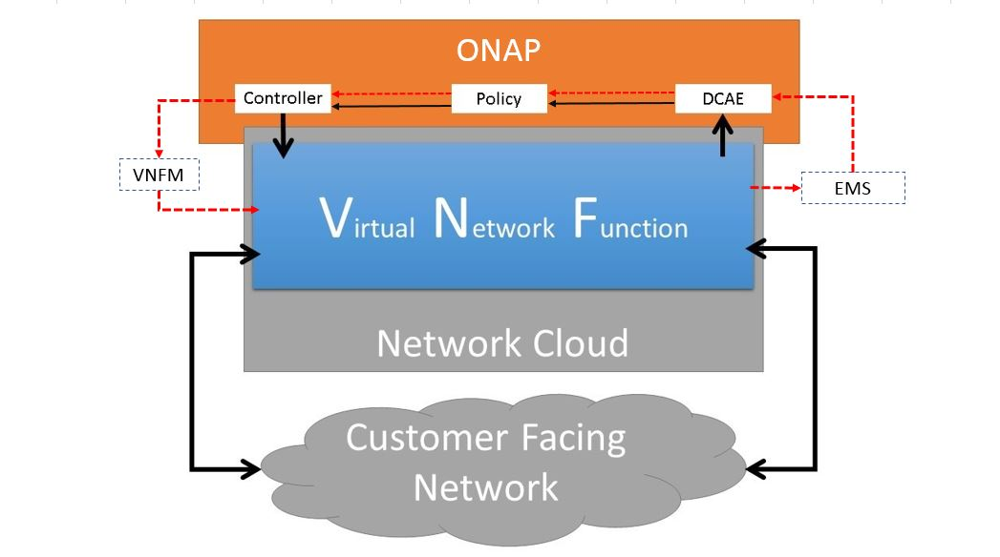
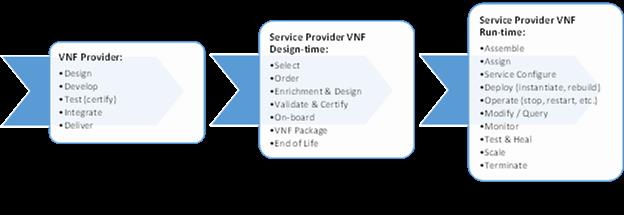
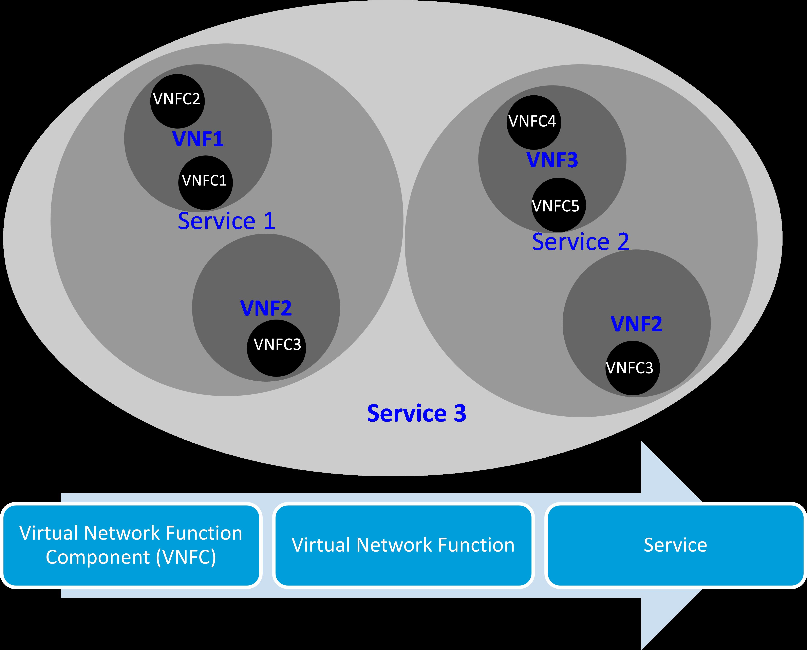

.. Modifications Copyright © 2017-2018 AT&T Intellectual Property.

.. Licensed under the Creative Commons License, Attribution 4.0 Intl.
   (the "License"); you may not use this documentation except in compliance
   with the License. You may obtain a copy of the License at

.. https://creativecommons.org/licenses/by/4.0/

.. Unless required by applicable law or agreed to in writing, software
   distributed under the License is distributed on an "AS IS" BASIS,
   WITHOUT WARRANTIES OR CONDITIONS OF ANY KIND, either express or implied.
   See the License for the specific language governing permissions and
   limitations under the License.

VNF/PNF Guidelines
==================

.. contents:: Table of Contents
   :depth: 4
   :backlinks: entry

**Purpose**
------------------------
- This document focuses on setting and evolving VNF/PNF standards that
  will facilitate industry discussion, participation, alignment and evolution
  towards comprehensive and actionable VNF/PNF best practices and standard
  interface.
- The goal is to accelerate adoption of VNF/PNF best practices which will
  increase innovation, minimize customization needed to onboard VNFs/PNFs as
  well as reduce implementation complexity, time and cost for all impacted
  stakeholders.
- The intent is to drive harmonization of VNFs/PNFs across VNF/PNF providers,
  Network Cloud Service providers (NCSPs) and the overall Network Function
  Virtualization (NFV) ecosystem by providing both long term vision as well
  as short tem focus and clarity.

**Scope**
--------------------
- The audience for this document are VNF/PNF providers, NCSPs and other
  interested 3rd parties who need to know the design, build and lifecycle
  management requirements for VNFs/PNFs to be compliant with ONAP.
- These guidelines describe VNF environment and provide an overview of
  what the VNF developer needs to know to operate and be compliant with ONAP.
- These guidelines contains high level expectations and references to
  specific requirements documentation for VNFs/PNFs which are applicable
  to the current release of ONAP.
- Part of the guidelines also contains visionary recommendations for
  future functionality that could be desirable for ONAP future releases.
- Conformance requirements are in the :ref:`VNF/PNF Requirements
  document <vnf_requirements_documentation>`.

**Introduction**
-------------------------------

Motivation
^^^^^^^^^^^^^^^^^^^^

The requirements and guidelines defined herein are intended to
facilitate industry discussion, participation alignment and evolution
toward comprehensive and actionable VNF/PNF best practices. Integration
costs are a significant impediment to the development and deployment of
new services. We envision developing open source industry processes and
best practices leading eventually to VNF/PNF standards supporting commercial
acquisition of VNFs/PNFs with minimal integration costs. Traditional PNFs
have all been unique like snowflakes and required expensive custom
integration, whereas VNF products and services should be designed for
easier integration just like Lego\ :sup:`TM` blocks. For example, by
standardizing on common actions and related APIs supported by VNFs, plug
and play integration is assured, jumpstarting automation with management
frameworks. Onboarding VNFs would no longer require complex and
protracted integration or development activities thus maximizing
automation and minimizing integration cost. Creating VNF open source
environments, best practices and standards provides additional benefits
to the NFV ecosystems such as:

-  Larger market for VNF providers

-  Rapid introduction and integration of new capabilities into the
   services providers environment

-  Reduced development times and costs for VNF providers

-  Better availability of new capabilities to NCSPs

-  Better distribution of new capabilities to end-user consumers

-  Reduced integration cost (capex) for NCSPs

-  Usage based software licensing for end-user consumers and NCSPs

Audience
^^^^^^^^^^^^

The industry transformation associated with softwarization [1]_ results
in a number of changes in traditional approaches for industry
collaboration. Changes from hardware to software, from waterfall to
agile processes and the emergence of industry supported open source
communities imply corresponding changes in processes at many industry
collaboration bodies. With limited operational experience and much more
dynamic requirements, open source communities are expected to evolve
these VNF/PNF guidelines further before final documentation of those aspects
necessary for standardization. This document and accompanying refer documents
provides VNF/PNF providers, NCSPs and other interested 3rd parties a set of
guidelines and requirements for the design, build and overall lifecycle
management of VNFs.

**VNF/PNF Providers**

PNF suppliers and those transitioning from providing physical network functions
to providing VNFs as well as new market entrants should find
these VNF/PNF requirements and guidelines a useful introduction to the
requirements to be able to develop VNFs/PNFs for deployment into a Network
Cloud. VNF/PNF Providers may also be interested to test their VNFs/PNFs in the
context of an open source implementation of the environment.

**Network Cloud Service Providers (NCSPs)**

A NCSP provides services based on Network Cloud infrastructure as well
as services above the infrastructure layer, e.g., platform service,
end-to-end services.

Common approaches to packaging of VNFs enable economies of scale in
their development. As suitable infrastructure becomes deployed, NCSPs
have a common interest in guidelines that support the ease of deployment
of VNFs in each other's Network Cloud. After reading these VNF
guidelines, NCSPs should be motivated to join ONAP in evolving these
guidelines to meet the industry's collective needs.

**Other interested parties**

Other parties such as solution providers, open source community,
industry standard bodies, students and researchers of network
technologies, as well as enterprise customers may also be interested in
the VNF/PNF Guidelines. Solution Providers focused on specific industry
verticals may find these VNF/PNF guidelines useful in the development of
specialized VNFs/PNFs that can better address the needs of their industry
through deployment of these VNFs/PNFs in NCSP infrastructure. Open Source
developers can use these VNF/PNF guidelines to facilitate the automation of
VNF ingestion and deployment. The emergence of a market for VNFs enables
NCSPs to more rapidly deliver increased functionality, for execution on
white box hardware on customer's premises – such functionality may be of
particular interest to enterprises supporting similar infrastructure.

Program and Document Structure
^^^^^^^^^^^^^^^^^^^^^^^^^^^^^^^^^^^^^^

This document is part of a hierarchy of documents that describes the
overall Requirements and Guidelines for ONAP. The diagram below
identifies where this document fits in the hierarchy.

+-------------------------------------------------------------------------+
| ONAP Requirements and Guidelines                                        |
+=======================+=================================================+
| VNF/PNF Guidelines    | Future ONAP Subject Documents                   |
+-----------------------+-------------------------+-----------------------+
| VNF/PNF Requirements  | Future VNF/PNF          | Future Requirements   |
|                       | Requirements Documents  | Documents             |
+-----------------------+-------------------------+-----------------------+

Document summary:

**VNF/PNF Guidelines**

-  Describes VNF/PNF environment and overview of requirements

*VNF Requirements*

-  VNF development readiness requirements (Design, Resiliency, Security,
   and DevOps)

-  Requirements for how VNFs interact and utilize ONAP

-  Provides recommendations and standards for building Heat templates
   compatible with ONAP.

-  Provides recommendations and standards for building TOSCA templates
   compatible with ONAP.

Acronyms and Definitions
^^^^^^^^^^^^^^^^^^^^^^^^^
Refer to Appendix A - Glossary

**VNF Context**
----------------------------------------

A technology trend towards softwarization is impacting the
communications industry as it has already impacted a number of other
industries. This trend is expected to have some significant impacts on
the products and processes of this industry. The transformation from
products primarily based on hardware to products primarily based on
software has a number of impacts. The completeness of the software
packages to ease integration, usage based licensing to reflect scaling
properties, independence from hardware and location and software
resilience in the presence of underlying hardware failure all gain in
importance compared to prior solutions. The processes supporting
software products and services are also expected to transform from
traditional waterfall methodologies to agile methods. In agile
processes, characteristics such as versioned APIs, rolling upgrades,
automated testing and deployment support with incremental release
schedules become important for these software products and services.
Industry process related to software products and services also change
with the rise of industrially supported open source communities.
Engagement with these open source communities enables sharing of best
practices and collaborative development of open source testing and
integration regimes, open source APIs and open source code bases.

The term VNF is inspired by the work [2]_ of the ETSI [3]_ Network
Functions Virtualization (NFV) Industry Specification Group (ISG).
ETSI's VNF definition includes both historically network functions, such
as Virtual Provider Edge (VPE), Virtual Customer Edge (VCE), and Session
Border Controller (SBC), as well as historically non-network functions
when used to support network services, such as network-supporting web
servers and databases. The VNF discussion in these guidelines applies to
all types of virtualized workloads, not just network appliance
workloads. Having a consistent approach to virtualizing any workload
provides more industry value than just virtualizing some workloads. [4]_

VNFs are functions that are implemented in Network Clouds. Network
Clouds must support end-to-end high-bandwidth low latency network flows
through VNFs running in virtualization environments. For example, a
Network Cloud is able to provide a firewall service to be created such
that all Internet traffic to a customer premise passes through a virtual
firewall running in the Network Cloud.

A data center may be the most common target for a virtualization
environment, but it is not the only target. Virtualization environments
are also supported by more constrained resources e.g., Enterprise
Customer Premise Equipment (CPE). Virtualization environments are also
expected to be available at more distributed network locations by
architecting central offices as data centers, or virtualizing functions
located at the edge of the operator infrastructure (e.g., virtualized
Optical Line Termination (vOLT) or xRAN [5]_) and in constrained
resource Access Nodes. Expect detailed requirements to evolve with these
additional virtualization environments. Some VNFs may scale across all
these environments, but all VNFs should onboard through the same process
before deployment to the targeted virtualization environment.

Business Process Impacts
^^^^^^^^^^^^^^^^^^^^^^^^^^^^^^^^

Business process changes need to occur in order to realize full benefits
of VNF characteristics: efficiency via automation, open source reliance,
and improved cycle time through careful design.

**Efficiency via Automation**

reliant on human labor for critical operational tasks don't scale. By
aggressively automating all VNF operational procedures, VNFs have lower
operational cost, are more rapidly deployed at scale and are more
consistent in their operation. ONAP provides the automation
framework which VNFs can take advantage of simply by implementing
ONAP compatible interfaces and lifecycle models. This enables
automation which drives operational efficiencies and delivers the
corresponding benefits.

**Open Source**

VNFs are expected to run on infrastructure largely enabled by open
source software. For example, OpenStack [6]_ is often used to provide
the virtualized compute, network, and storage capabilities used to host
VNFs. OpenDaylight (ODL) [7]_ can provide the network control plane. The
OPNFV community [8]_ provides a reference platform through integration
of ODL, OpenStack and other relevant open source projects. VNFs also run
in open source operating systems like Linux. VNFs might also utilize
open source software libraries to take advantage of required common but
critical software capabilities where community support is available.
Automation becomes easier, overall costs go down and time to market can
decrease when VNFs can be developed and tested in an open source
reference platform environment prior to on-boarding by the NCSP. All of
these points contribute to a lower cost structure for both VNF providers
and NCSPs.

**Improved Cycle Time through Careful Design**

Today's fast paced world requires businesses to evolve rapidly in order
to stay relevant and competitive. To a large degree VNFs, when used with
the same control, orchestration, management and policy framework (e.g.,
ONAP), will improve service development and composition. VNFs
should enable NCSPs to exploit recursive nesting of VNFs to acquire VNFs
at the smallest appropriate granularity so that new VNFs and network
services can be composed. The ETSI NFV Framework [9]_ envisages such
recursive assembly of VNFs, but many current implementations fail to
support such features. Designing for VNF reuse often requires that
traditional appliance based PNFs be refactored into multiple individual
VNFs where each does one thing particularly well. While the original
appliance based PNF can be replicated virtually by the right combination
and organization of lower level VNFs, the real advantage comes in
creating new services composed of different combinations of lower level
VNFs (possibly from many providers) organized in new ways. Easier and
faster service creation often generates real value for businesses. As
softwarization trends progress towards more agile processes, VNFs,
ONAP and Network Clouds are all expected to evolve towards
continuous integration, testing and deployment of small incremental
changes to de-risk the upgrade process.

ETSI Network Function Virtualization (NFV) comparison
^^^^^^^^^^^^^^^^^^^^^^^^^^^^^^^^^^^^^^^^^^^^^^^^^^^^^^^^^^^^^^

ETSI defines a VNF as an implementation of a network function that can
be deployed on a Network Function Virtualization Infrastructure (NFVI).
Service instances may be composed of an assembly of VNFs. In turn, a VNF
may also be assembled from VNF components (VNFCs) that each provide a
reusable set of functionality. VNFs are expected to take advantage of
platform provided common services.

VNF management and control under ONAP is different but remain compatible
with the management and control exposed in the ETSI MANO model. With ONAP,
there are two ways to manage and control VNF. One is asking all VNF providers
to take advantage of and interoperate with common control software, as
loop indicates by the black arrows in figure 1. At the same time a
management and control architectural option exists for preserving legacy
systems, e.g., ETSI MANO compatible VNFs can be controlled by third-party or
specific VNF Managers(VNFMs) and Element Management Systems (EMSs) provided
outside ONAP,as the loop indicates by the red arrows in figure 1.
The ONAP is being made available as an open source project to reduce
friction for VNF providers and enable new network functions to get to
market faster and with lower costs.

**Figure 1** shows a simplified ONAP and Infrastructure view to
highlight how individual Virtual Network Functions plug into the
ONAP control loops.

|image0|

\ **Figure 1. Control Loop**

In the control loop view in **Figure 1**, the VNF provides an event
data stream via an API to Data Collection, Analytics and Events (DCAE).
DCAE analyzes and aggregates the data stream and when particular
conditions are detected, uses policy to enable what, if any, action
should be triggered. Some of the triggered actions may require a
controller to make changes to the VNF through a VNF provided API.

For a detailed comparison between ETSI NFV and ONAP, refer to
Appendix C - Comparison between VNF Guidelines and ETSI GS NFV-SWA 001.

Evolving towards VNFs
^^^^^^^^^^^^^^^^^^^^^^^^^^^^^^^^^^^^^

In order to deploy VNFs, a target virtualization environment must
already be in place. The NCSPs scale necessitates a phased rollout of
virtualization infrastructure and then of VNFs upon that infrastructure.
Some VNF use cases may require greenfield infrastructure deployments,
others may start brownfield deployments in centralized data centers and
then scale deployment more widely as infrastructure becomes available.
Some service providers have been very public and proactive in setting
transformation targets associated with VNFs.

Because of the complexity of migration and integration issues, the
requirements for VNFs in the short term may need to be contextualized to
the specific service and transition planning.

Much of the existing VNF work has been based on corresponding network
function definitions and requirements developed for PNFs. Many of the
assumptions about PNFs do not apply to VNFs and the modularity of the
functionality is expected to be significantly different. In addition,
the increased service velocity objectives of NFV are based on new types
of VNFs being developed to support new services being deployed in
virtualized environments. Much of the functionality associated with 5G
(e.g., IoT, augmented reality/virtual reality) is thus expected to be
deployed as VNFs in targeted virtualization infrastructure towards the
edge of the network.

**VNF Characteristics**
-------------------------------------------------------

VNFs need to be constructed using a distributed systems architecture
that we will call "Network Cloud Ready". They need to interact with the
orchestration and control platform provided by ONAP and address the
new security challenges that come in this environment.

The main goal of a Network Cloud Ready VNF is to run 'well' on any
Network Cloud (public or private) over any network (carrier or
enterprise). In addition, for optimal performance and efficiency, VNFs
will be designed to take advantage of Network Clouds. This requires
careful engineering in both VNFs and candidate Network Cloud computing
frameworks.

To ensure Network Cloud capabilities are leveraged and VNF resource
consumption meets engineering and economic targets, VNF performance and
efficiency will be benchmarked in a controlled lab environment. In line
with the principles and practices laid out in ETSI GS NFV-PER 001,
efficiency testing will consist of benchmarking VNF performance with a
reference workload and associated performance metrics on a reference
Network Cloud (or, when appropriate, additional benchmarking on a bare
metal reference platform).

Network Cloud Ready VNF characteristics and design consideration can be
grouped into three areas:

-  VNF Development

-  ONAP Ready

-  Virtualization Environment Ready

Detailed requirements are contained in the reference documents that are
listed in Appendix B - References.

VNF Development
^^^^^^^^^^^^^^^^^^^^^^^^^^^

VNFs should be designed to operate within a cloud environment from the
first stages of the development. The VNF provider should think clearly
about how the VNF should be decomposed into various modules. Resiliency
within a cloud environment is very different than in a physical
environment and the developer should give early thought as to how the
Network Cloud Service Provider will ensure the level of resiliency
required by the VNF and then provide the capabilities needed within that
VNF. Scaling and Security should also be well thought out at design time
so that the VNF runs well in a virtualized environment. Finally, the VNF
Provider also needs to think about how they will integrate and deploy
new versions of the VNF. Since the cloud environment is very dynamic,
the developer should utilize DevOps practices to deploy new software.

Detailed requirements for VNF Development can be found in the
*VNF Requirements* document.

VNF Design
~~~~~~~~~~

A VNF may be a large construct and therefore when designing it, it is
important to think about the components from which it will be composed.
The ETSI SWA 001 document gives a good overview of the architecture of a
VNF in Chapter 4 as well as some good examples of how to compose a VNF
in its Annex B. When laying out the components of the VNF it is
important to keep in mind the following principles: Single Capability,
Independence, State and the APIs.

Many Network Clouds will use Heat and TOSCA to describe orchestration
templates for instantiating VNFs and VNFCs. Heat and TOSCA has a useful
abstraction called a "module" that can contain one or more VNFCs. A
module can be thought of as a deployment unit. In general the goal should
be for each module to contain a single VNFC.

Single Capability
+++++++++++++++++++

VNFs should be carefully decomposed into loosely coupled, granular,
re-usable VNFCs that can be distributed and scaled on a Network Cloud.
VNFCs should be responsible for a single capability.

The Network Cloud will define several flavors of VMs for a VNF designer
to choose from for instantiating a VNFC. The best practice is to keep
the VNFCs as lightweight as possible while still fulfilling the business
requirements for the "single capability", however the VNFC should not be
so small that the overhead of constructing, maintaining, and operating
the service outweighs its utility.

Independence
+++++++++++++++

VNFCs should be independently deployed, configured, upgraded, scaled,
monitored, and administered (by ONAP). The VNFC must be a
standalone executable process.

API versioning is one of the biggest enablers of independence. To be
able to independently evolve a component, versioning must ensure
existing clients of the component are not forced to flash-cut with each
interface change. API versioning enables smoother evolution while
preserving backward compatibility.

Scaling
+++++++++++

Each VNFC within a VNF must support independent horizontal scaling, by
adding/removing instances, in response to demand loads on that VNFC. The
Network Cloud is not expected to support adding/removing resources
(compute, memory, storage) to an existing instance of a VNFC (vertical
scaling). A VNF should be designed such that its components can scale
independently of each other. Scaling one component should not require
another component to be scaled at the same time. All scaling will be
controlled by ONAP.

Managing State
++++++++++++++++++++++++

VNFCs and their interfaces should isolate and manage state to allow for
high-reliability, scalability, and performance in a Network Cloud
environment. The use of state should be minimized as much as possible to
facilitate the movement of traffic from one instance of a VNFC to
another. Where state is required it should be maintained in a
geographically redundant data store that may in fact be its own VNFC.

This concept of decoupling state data can be extended to all persistent
data. Persistent data should be held in a loosely coupled database.
These decoupled databases need to be engineered and placed correctly to
still meet all the performance and resiliency requirements of the
service.

Lightweight and Open APIs
++++++++++++++++++++++++++++++++++++++++++++++++

Key functions are accessible via open APIs, which align to Industry API
Standards and supported by an open and extensible information/data
model.

Reusability
++++++++++++++++++++++++

Properly (de)composing a VNF requires thinking about "reusability".
Components should be designed to be reusable within the VNF as well as
by other VNFs. The "single capability" principle aids in this
requirement. If a VNFC could be reusable by other VNFs then it should be
designed as its own single component VNF that may then be chained with
other VNFs. Likewise, a VNF provider should make use of other common
platform VNFs such as firewalls and load balancers, instead of building
their own.

Resiliency
~~~~~~~~~~

The VNF is responsible for meeting its resiliency goals and must factor
in expected availability of the targeted virtualization environment.
This is likely to be much lower than found in a traditional data center.
The VNF developer should design the function in such a way that if there
is a platform problem the VNF will continue working as needed and meet
the SLAs of that function. VNFs should be designed to survive single
failure platform problems including: hypervisor, server, datacenter
outages, etc. There will also be significant planned downtime for the
Network Cloud as the infrastructure goes through hardware and software
upgrades. The VNF should support tools for gracefully meeting the
service needs such as methods for migrating traffic between instances
and draining traffic from an instance. The VNF needs to rapidly respond
to the changing conditions of the underlying infrastructure.

VNF resiliency can typically be met through redundancy often supported
by distributed systems architectures. This is another reason for
favoring smaller VNFCs. By having more instances of smaller VNFCs it is
possible to spread the instance out across servers, racks, datacenters,
and geographic regions. This level of redundancy can mitigate most
failure scenarios and has the potential to provide a service with even
greater availability than the old model. Careful consideration of VNFC
modularity also minimizes the impact of failures when an instance does
fail.

Security
~~~~~~~~

Security must be integral to the VNF through its design, development,
instantiation, operation, and retirement phases. VNF architectures
deliver new security capabilities that make it easier to maximize
responsiveness during a cyber-attack and minimize service interruption
to the customers. SDN enables the environment to expand and adapt for
additional traffic and incorporation of security solutions. Further,
additional requirements will exist to support new security capabilities
as well as provide checks during the development and production stages
to assure the expected advantages are present and compensating controls
exist to mitigate new risks.

New security requirements will evolve along with the new architecture.
Initially, these requirements will fall into the following categories:

-  VNF General Security Requirements

-  VNF Identity and Access Management Requirements

-  VNF API Security Requirements

-  VNF Security Analytics Requirements

-  VNF Data Protection Requirements

DevOps
~~~~~~

The ONAP software development and deployment methodology is
evolving toward a DevOps model. VNF development and deployment should
evolve in the same direction, enabling agile delivering of end-to-end
services.

Testing
++++++++++++++++++++++++

VNF packages should provide comprehensive automated regression,
performance and reliability testing with VNFs based on open industry
standard testing tools and methodologies. VNF packages should provide
acceptance and diagnostic tests and in-service instrumentation to be
used in production to validate VNF operation.

Build and Deployment Processes
++++++++++++++++++++++++++++++++++++++++++++++++

VNF packages should include continuous integration and continuous
deployment (CI/CD) software artifacts that utilize automated open
industry standard system and container build tools. The VNF package
should include parameterized configuration variables to enable automated
build customization. Don't create unique (snowflake) VNFs requiring any
manual work or human attention to deploy. Do create standardized (Lego™)
VNFs that can be deployed in a fully automated way.

ONAP will orchestrate updates and upgrades of VNFs. One method for updates
and upgrades is to onboard and validate the new version, then build a new
instance with the new version of software,transfer traffic to that instance
and kill the old instance. There should be no need for the VNF or its
components to provide an update/upgrade mechanism.

Automation
++++++++++++++++++++++++

Increased automation is enabled by VNFs and VNF design and composition.
VNF and VNFCs should provide the following automation capabilities, as
triggered or managed via ONAP:

-  Events and alarms

-  Lifecycle events

-  Zero-Touch rolling upgrades and downgrades

-  Configuration

ONAP Ready
^^^^^^^^^^^^^^^^^^^^^^

ONAP is the "brain" providing the lifecycle management and control
of software-centric network resources, infrastructure and services.
ONAP is critical in achieving the objectives to increase the value
of the Network Cloud to customers by rapidly on-boarding new services,
enabling the creation of a new ecosystem of consumer and enterprise
services, reducing capital and operational expenditures, and providing
operations efficiencies. It delivers enhanced customer experience by
allowing them in near real-time to reconfigure their network, services,
and capacity.

One of the main ONAP responsibilities is to rapidly onboard and
enrich VNFs to be cataloged as resources to allow composition and
deployment of services in a multi-vendor plug and play environment. It
is also extremely important to be able to automatically manage the VNF
run-time lifecycle to fully realize benefits of NFV. The VNF run-time
lifecycle includes aspects such as instantiation, configuration, elastic
scaling, automatic recovery from resource failures, and resource
allocation. It is therefore imperative to provide VNFs that are equipped
with well-defined capabilities that comply with ONAP standards to
allow rapid onboarding and automatic lifecycle management of these
resources when deploying services as depicted in **Figure 2**.

|image1|

\ **Figure 2. VNF Complete Lifecycle Stages**

In order to realize these capabilities within the ONAP platform, it
is important to adhere to a set of key principles (listed below) for
VNFs to integrate into ONAP.

Requirements for ONAP Ready can be found in the *VNF Requirements* document.

Design Definition
~~~~~~~~~~~~~~~~~

Onboarding automation will be facilitated by applying standards-based
approaches to VNF packaging to describe the VNF's infrastructure
resource requirements, topology, licensing model, design constraints,
and other dependencies to enable successful VNF deployment and
management of VNF configuration and operational behavior.

The current VNF Package Requirement is based on a subset of the
Requirements contained in the ETSI Document: ETSI GS NFV-MAN 001 v1.1.1
and GS NFV IFA011 V0.3.0 (2015-10) - Network Functions Virtualization
(NFV), Management and Orchestration, VNF Packaging Specification.

Configuration Management
~~~~~~~~~~~~~~~~~~~~~~~~

ONAP must be able to orchestrate and manage the VNF configuration
to provide fully automated environment for rapid service provisioning
and modification. VNF configuration/reconfiguration could be allowed
directly through standardized APIs or through EMS and VF-C.

Monitoring and Management
~~~~~~~~~~~~~~~~~~~~~~~~~~

The end-to-end service reliability and availability in a virtualized
environment will greatly depend on the ability to monitor and manage the
behavior of Virtual Network Functions in real-time. ONAP platform
must be able to monitor the health of the network and VNFs through
collection of event and performance data directly from network resources
utilizing standardized APIs or through EMS. The VNF provider must provide
visibility into VNF performance and fault at the VNFC level (VNFC is the
smallest granularity of functionality in our architecture) to allow ONAP
to proactively monitor, test, diagnose and trouble shoot the health and
behavior of VNFs at their source.

Virtualization Environment Ready
^^^^^^^^^^^^^^^^^^^^^^^^^^^^^^^^^^^^^^^

Every Network Cloud Service Provider will have a different set of
resources and capabilities for their Network Cloud, but there are some
common resources and capabilities that nearly every NCSP will offer.

Network Cloud
~~~~~~~~~~~~~

VNFCs should be agnostic to the details of the Network Cloud (such as
hardware, host OS, Hypervisor or container technology) and must run on
the Network Cloud with acknowledgement to the paradigm that the Network
Cloud will continue to rapidly evolve and the underlying components of
the platform will change regularly. VNFs should be prepared to move
VNFCs across VMs, hosts, locations or datacenters, or Network Clouds.

Overlay Network
~~~~~~~~~~~~~~~

VNFs should be compliant with the Network Cloud network virtualization
platform including the specific set of characteristics and features.

The Network Cloud is expected to be tuned to support VNF performance
requirements. Initially, specifics may differ per Network Cloud
implementation and are expected to evolve over time, especially as the
technology matures.

Guest Operating Systems
~~~~~~~~~~~~~~~~~~~~~~~~

All components in ONAP should be virtualized, preferably with support for
both virtual machines and containers. All components should be software-based
with no requirement on a specific hardware platform.

To enable the compliance with security, audit, regulatory and
other needs, NCSPs may operate a limited set of  guest OS and
CPU architectures and families, virtual machines, etc.

VNFCs should be agnostic to the details of the Network Cloud (such as
hardware, host OS, Hypervisor or container technology) and must run on
the Network Cloud with acknowledgement to the paradigm that the Network
Cloud will continue to rapidly evolve and the underlying
components of the platform will change regularly.

Compute Flavors
~~~~~~~~~~~~~~~

VNFs should take advantage of the standard Network Cloud capabilities in
terms of VM characteristics (often referred to as VM Flavors), VM sizes
and cloud acceleration capabilities aimed at VNFs such as Linux Foundation
project Data Plane Development Kit (DPDK).

**PNF Characteristics**
----------------------------------------

Physical Network Functions (PNF) are a vendor-provided Network Function(s)
implemented using a set of software modules deployed on a dedicated
hardware element while VNFs utilize cloud resources to provide Network
Functions through virtualized software modules.

PNFs can be supplied by a vendor as a Black Box (provides no knowledge
of its internal characteristics, logic, and software design/architecture)
or as a White Box (provides detailed knowledge and access of its internal
components and logic) or as a Grey Box (provides limited knowledge and
access to its internal components).  Also note that the PNF hardware and
the software running on it could come from the same vendor or different
vendors.

PNFs need to be chained with VNFs to design and deploy more complex end
to end services that span across Network Clouds. PNF should have the
following characteristics.

Cloud Integration
^^^^^^^^^^^^^^^^^^^

Although the goal is to virtualize network functions within a service
chain, there will be certain network functions in the near term or even
in the end state that would remain physical (e.g., 5G radio functions,
ROADM, vOLT, AR/CR appliances etc.). PNFs must be designed to allow
their seamless integration with Network Clouds and complement end to
end service requirements for resiliency, scalability, upgrades, and
security.

PNF Design
^^^^^^^^^^^^^^^^^^^

A PNF provides one or more network functions on a dedicated hardware
box. PNFs are expected to evolve to Virtualized Network Functions and
their current design should facilitate their future virtualization.
The software modules and corresponding hardware should be packaged
together to provide the desired Network Functions. However, it is not
required for the software modules and hardware to be provided by a
single vendor. PNFs are deployed through Service Provider's installation
and commission procedure. Virtualized instantiation processes flows
such as OpenStack HHEAT are not utilized and PNFs are instantiated
when they are powered up and connected to ONAP. PNFs must provide
access to its software modules and management functions through
open APIs.

Scaling
^^^^^^^^^^^

Horizontal scaling for PNFs would not be the logical approach and they
need to be scaled up vertically by increasing computing hardware
resources (e.g. cpu, memory). Vertical scaling of PNFs will need to
follow Service Provider's hardware upgrade processes and procedures.

Managing State
^^^^^^^^^^^^^^^^^

Software modules and their interfaces should be able to monitor and
manage their state to allow high-reliability, performance, and
high-availability (active-active or stand by) as needed by overriding
services. At this time, PNF data store should be replicated in the back
up hardware to allow fail overs for both active-active and stand by
high-availability methods.

Resiliency
^^^^^^^^^^^^^

The PNF is responsible for meeting its resiliency goals with the use
of redundant physical infrastructure.  The PNF developer should design
the function in such a way that if there is a physical platform problem
the PNF will continue working as needed and meet the SLAs of that
function. PNFs should be designed to survive single failure platform
problems including: processor, memory, NIC, datacenter outages, etc.
The PNF should support tools for gracefully meeting the service needs
such as methods for migrating traffic between PNF's and draining
traffic from a PNF.

DevOps
^^^^^^^^

The ONAP software development and deployment methodology is evolving
toward a DevOps model. PNF development and deployment should evolve in the
same direction, enabling agile delivering of end-to-end services.

Testing
^^^^^^^^^^^

PNF packages should provide comprehensive automated regression, performance
and reliability testing with PNFs based on open industry standard testing
tools and methodologies. PNF packages should provide acceptance and diagnostic
tests and in-service instrumentation to be used in production to validate
PNF operation.

Build and Deployment Processes
^^^^^^^^^^^^^^^^^^^^^^^^^^^^^^^^^^^^^^

PNF packages should include continuous integration and continuous deployment
(CI/CD) software artifacts that utilize automated open industry standard
system and container build tools. The PNF package should include
parameterized configuration variables to enable automated build
customization. Don't create unique (snowflake) PNFs requiring any
manual work or human attention to deploy. Do create standardized
(Lego™) PNFs that can be deployed in a fully automated way.
ONAP will orchestrate updates and upgrades of PNFs. One method
for updates and upgrades is to onboard and validate the new version,
then build a new instance with the new version of software, transfer
traffic to that instance and kill the old instance. There should be
no need for the PNF or its components to provide an update/upgrade
mechanism.

Automation
^^^^^^^^^^^^^^^^^^^

Increased automation is enabled by PNFs and PNF design and composition.
PNF should provide the following automation capabilities, as triggered
or managed via ONAP:

- Events and alarms
- Lifecycle events
- Zero-Touch rolling upgrades and downgrades
- Configuration

ONAP Ready
^^^^^^^^^^^^^^^^^^^

PNF and VNF lifecycles are fundamentally managed the same way utilizing
ONAP onboarding, configuration, and monitoring capabilities. The main
difference is related to the processes and methods used for deployment
and instantiation of these resources. PNFs are first installed in the
target location utilizing Service Provider's installation and commission
procedures that includes manual activities. Next, any additional software
module will be downloaded to the physical hardware and started utilizing
the required APIs. On the other had VNF deployment and instantiation are
orchestrated by ONAP utilizing the underlying Network Cloud orchestration
and APIs.

Design Definition
^^^^^^^^^^^^^^^^^^^

It is intended to onboard PNF packages into ONAP using the same processes
and tools as VNFs to reduce the need for customization based on the Network
Function underlying infrastructure. The main difference is associated with
the content of the Package that describes the required information for
lifecycle management of the Network Function. For instance, PNF packages
will not include any information related to the Network Cloud infrastructure
such as HEAT templates.

Configuration Management
^^^^^^^^^^^^^^^^^^^^^^^^^^^^^^^^^^^^^^

The configuration for both PNFs and VNFs are managed utilizing common
orchestration capabilities and standardized resource interfaces supported
by ONAP. PNFs must allow direct configuration management interfaces to
ONAP without any needs for an EMS support.

Monitoring and Management
^^^^^^^^^^^^^^^^^^^^^^^^^^^^^^^^^^^^^^

PNFs must allow ONAP to directly collect event and performance data without
the aid of any EMSs to monitor PNF health and behavior. ONAP requires common
standardized models and interfaces to support collection of events and data
streams for both VNFs and PNFs and the vendors must be able to support these
requirements.

Computing Environment
^^^^^^^^^^^^^^^^^^^^^^^^^^^^^^^^^^^^^^

Network functions implemented over dedicated physical hardware will
eventually be virtualized over Network Cloud infrastructure. However,
this transition will take place over time and there is a need to support
this integrated network functions in various forms until complete
virtualization is achieved. The integrated solution may come in the
form of a tightly bundled package from a single provider referred to
as black box in this document. In this configuration, the software
modules will not be directly managed by an external management
system and the bundled package is managed utilizing standardized open
APIs provided by the vendor.

In an alternative configuration, the internal software modules are
not tightly coupled with physical hardware and can be directly
accessed, extended, and managed by an external management system
through standardized interfaces. Each software module can be provided
by different vendors and loaded onto the underlying hardware. This
configuration is referred to as a white box in this document.

A gray box configuration provides direct access and manageability
only to a subset of software modules that are loaded on top of a
basic bundled package.

**Summary**
---------------------------------------

The intent of these guidelines and requirements is to provide long term
vision as well as short term focus and clarity where no current open
source implementation exists today. The goal is to accelerate the
adoption of VNFs which will increase innovation, minimize customization
to onboard VNFs, reduce implementation time and complexity as well as
lower overall costs for all stakeholders. It is critical for the
Industry to align on a set of standards and interfaces to quickly
realize the benefits of NFV.

This VNF guidelines document provides a general overview and points to
more detailed requirements documents. The subtending documents provide
more detailed requirements and are listed in Appendix B - References.
All documents are expected to evolve.

Some of these VNF/PNF guidelines may be more broadly applicable in the
industry, e.g., in other open source communities or standards bodies.
The art of VNF architecture and development is expected to mature
rapidly with practical deployment and operations experience from a
broader ecosystem of types of VNFs and different VNF providers.
Individual operators may also choose to provide their own extensions and
enhancements to support their particular operational processes, but
these guidelines are expected to remain broadly applicable across a
number of service providers interested in acquiring VNFs.

We invite feedback on these VNF/PNF Guidelines in the context of the
ONAP Project. We anticipate an ongoing project within the ONAP community
to maintain similar guidance for VNF developers to ONAP.Comments on these
guidelines should be discussed there.

**Appendix**
-----------------------------------

Glossary
^^^^^^^^^^^^^^^^^^

+--------------------+-------------------------------------------------------+
| Heat               | Heat is a service to orchestrate composite cloud      |
|                    | applications using a declarative template format      |
|                    | through an OpenStack-native REST API.                 |
+--------------------+-------------------------------------------------------+
| HPA                | Hardware Platform Awareness (HPA) is the means by     |
|                    | which the underlying NFV-I hardware platform          |
|                    | capabilities are exposed to the network service       |
|                    | orchestration and management functionality, for the   |
|                    | purpose of fulfilling VNF instantiation-time hardware |
|                    | platform                                              |
+--------------------+-------------------------------------------------------+
| NC                 | Network Cloud (NC) are built on a framework containing|
|                    | these essential elements: refactoring hardware        |
|                    | elements into software functions running on commodity |
|                    | cloud computing infrastructure; aligning access, core,|
|                    | and edge networks with the traffic patterns created by|
|                    | IP based services; integrating the network and cloud  |
|                    | technologies on a software platform that enables      |
|                    | rapid, highly automated, deployment and management of |
|                    | services, and software defined control so that both   |
|                    | infrastructure and functions can be optimized across  |
|                    | change in service demand and infrastructure           |
|                    | availability; and increasing competencies in software |
|                    | integration and a DevOps operations model.            |
+--------------------+-------------------------------------------------------+
| NCSP               | Network Cloud Service Provider (NCSP) is a company or |
|                    | organization, making use of a communications network  |
|                    | to provide Network Cloud services on a commercial     |
|                    | basis to third parties.                               |
+--------------------+-------------------------------------------------------+
| NFV                | Network functions virtualization (NFV) defines        |
|                    | standards for compute, storage, and networking        |
|                    | resources that can be used to build virtualized       |
|                    | network functions.                                    |
+--------------------+-------------------------------------------------------+
| NFV-I              | NFV Infrastructure (NFVI) is a key component of the   |
|                    | NFV architecture that describes the hardware and      |
|                    | software components on which virtual networks are     |
|                    | built.                                                |
+--------------------+-------------------------------------------------------+
| PNF                | PNF is a vendor-provided Network Function(s)          |
|                    | implemented using a bundled set of hardware and       |
|                    | software.                                             |
+--------------------+-------------------------------------------------------+
| SDOs               | Standards Developing Organizations are organizations  |
|                    | which are active in the development of standards      |
|                    | intended to address the needs of a group of affected  |
|                    | adopters.                                             |
+--------------------+-------------------------------------------------------+
| Softwarization     | Softwarization is the transformation of business      |
|                    | processes to reflect characteristics of software      |
|                    | centric products, services, lifecycles, and methods.  |
+--------------------+-------------------------------------------------------+
| Targeted           | Targeted Virtualization Environment is the execution  |
| Virtualization     | environment for VNFs. While Network Clouds located in |
| Environment        | datacenters are a common execution environment, VNFs  |
|                    | can and will be deployed in various locations (e.g.,  |
|                    | non-datacenter environments) and form factors (e.g.,  |
|                    | enterprise Customer Premise Equipment). Non-datacenter|
|                    | environments are expected to be available at more     |
|                    | distributed network locations including central       |
|                    | offices and at the edge of the NCSP's infrastructure. |
+--------------------+-------------------------------------------------------+
| TOSCA              | Topology and Orchestration Specification for Cloud    |
|                    | Applications (OASIS spec)                             |
+--------------------+-------------------------------------------------------+
| VM                 | Virtual Machine (VM) is a virtualized computation     |
|                    | environment that behaves very much like a physical    |
|                    | computer/server. A VM has all its ingredients         |
|                    | (processor, memory/storage, interfaces/ports) of a    |
|                    | physical computer/server and is generated by a        |
|                    | hypervisor, which partitions the underlying physical  |
|                    | resources and allocates them to VMs. Virtual Machines |
|                    | are capable of hosting a virtual network function     |
|                    | component (VNFC).                                     |
+--------------------+-------------------------------------------------------+
| VNF                | Virtual Network Function (VNF) is the software        |
|                    | implementation of a function that can be deployed on a|
|                    | Network Cloud. It includes network functions that     |
|                    | provide transport and forwarding. It also includes    |
|                    | other functions when used to support network services,|
|                    | such as network-supporting web servers and database.  |
+--------------------+-------------------------------------------------------+
| VNFC               | Virtual Network Function Component (VNFC) are the     |
|                    | sub-components of a VNF providing a VNF Provider a    |
|                    | defined sub-set of that VNF's functionality, with the |
|                    | main characteristic that a single instance of this    |
|                    | component maps 1:1 against a single Virtualization    |
|                    | Container. See Figure 3 for the relationship between  |
|                    | VNFC and VNFs.                                        |
|                    |                                                       |
|                    | |image2|                                              |
+--------------------+-------------------------------------------------------+

References
^^^^^^^^^^^^^

1. VNF Requirements

Comparison between VNF Guidelines and ETSI GS NFV-SWA 001
^^^^^^^^^^^^^^^^^^^^^^^^^^^^^^^^^^^^^^^^^^^^^^^^^^^^^^^^^^^^^^^^^^^

The VNF guidelines presented in this document (VNF Guidelines) overlap
with the ETSI GS NFV-SWA 001 (Network Functions Virtualization (NFV);
Virtual Network Function Architecture) document. For convenience we will
just refer to this document as SWA 001.

The SWA 001 document is a survey of the landscape for architecting a
VNF. It includes many different options for building a VNF that take
advantage of the ETSI MANO architecture.

The Network Cloud and ONAP have similarities to ETSI's MANO, but
also have differences described in earlier sections. The result is
differences in the VNF requirements. Since these VNF Guidelines are for
a specific implementation of an architecture they are narrower in scope
than what is specified in the SWA 001 document.

The VNF Guidelines primarily overlaps the SWA 001 in Sections 4 and 5.
The other sections of the SWA 001 document lie outside the scope of the
VNF Guidelines.

This appendix will describe the differences between these two documents
indexed on the SWA 001 sections.

Section 4 Overview of VNF in the NFV Architecture
~~~~~~~~~~~~~~~~~~~~~~~~~~~~~~~~~~~~~~~~~~~~~~~~~~

This section provides an overview of the ETSI NFVI architecture and how
it interfaces with the VNF architecture. Because of the differences
between infrastructure architectures there will naturally be some
differences in how it interfaces with the VNF.

A high level view of the differences in architecture can be found in the
main body of this document.

Section 5 VNF Design Patterns and Properties
~~~~~~~~~~~~~~~~~~~~~~~~~~~~~~~~~~~~~~~~~~~~~

This section of the SWA 001 document gives a broad view of all the
possible design patterns of VNFs. The VNF Guidelines do not generally
differ from this section. The VNF Guidelines address a more specific
scope than what is allowed in the SWA 001 document.

Section 5.1 VNF Design Patterns
+++++++++++++++++++++++++++++++++++++++

The following are differences between the VNF Guidelines and SWA-001:

-  5.1.2 - The Network Cloud does not recognize the distinction between
   "parallelizable" and "non-parallelizable" VNFCs, where parallelizable
   means that there can be multiple instances of the VNFC. In the VNF
   Guidelines, all VNFCs should support multiple instances and therefore
   be parallelizable.

-  5.1.3 - The VNF Guidelines encourages the use of stateless VNFCs.
   However, where state is needed it should be kept external to the VNFC
   to enable easier failover.

-  5.1.5 - The VNF Guidelines only accepts horizontal scaling (scale
   out/in) by VNFC. Vertical scaling (scale up/down) is not supported by
   ONAP.

Section 5.2 VNF Update and Upgrade
+++++++++++++++++++++++++++++++++++++++

-  5.2.2 - ONAP will orchestrate updates and upgrades. The
   preferred method for updates and upgrades is to build a new instance
   with the new version of software, transfer traffic to that instance
   and kill the old instance.

Section 5.3 VNF Properties
+++++++++++++++++++++++++++++++++++++++

The following are differences between the VNF Guidelines and SWA-001:

-  5.3.1 - In a Network Cloud all VNFs must be only "COTS-Ready". The
   VNF Guidelines does not support "Partly COTS-READY" or "Hardware
   Dependent".

-  5.3.2 – The only virtualization environment currently supported by
   ONAP is "Virtual Machines". The VNF Guidelines state that all
   VNFs should be hypervisor agnostic. Other virtualized environment
   options such as containers are not currently supported. However,
   container technology is targeted to be supported in the future.

-  5.3.3 - All VNFs must scale horizontally (scale out/in) within the
   Network Cloud. Vertical (scale up/down) is not supported.

-  5.3.5 - The VNF Guidelines state that ONAP will provide full
   policy management for all VNFs. The VNF will not provide its own
   policy management for provisioning and management.

-  5.3.7 - The VNF Guidelines recognizes both stateless and stateful
   VNFCs but it encourages the minimization of stateful VNFCs.

Section 5.4 Attributes describing VNF Requirements
++++++++++++++++++++++++++++++++++++++++++++++++++++++++++++++++++++++++++++++

Attributes described in the VNF Guidelines and reference documents
include those attributes defined in this section of the SWA 001 document
but also include additional attributes.

.. [1]
   Softwarization is the transformation of business processes to reflect
   characteristics of software centric products, services, lifecycles
   and methods.

.. [2]
   "Virtual Network Functions Architecture" ETSI GS NFV-SWA 001 v1.1.1
   (Dec 2012)

.. [3]
   European Telecommunications Standards Institute or `ETSI
   <http://www.etsi.org>`_ is a respected standards body providing
   standards for information and communications technologies.

.. [4]
   Full set of capabilities of Network Cloud and/or ONAP might not
   be needed to support traditional IT like workloads.

.. [5]
   `xRAN <http://www.xran.org/>`_

.. [6]
   `OpenStack <http://www.openstack.org>`_

.. [7]
   `OpenDaylight <http://www.opendaylight.org>`_

.. [8]
   `OPNFV <http://www.opnfv.org>`_

.. [9]
   See, e.g., Figure 3 of GS NFV 002, Architectural Framework

